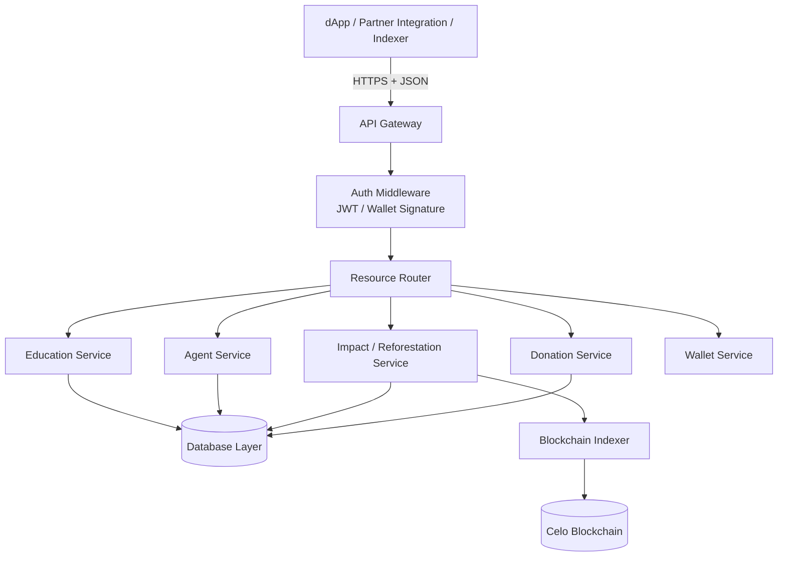
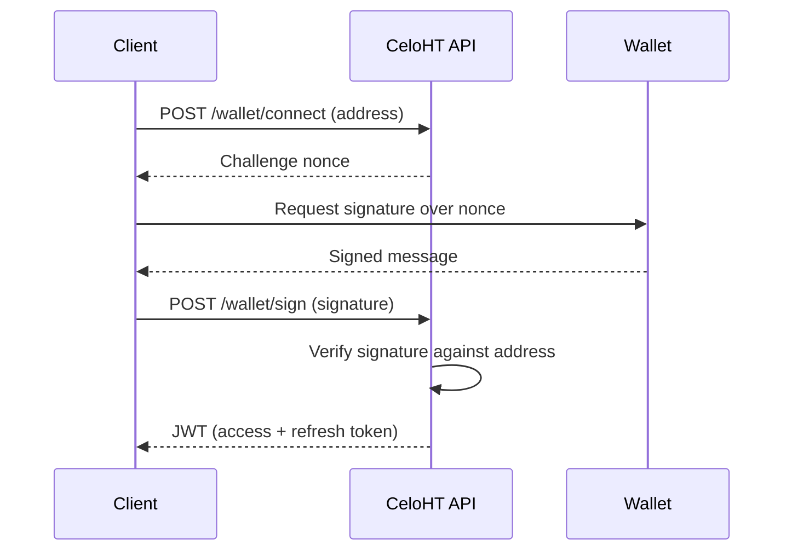
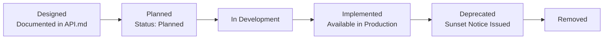

# CeloHT API Documentation

**Version:** 1.0
**Last Updated:** August 2026
**Status:** Specification Published — Implementation Status Marked Per Endpoint

---

CeloHT is an open-source, community-governed initiative built on the Celo blockchain, focused on financial inclusion education, a community Agent Network, and environmental reforestation. This document specifies the CeloHT API: its design principles, authentication model, conventions, and endpoints.

**CeloHT is not a cryptocurrency, ICO, token sale, or investment platform.** No endpoint in this specification issues, sells, or trades a token or security. Endpoints referencing cUSD or CELO expose read access to existing, independently issued Celo-network assets used strictly as payment and settlement infrastructure — never a CeloHT-issued instrument.

As of this document's publication date, CeloHT's backend infrastructure is in early development. Every endpoint below is explicitly labeled **Implemented**, **In Development**, or **Planned**. Endpoints marked **Planned** describe designed-but-unbuilt functionality and are published so that integrating partners and contributors can build against a stable, forward-looking contract. No endpoint's status label should be read as a claim that the underlying functionality is live unless labeled **Implemented**.

---

## Table of Contents

1. [Introduction](#1-introduction)
2. [Architecture](#2-architecture)
3. [Base URL](#3-base-url)
4. [Authentication](#4-authentication)
5. [Authorization](#5-authorization)
6. [Headers](#6-headers)
7. [Content Types](#7-content-types)
8. [Versioning Policy](#8-versioning-policy)
9. [Rate Limits](#9-rate-limits)
10. [Pagination](#10-pagination)
11. [Filtering, Sorting, and Search](#11-filtering-sorting-and-search)
12. [Error Handling](#12-error-handling)
13. [HTTP Status Codes](#13-http-status-codes)
14. [Security](#14-security)
15. [Endpoints](#15-endpoints)
16. [Response Standards](#16-response-standards)
17. [Error Response Standards](#17-error-response-standards)
18. [API Conventions](#18-api-conventions)
19. [Webhooks (Future)](#19-webhooks-future)
20. [SDK Roadmap](#20-sdk-roadmap)
21. [OpenAPI 3.1 Specification](#21-openapi-31-specification)
22. [Postman Collection](#22-postman-collection)
23. [Developer Quick Start](#23-developer-quick-start)
24. [Testing](#24-testing)
25. [Monitoring](#25-monitoring)
26. [Changelog](#26-changelog)
27. [Deprecation Policy](#27-deprecation-policy)
28. [API Lifecycle](#28-api-lifecycle)
29. [Best Practices](#29-best-practices)
30. [FAQ](#30-faq)
31. [Support](#31-support)
32. [License](#32-license)

---

## 1. Introduction

### 1.1 Purpose

The CeloHT API exposes CeloHT's public-good data — education content, Agent Network information, reforestation impact records, and transparency reporting — and, where authenticated, supports user- and agent-facing actions such as wallet connection and donation processing. It exists to let the CeloHT dApp, community-built tools, partner integrations, and the public Impact Dashboard read from a single, consistent, well-governed source of truth.

### 1.2 Intended Audience

- Core and community developers contributing to the CeloHT dApp (`ARCHITECTURE.md` Section 4).
- Third-party developers building tools or integrations on top of CeloHT's public data.
- Ecosystem partners (NGOs, universities, grant programs) consuming impact and transparency data for due diligence.
- Internal services (analytics engine, indexer) described in `ARCHITECTURE.md` Section 5.

### 1.3 API Philosophy

- **Read access is public by default.** Impact, education, and reforestation data are designed to be openly queryable, consistent with CeloHT's Transparency Policy (`GOVERNANCE.md` Section 18).
- **Write access is minimal and purposeful.** Only actions with a genuine need for server-side coordination (donation processing, wallet linkage) require authenticated write endpoints; CeloHT does not build API surface area for its own sake.
- **No token, no trading, no custody.** The API never exposes an endpoint to issue, buy, sell, or trade a token, consistent with `LEGAL_STATUS.md` and `NO_TOKEN_POLICY.md`.
- **Honesty about implementation status.** Every endpoint is labeled with its real build status, never presented as live before it is.

### 1.4 REST Principles

The CeloHT API follows REST conventions: resources are addressed by URL, standard HTTP methods express intent (`GET`, `POST`, `PATCH`, `DELETE`), and responses use standard HTTP status codes combined with a consistent JSON envelope (Section 16).

### 1.5 Design Goals

| Goal | How It's Achieved |
|---|---|
| Predictability | Consistent response envelope, consistent error format, documented conventions (Section 18) |
| Transparency-first | Public read endpoints require no authentication wherever data sensitivity allows |
| Security by default | HTTPS-only, JWT and wallet-signature authentication, input validation (Section 14) |
| Extensibility | Versioned base URL, additive-first change policy (Section 27) |
| Low integration friction | OpenAPI 3.1 specification (Section 21), Postman collection (Section 22), multi-language examples |

---

## 2. Architecture

The CeloHT API is a stateless REST API, consistent with the Backend Architecture described in `ARCHITECTURE.md` Section 5.

- **REST** — Resources are nouns (`/education`, `/agents`, `/reforestation`); actions are expressed through HTTP methods, not verbs in the URL.
- **Stateless requests** — Each request carries all information needed to process it (authentication token, parameters); the server holds no client session state between requests.
- **JSON responses** — All responses are `application/json` (Section 7), following the response envelope in Section 16.
- **HTTPS only** — Plain HTTP requests are rejected; see Section 14.1.
- **Versioning strategy** — The API is versioned in the URL path (`/v1`), described fully in Section 8.



---

## 3. Base URL

```
https://api.celoht.org/v1
```

This URL is a placeholder consistent with CeloHT's expected production domain. As of this document's publication date, this base URL is **Planned**; no production API is confirmed live at this address. Developers should treat this base URL as the target contract for integration and confirm current availability through CeloHT's official GitHub organization before building against it in production.

A staging base URL, once available, will be published in `ARCHITECTURE.md` Section 14 and referenced from this document.

---

## 4. Authentication

| Method | Use Case | Status |
|---|---|---|
| JWT Authentication | Standard authenticated requests (donation history, agent dashboard) | Planned |
| Wallet Signature Authentication | Actions tied to on-chain identity (wallet linkage, agent verification) | Planned |
| API Keys | Server-to-server integration for trusted partners | Planned |
| OAuth 2.0 | Third-party application authorization | Future |

### 4.1 JWT Authentication

Authenticated requests include a bearer token issued after a successful login or wallet-signature exchange:

```
Authorization: Bearer <jwt_token>
```

JWTs are short-lived (target: 15 minutes access token, 7-day refresh token) and signed using an asymmetric algorithm (RS256), consistent with OWASP API Security guidance (Section 14.9).

### 4.2 Wallet Signature Authentication

For actions tied to on-chain identity (e.g., linking a Valora or MiniPay wallet, verifying agent status), the client signs a server-issued challenge message using the connected wallet, and the API verifies the signature against the claimed address before issuing a session JWT.



### 4.3 API Keys

**Planned.** Server-to-server integrations (for example, a partner NGO's reporting system) will authenticate using a scoped API key issued by the Governance Council's Technology Working Group, transmitted via the `X-API-Key` header.

### 4.4 OAuth 2.0 (Future)

**Future.** OAuth 2.0 authorization-code flow is under consideration for third-party applications requiring delegated, user-consented access, and is not yet designed in detail.

### 4.5 Authentication Flow Summary

1. Client authenticates via wallet signature (Section 4.2) or, where applicable, a future username/credential flow.
2. API issues a short-lived JWT access token and a longer-lived refresh token.
3. Client includes the access token in the `Authorization` header on subsequent requests.
4. Client exchanges the refresh token for a new access token upon expiry via the token-refresh endpoint (Planned).

---

## 5. Authorization

Authorization is role-based, mirroring the roles defined in `GOVERNANCE.md` Section 3 and `TEAM.md`.

| Role | Example Permissions |
|---|---|
| **Public (unauthenticated)** | Read access to `/education`, `/impact`, `/reforestation`, `/partners`, `/news`, `/health`, `/version` |
| **Learner** | Read own education progress; enroll in courses |
| **Donor** | Submit donations; read own donation history |
| **Agent** | Submit cash-in/cash-out transaction records within verified scope |
| **Maintainer / Working Group** | Access to internal metrics and moderation endpoints |
| **Governance Council / Treasury Committee** | Access to treasury-adjacent internal endpoints (not part of the public API surface) |

Authorization checks are enforced server-side on every request; a valid JWT alone does not grant access beyond the roles encoded in its claims.

---

## 6. Headers

| Header | Required | Description |
|---|---|---|
| `Authorization` | For authenticated endpoints | `Bearer <jwt_token>` |
| `Content-Type` | For requests with a body | `application/json` |
| `Accept` | Recommended | `application/json` |
| `X-API-Key` | For server-to-server integrations (Planned) | Partner-issued API key |
| `X-Request-ID` | Optional, recommended | Client-generated UUID for request tracing |
| `Accept-Language` | Optional | `ht` (Haitian Creole) or `en`, for content localization where applicable |

---

## 7. Content Types

The API exclusively accepts and returns `application/json`. Requests with an unsupported `Content-Type` receive a `415 Unsupported Media Type` response (Planned enforcement).

---

## 8. Versioning Policy

- The API is versioned via the URL path: `/v1`, `/v2`, etc.
- Breaking changes are introduced only in a new major version; non-breaking (additive) changes may be introduced within the current version.
- A minimum 6-month deprecation notice is provided before a version is retired, consistent with Section 27.
- The currently active version and any deprecation notices are published via `GET /version` (Section 15).

---

## 9. Rate Limits

| Tier | Limit (Planned) | Notes |
|---|---|---|
| Unauthenticated (public read) | 60 requests/minute per IP | Applies to public endpoints |
| Authenticated (JWT) | 300 requests/minute per user | Applies to authenticated endpoints |
| Partner API Key | Negotiated per partnership agreement | Per `PARTNERSHIP` governance (`GOVERNANCE.md` Section 19) |

- Rate-limit status is communicated via standard headers: `X-RateLimit-Limit`, `X-RateLimit-Remaining`, `X-RateLimit-Reset`.
- Exceeding a rate limit returns `429 Too Many Requests` with a `Retry-After` header.
- **Retry policy:** clients should implement exponential backoff starting at 1 second, honoring the `Retry-After` header where present.

Specific numeric limits above are the current design target and are subject to adjustment before general availability; the mechanism (headers, `429` response, `Retry-After`) is stable.

---

## 10. Pagination

List endpoints use cursor-based pagination for stability under concurrent writes:

**Request:**
```
GET /v1/education/courses?limit=20&cursor=eyJpZCI6IjEyMyJ9
```

**Response fragment:**
```json
{
  "data": [ ... ],
  "pagination": {
    "limit": 20,
    "next_cursor": "eyJpZCI6IjE0MyJ9",
    "has_more": true
  }
}
```

| Parameter | Type | Description |
|---|---|---|
| `limit` | integer | Items per page (default 20, max 100) |
| `cursor` | string | Opaque cursor returned by the previous response |

---

## 11. Filtering, Sorting, and Search

### 11.1 Filtering

List endpoints support field-based filtering via query parameters, e.g.:

```
GET /v1/reforestation/trees?status=verified&region=leogane
```

### 11.2 Sorting

```
GET /v1/education/courses?sort=created_at&order=desc
```

| Parameter | Description |
|---|---|
| `sort` | Field to sort by |
| `order` | `asc` or `desc` (default `asc`) |

### 11.3 Search

Endpoints supporting free-text search accept a `q` parameter:

```
GET /v1/education/courses?q=cUSD+basics
```

Search behavior (exact-match vs. full-text) is documented per endpoint in Section 15.

---

## 12. Error Handling

All errors return a consistent JSON error object (Section 17) alongside the appropriate HTTP status code (Section 13). Clients should branch on the HTTP status code first and use the error `code` field for programmatic handling of specific conditions.

---

## 13. HTTP Status Codes

| Code | Meaning | Usage in CeloHT API |
|---|---|---|
| `200 OK` | Success | Successful `GET`, `PATCH` |
| `201 Created` | Resource created | Successful `POST` creating a resource (e.g., a donation record) |
| `204 No Content` | Success, no response body | Successful `DELETE` or action with no return payload |
| `400 Bad Request` | Malformed request | Invalid JSON, missing required field |
| `401 Unauthorized` | Missing or invalid authentication | Missing/expired JWT, invalid signature |
| `403 Forbidden` | Authenticated but not permitted | Valid JWT, insufficient role |
| `404 Not Found` | Resource does not exist | Invalid resource ID |
| `409 Conflict` | State conflict | Duplicate wallet linkage, concurrent update conflict |
| `422 Unprocessable Entity` | Semantically invalid request | Valid JSON, fails business-rule validation |
| `429 Too Many Requests` | Rate limit exceeded | See Section 9 |
| `500 Internal Server Error` | Unhandled server error | Logged and monitored per Section 25 |
| `503 Service Unavailable` | Service temporarily unavailable | Planned maintenance, dependency outage |

---

## 14. Security

CeloHT's API security approach follows the principles in `ARCHITECTURE.md` Section 12 and the OWASP API Security Top 10.

### 14.1 HTTPS

All traffic is served exclusively over HTTPS (TLS 1.2+). Plain HTTP requests are redirected or rejected, never processed.

### 14.2 Input Validation

All request bodies and parameters are validated against a defined schema (JSON Schema, derived from the OpenAPI specification in Section 21) before processing; invalid input returns `400` or `422` with a specific error code.

### 14.3 Rate Limiting

See Section 9. Rate limiting mitigates abuse and brute-force authentication attempts, consistent with OWASP API4:2023 (Unrestricted Resource Consumption).

### 14.4 Wallet Signature Verification

Wallet-signature authentication (Section 4.2) verifies the cryptographic signature against the claimed address server-side before issuing any session token; a mismatched or malformed signature is rejected with `401`.

### 14.5 JWT Validation

JWTs are validated for signature integrity, expiry, issuer, and audience claims on every authenticated request. Expired or tampered tokens are rejected with `401`.

### 14.6 Replay Protection

Wallet-signature challenges (Section 4.2) are single-use, time-limited nonces; a previously used nonce is rejected, mitigating replay attacks.

### 14.7 CORS

Cross-Origin Resource Sharing is restricted to an explicit allow-list of CeloHT-controlled and approved partner domains, configured server-side rather than allowing wildcard origins for authenticated endpoints.

### 14.8 OWASP API Security Best Practices

The API design targets alignment with the OWASP API Security Top 10, including broken object-level authorization (API1), broken authentication (API2), broken object property-level authorization (API3), unrestricted resource consumption (API4), and security misconfiguration (API8), addressed through the authorization model (Section 5), authentication design (Section 4), rate limiting (Section 9), and input validation (Section 14.2).

### 14.9 Secrets Management

API signing keys, database credentials, and partner API keys are stored in a dedicated secrets-management system, never committed to source control, consistent with `ARCHITECTURE.md` Section 12.5 (CI/CD Pipeline) secret-scanning practices.

### 14.10 Logging

Requests are logged with a request ID, timestamp, endpoint, status code, and latency; authentication and authorization failures are logged with additional detail sufficient for incident investigation, excluding sensitive payload content.

### 14.11 Monitoring

See Section 25.

---

## 15. Endpoints

Each endpoint below documents its current implementation status. Full request/response detail and a subset of language examples are provided for every endpoint; representative endpoints include the complete multi-language example set described in Section 23. Additional language examples follow the same pattern documented there.

### 15.1 `GET /health`

**Status:** Planned

| Field | Detail |
|---|---|
| **Purpose** | Liveness check for load balancers and monitoring |
| **Method / URL** | `GET /v1/health` |
| **Description** | Returns a minimal payload confirming the API process is running |
| **Authentication** | None |
| **Parameters** | None |
| **Headers** | None required |
| **Request Body** | None |

**Success Response — `200 OK`**
```json
{
  "status": "ok",
  "timestamp": "2026-08-04T12:00:00Z"
}
```

**Error Response — `503 Service Unavailable`**
```json
{
  "error": {
    "code": "service_unavailable",
    "message": "The service is temporarily unavailable.",
    "request_id": "b3f1e2a4-...-000"
  }
}
```

**cURL**
```bash
curl -s https://api.celoht.org/v1/health
```

**JavaScript (Fetch)**
```javascript
const res = await fetch("https://api.celoht.org/v1/health");
const data = await res.json();
console.log(data.status);
```

**TypeScript**
```typescript
interface HealthResponse {
  status: "ok" | "degraded";
  timestamp: string;
}

const res = await fetch("https://api.celoht.org/v1/health");
const data: HealthResponse = await res.json();
```

**Python**
```python
import requests

response = requests.get("https://api.celoht.org/v1/health")
data = response.json()
print(data["status"])
```

**Flutter / Dart**
```dart
final response = await http.get(Uri.parse('https://api.celoht.org/v1/health'));
final data = jsonDecode(response.body);
print(data['status']);
```

---

### 15.2 `GET /metrics`

**Status:** Planned

| Field | Detail |
|---|---|
| **Purpose** | Expose aggregate, non-identifying platform metrics for internal monitoring and the public Impact Dashboard |
| **Method / URL** | `GET /v1/metrics` |
| **Description** | Returns aggregate counts (learners reached, agents active, trees planted) consistent with `ARCHITECTURE.md` Section 13.3 |
| **Authentication** | None for public aggregate metrics; internal operational metrics require Maintainer-level JWT |
| **Parameters** | `scope` (optional): `public` (default) or `internal` |
| **Headers** | `Authorization` required only for `scope=internal` |
| **Request Body** | None |

**Success Response — `200 OK`**
```json
{
  "data": {
    "learners_reached": null,
    "agents_active": null,
    "trees_planted": null,
    "as_of": "2026-08-04T00:00:00Z"
  },
  "meta": {
    "note": "Not Yet Available — reporting pipeline pending activation"
  }
}
```

**Error Response — `403 Forbidden`**
```json
{
  "error": {
    "code": "insufficient_scope",
    "message": "Internal metrics require a Maintainer-level token.",
    "request_id": "b3f1e2a4-...-001"
  }
}
```

**cURL**
```bash
curl -s https://api.celoht.org/v1/metrics
```

**JavaScript (Fetch)**
```javascript
const res = await fetch("https://api.celoht.org/v1/metrics");
const { data } = await res.json();
```

---

### 15.3 `GET /impact`

**Status:** Planned

| Field | Detail |
|---|---|
| **Purpose** | Return aggregated impact data across all three pillars for the public Impact Dashboard |
| **Method / URL** | `GET /v1/impact` |
| **Description** | Aggregates data from Education, Agent Network, and Reforestation services per `ARCHITECTURE.md` Section 13.3 |
| **Authentication** | None |
| **Parameters** | `period` (optional): `all_time` (default), `year`, `quarter`, `month` |
| **Headers** | None required |
| **Request Body** | None |

**Success Response — `200 OK`**
```json
{
  "data": {
    "period": "all_time",
    "education": { "learners": null, "courses_completed": null },
    "agent_network": { "agents_active": null, "transactions_facilitated": null },
    "reforestation": { "trees_planted": null, "sites_active": null }
  }
}
```

**cURL**
```bash
curl -s "https://api.celoht.org/v1/impact?period=quarter"
```

**Python**
```python
import requests

response = requests.get("https://api.celoht.org/v1/impact", params={"period": "quarter"})
print(response.json())
```

---

### 15.4 `GET /education`

**Status:** Planned

| Field | Detail |
|---|---|
| **Purpose** | Return the Education pillar's program overview and category listing |
| **Method / URL** | `GET /v1/education` |
| **Description** | Top-level entry point for the Education pillar; links to `/education/courses` |
| **Authentication** | None |
| **Parameters** | None |
| **Headers** | `Accept-Language` optional |
| **Request Body** | None |

**Success Response — `200 OK`**
```json
{
  "data": {
    "pillar": "education",
    "description": "Web3, financial literacy, and digital-skills education.",
    "categories": ["web3-basics", "financial-literacy", "cusd-valora-training", "digital-skills"]
  }
}
```

**cURL**
```bash
curl -s https://api.celoht.org/v1/education
```

---

### 15.5 `GET /education/courses`

**Status:** Planned

| Field | Detail |
|---|---|
| **Purpose** | List available education courses/modules |
| **Method / URL** | `GET /v1/education/courses` |
| **Description** | Supports pagination, filtering, sorting, and search per Sections 10–11 |
| **Authentication** | None for listing; `Authorization` required to view personal enrollment status |
| **Parameters** | `category`, `language`, `q`, `sort`, `order`, `limit`, `cursor` |
| **Headers** | `Authorization` optional |
| **Request Body** | None |

**Success Response — `200 OK`**
```json
{
  "data": [
    {
      "id": "crs_01HXAMPLE",
      "title": "Introduction to cUSD and Valora",
      "category": "cusd-valora-training",
      "language": "ht",
      "duration_minutes": 45
    }
  ],
  "pagination": { "limit": 20, "next_cursor": null, "has_more": false }
}
```

**Error Response — `400 Bad Request`**
```json
{
  "error": {
    "code": "invalid_parameter",
    "message": "The 'limit' parameter must be between 1 and 100.",
    "request_id": "b3f1e2a4-...-002"
  }
}
```

**cURL**
```bash
curl -s "https://api.celoht.org/v1/education/courses?category=cusd-valora-training&limit=10"
```

**JavaScript (Fetch)**
```javascript
const res = await fetch(
  "https://api.celoht.org/v1/education/courses?category=cusd-valora-training&limit=10"
);
const { data } = await res.json();
```

**TypeScript**
```typescript
interface Course {
  id: string;
  title: string;
  category: string;
  language: "ht" | "en";
  duration_minutes: number;
}

const res = await fetch("https://api.celoht.org/v1/education/courses");
const { data }: { data: Course[] } = await res.json();
```

**Python**
```python
import requests

response = requests.get(
    "https://api.celoht.org/v1/education/courses",
    params={"category": "cusd-valora-training", "limit": 10},
)
courses = response.json()["data"]
```

**Flutter / Dart**
```dart
final uri = Uri.parse('https://api.celoht.org/v1/education/courses')
    .replace(queryParameters: {'category': 'cusd-valora-training', 'limit': '10'});
final response = await http.get(uri);
final courses = jsonDecode(response.body)['data'];
```

---

### 15.6 `GET /agents`

**Status:** Planned

| Field | Detail |
|---|---|
| **Purpose** | List verified Agent Network participants (public, non-identifying summary) |
| **Method / URL** | `GET /v1/agents` |
| **Description** | Returns public agent summary data consistent with `ARCHITECTURE.md` Section 8; does not expose personal identity data |
| **Authentication** | None for public listing; `Authorization` required for full agent profile access |
| **Parameters** | `region`, `status` (`verified`, `pending`), `limit`, `cursor` |
| **Headers** | None required for public access |
| **Request Body** | None |

**Success Response — `200 OK`**
```json
{
  "data": [
    {
      "agent_id": "agt_01HXAMPLE",
      "region": "leogane",
      "status": "verified",
      "on_chain_registry_ref": "0xExampleTxHash"
    }
  ],
  "pagination": { "limit": 20, "next_cursor": null, "has_more": false }
}
```

**cURL**
```bash
curl -s "https://api.celoht.org/v1/agents?region=leogane&status=verified"
```

---

### 15.7 `GET /communities`

**Status:** Planned

| Field | Detail |
|---|---|
| **Purpose** | List communities CeloHT operates in or partners with |
| **Method / URL** | `GET /v1/communities` |
| **Description** | Returns community metadata (region, active pillars, contact channel) |
| **Authentication** | None |
| **Parameters** | `region`, `limit`, `cursor` |
| **Headers** | None required |
| **Request Body** | None |

**Success Response — `200 OK`**
```json
{
  "data": [
    {
      "community_id": "cmt_01HXAMPLE",
      "region": "leogane",
      "active_pillars": ["education", "agent_network"]
    }
  ]
}
```

**cURL**
```bash
curl -s https://api.celoht.org/v1/communities
```

---

### 15.8 `GET /reforestation`

**Status:** Planned

| Field | Detail |
|---|---|
| **Purpose** | Return the Reforestation pillar's program overview |
| **Method / URL** | `GET /v1/reforestation` |
| **Description** | Top-level entry point for the Reforestation pillar; links to `/reforestation/trees` |
| **Authentication** | None |
| **Parameters** | None |
| **Headers** | None required |
| **Request Body** | None |

**Success Response — `200 OK`**
```json
{
  "data": {
    "pillar": "reforestation",
    "description": "Tree planting and environmental impact tracking.",
    "active_sites": null
  }
}
```

**cURL**
```bash
curl -s https://api.celoht.org/v1/reforestation
```

---

### 15.9 `GET /reforestation/trees`

**Status:** Planned

| Field | Detail |
|---|---|
| **Purpose** | List individual or aggregated tree-planting records with verification status |
| **Method / URL** | `GET /v1/reforestation/trees` |
| **Description** | Returns records anchored to on-chain attestation hashes per `ARCHITECTURE.md` Section 10.2 |
| **Authentication** | None |
| **Parameters** | `region`, `status` (`verified`, `pending`), `species`, `limit`, `cursor` |
| **Headers** | None required |
| **Request Body** | None |

**Success Response — `200 OK`**
```json
{
  "data": [
    {
      "record_id": "tre_01HXAMPLE",
      "region": "leogane",
      "species": "example_species",
      "quantity": 0,
      "status": "pending",
      "attestation_hash": null
    }
  ]
}
```

**cURL**
```bash
curl -s "https://api.celoht.org/v1/reforestation/trees?region=leogane&status=verified"
```

**JavaScript (Fetch)**
```javascript
const res = await fetch(
  "https://api.celoht.org/v1/reforestation/trees?status=verified"
);
const { data } = await res.json();
```

---

### 15.10 `GET /partners`

**Status:** Planned

| Field | Detail |
|---|---|
| **Purpose** | List publicly disclosed CeloHT partnerships |
| **Method / URL** | `GET /v1/partners` |
| **Description** | Reflects partnerships approved per `GOVERNANCE.md` Section 19 |
| **Authentication** | None |
| **Parameters** | `type` (`ngo`, `university`, `grant_program`, `ecosystem`), `limit`, `cursor` |
| **Headers** | None required |
| **Request Body** | None |

**Success Response — `200 OK`**
```json
{
  "data": []
}
```

**cURL**
```bash
curl -s https://api.celoht.org/v1/partners
```

---

### 15.11 `GET /events`

**Status:** Planned

| Field | Detail |
|---|---|
| **Purpose** | List upcoming and past CeloHT community events (workshops, planting days) |
| **Method / URL** | `GET /v1/events` |
| **Description** | Returns event metadata; supports filtering by pillar and time range |
| **Authentication** | None |
| **Parameters** | `pillar`, `from`, `to`, `limit`, `cursor` |
| **Headers** | None required |
| **Request Body** | None |

**Success Response — `200 OK`**
```json
{
  "data": []
}
```

**cURL**
```bash
curl -s "https://api.celoht.org/v1/events?pillar=education"
```

---

### 15.12 `GET /news`

**Status:** Planned

| Field | Detail |
|---|---|
| **Purpose** | List official CeloHT announcements and published updates |
| **Method / URL** | `GET /v1/news` |
| **Description** | Mirrors release notes and governance announcements per `GOVERNANCE.md` Section 18.5 |
| **Authentication** | None |
| **Parameters** | `limit`, `cursor` |
| **Headers** | `Accept-Language` optional |
| **Request Body** | None |

**Success Response — `200 OK`**
```json
{
  "data": []
}
```

**cURL**
```bash
curl -s https://api.celoht.org/v1/news
```

---

### 15.13 `GET /transactions`

**Status:** Planned

| Field | Detail |
|---|---|
| **Purpose** | Return the authenticated user's or agent's cUSD transaction history facilitated through CeloHT |
| **Method / URL** | `GET /v1/transactions` |
| **Description** | Returns off-chain records reconciled with on-chain data per `ARCHITECTURE.md` Section 6.5. Does **not** expose other users' transaction data. |
| **Authentication** | Required (JWT) |
| **Parameters** | `from`, `to`, `limit`, `cursor` |
| **Headers** | `Authorization` required |
| **Request Body** | None |

**Success Response — `200 OK`**
```json
{
  "data": [
    {
      "transaction_id": "txn_01HXAMPLE",
      "type": "cash_in",
      "amount_cusd": "0.00",
      "on_chain_tx_hash": null,
      "status": "pending"
    }
  ]
}
```

**Error Response — `401 Unauthorized`**
```json
{
  "error": {
    "code": "unauthorized",
    "message": "A valid access token is required.",
    "request_id": "b3f1e2a4-...-003"
  }
}
```

**cURL**
```bash
curl -s -H "Authorization: Bearer <jwt_token>" \
  https://api.celoht.org/v1/transactions
```

**JavaScript (Fetch)**
```javascript
const res = await fetch("https://api.celoht.org/v1/transactions", {
  headers: { Authorization: `Bearer ${jwtToken}` },
});
const { data } = await res.json();
```

---

### 15.14 `GET /donations`

**Status:** Planned

| Field | Detail |
|---|---|
| **Purpose** | Return aggregate, non-identifying donation activity, or the authenticated donor's own donation history |
| **Method / URL** | `GET /v1/donations` |
| **Description** | Public scope returns aggregate totals per `DONATION_POLICY.md` Section 5; authenticated scope returns the caller's own donation records only |
| **Authentication** | None for aggregate scope; JWT required for personal donation history |
| **Parameters** | `scope` (`aggregate` default, `personal`), `period`, `limit`, `cursor` |
| **Headers** | `Authorization` required for `scope=personal` |
| **Request Body** | None |

**Success Response — `200 OK`** (aggregate scope)
```json
{
  "data": {
    "scope": "aggregate",
    "period": "all_time",
    "total_donations": null,
    "note": "Not Yet Available"
  }
}
```

**cURL**
```bash
curl -s "https://api.celoht.org/v1/donations?scope=aggregate"
```

---

### 15.15 `POST /donations`

**Status:** Planned

| Field | Detail |
|---|---|
| **Purpose** | Record a donation intent, consistent with `DONATION_POLICY.md` |
| **Method / URL** | `POST /v1/donations` |
| **Description** | Creates a pending donation record; actual value transfer occurs via the donor's wallet on the Celo blockchain, not custodially through this API |
| **Authentication** | Required (JWT) for a personally attributed donation; anonymous donations follow the review process in `DONATION_POLICY.md` Section 1 |
| **Parameters** | None |
| **Headers** | `Authorization` (if attributed), `Content-Type: application/json` |
| **Request Body** | See below |

**Request Body**
```json
{
  "amount_cusd": "10.00",
  "restriction": "reforestation",
  "anonymous": false
}
```

| Field | Type | Required | Description |
|---|---|---|---|
| `amount_cusd` | string (decimal) | Yes | Intended donation amount in cUSD |
| `restriction` | string \| null | No | One of the categories in `TREASURY.md` Section 6, or `null` for unrestricted |
| `anonymous` | boolean | No | Whether the donor requests anonymity per `DONATION_POLICY.md` Section 6 |

**Success Response — `201 Created`**
```json
{
  "data": {
    "donation_id": "don_01HXAMPLE",
    "status": "pending_on_chain_confirmation",
    "amount_cusd": "10.00",
    "restriction": "reforestation",
    "created_at": "2026-08-04T12:00:00Z"
  }
}
```

**Error Response — `422 Unprocessable Entity`**
```json
{
  "error": {
    "code": "invalid_restriction",
    "message": "The requested restriction could not be honored per DONATION_POLICY.md Section 2.",
    "request_id": "b3f1e2a4-...-004"
  }
}
```

**cURL**
```bash
curl -s -X POST https://api.celoht.org/v1/donations \
  -H "Authorization: Bearer <jwt_token>" \
  -H "Content-Type: application/json" \
  -d '{"amount_cusd": "10.00", "restriction": "reforestation", "anonymous": false}'
```

**JavaScript (Fetch)**
```javascript
const res = await fetch("https://api.celoht.org/v1/donations", {
  method: "POST",
  headers: {
    Authorization: `Bearer ${jwtToken}`,
    "Content-Type": "application/json",
  },
  body: JSON.stringify({
    amount_cusd: "10.00",
    restriction: "reforestation",
    anonymous: false,
  }),
});
const { data } = await res.json();
```

**TypeScript**
```typescript
interface DonationRequest {
  amount_cusd: string;
  restriction?: string | null;
  anonymous?: boolean;
}

interface DonationResponse {
  donation_id: string;
  status: string;
  amount_cusd: string;
  restriction: string | null;
  created_at: string;
}

async function createDonation(
  payload: DonationRequest,
  jwtToken: string
): Promise<DonationResponse> {
  const res = await fetch("https://api.celoht.org/v1/donations", {
    method: "POST",
    headers: {
      Authorization: `Bearer ${jwtToken}`,
      "Content-Type": "application/json",
    },
    body: JSON.stringify(payload),
  });
  const { data } = await res.json();
  return data;
}
```

**Python**
```python
import requests

response = requests.post(
    "https://api.celoht.org/v1/donations",
    headers={"Authorization": f"Bearer {jwt_token}"},
    json={"amount_cusd": "10.00", "restriction": "reforestation", "anonymous": False},
)
donation = response.json()["data"]
```

**Flutter / Dart**
```dart
final response = await http.post(
  Uri.parse('https://api.celoht.org/v1/donations'),
  headers: {
    'Authorization': 'Bearer $jwtToken',
    'Content-Type': 'application/json',
  },
  body: jsonEncode({
    'amount_cusd': '10.00',
    'restriction': 'reforestation',
    'anonymous': false,
  }),
);
final donation = jsonDecode(response.body)['data'];
```

---

### 15.16 `POST /wallet/connect`

**Status:** Planned

| Field | Detail |
|---|---|
| **Purpose** | Initiate wallet-signature authentication by requesting a challenge nonce for a given address |
| **Method / URL** | `POST /v1/wallet/connect` |
| **Description** | First step of the flow in Section 4.2 |
| **Authentication** | None (this endpoint issues the challenge that authentication is built on) |
| **Parameters** | None |
| **Headers** | `Content-Type: application/json` |
| **Request Body** | See below |

**Request Body**
```json
{
  "address": "0xExampleCeloAddress",
  "wallet_type": "valora"
}
```

| Field | Type | Required | Description |
|---|---|---|---|
| `address` | string | Yes | Celo wallet address |
| `wallet_type` | string | Yes | `valora`, `minipay`, or `walletconnect` |

**Success Response — `200 OK`**
```json
{
  "data": {
    "challenge": "Sign this message to authenticate with CeloHT: 7f2c...nonce",
    "expires_at": "2026-08-04T12:05:00Z"
  }
}
```

**Error Response — `400 Bad Request`**
```json
{
  "error": {
    "code": "invalid_address",
    "message": "The provided address is not a valid Celo address.",
    "request_id": "b3f1e2a4-...-005"
  }
}
```

**cURL**
```bash
curl -s -X POST https://api.celoht.org/v1/wallet/connect \
  -H "Content-Type: application/json" \
  -d '{"address": "0xExampleCeloAddress", "wallet_type": "valora"}'
```

**JavaScript (Fetch)**
```javascript
const res = await fetch("https://api.celoht.org/v1/wallet/connect", {
  method: "POST",
  headers: { "Content-Type": "application/json" },
  body: JSON.stringify({ address, wallet_type: "valora" }),
});
const { data } = await res.json();
```

---

### 15.17 `POST /wallet/sign`

**Status:** Planned

| Field | Detail |
|---|---|
| **Purpose** | Complete wallet-signature authentication by submitting the signed challenge |
| **Method / URL** | `POST /v1/wallet/sign` |
| **Description** | Second step of the flow in Section 4.2; issues a session JWT on success |
| **Authentication** | None (this endpoint produces authentication) |
| **Parameters** | None |
| **Headers** | `Content-Type: application/json` |
| **Request Body** | See below |

**Request Body**
```json
{
  "address": "0xExampleCeloAddress",
  "signature": "0xExampleSignature"
}
```

**Success Response — `200 OK`**
```json
{
  "data": {
    "access_token": "eyJhbGciOi...",
    "refresh_token": "eyJhbGciOi...",
    "expires_in": 900
  }
}
```

**Error Response — `401 Unauthorized`**
```json
{
  "error": {
    "code": "signature_verification_failed",
    "message": "The provided signature does not match the claimed address.",
    "request_id": "b3f1e2a4-...-006"
  }
}
```

**cURL**
```bash
curl -s -X POST https://api.celoht.org/v1/wallet/sign \
  -H "Content-Type: application/json" \
  -d '{"address": "0xExampleCeloAddress", "signature": "0xExampleSignature"}'
```

**JavaScript (Fetch)**
```javascript
const res = await fetch("https://api.celoht.org/v1/wallet/sign", {
  method: "POST",
  headers: { "Content-Type": "application/json" },
  body: JSON.stringify({ address, signature }),
});
const { data } = await res.json();
```

**Python**
```python
import requests

response = requests.post(
    "https://api.celoht.org/v1/wallet/sign",
    json={"address": address, "signature": signature},
)
tokens = response.json()["data"]
```

---

### 15.18 `GET /system/status`

**Status:** Planned

| Field | Detail |
|---|---|
| **Purpose** | Return operational status of API subsystems (database, blockchain indexer, external dependencies) |
| **Method / URL** | `GET /v1/system/status` |
| **Description** | More detailed than `/health`; intended for status-page and monitoring integration |
| **Authentication** | None |
| **Parameters** | None |
| **Headers** | None required |
| **Request Body** | None |

**Success Response — `200 OK`**
```json
{
  "data": {
    "api": "operational",
    "database": "operational",
    "blockchain_indexer": "operational",
    "checked_at": "2026-08-04T12:00:00Z"
  }
}
```

**cURL**
```bash
curl -s https://api.celoht.org/v1/system/status
```

---

### 15.19 `GET /version`

**Status:** Planned

| Field | Detail |
|---|---|
| **Purpose** | Return current API version and deprecation notices |
| **Method / URL** | `GET /v1/version` |
| **Description** | Supports client-side version-compatibility checks |
| **Authentication** | None |
| **Parameters** | None |
| **Headers** | None required |
| **Request Body** | None |

**Success Response — `200 OK`**
```json
{
  "data": {
    "current_version": "v1",
    "supported_versions": ["v1"],
    "deprecated_versions": []
  }
}
```

**cURL**
```bash
curl -s https://api.celoht.org/v1/version
```

---

## 16. Response Standards

All successful responses use a consistent envelope:

```json
{
  "data": { },
  "meta": { },
  "pagination": { }
}
```

| Field | Presence | Description |
|---|---|---|
| `data` | Always | The primary payload — an object or array |
| `meta` | Optional | Supplementary information (notices, counts) |
| `pagination` | List endpoints only | Pagination cursor and limit information (Section 10) |

---

## 17. Error Response Standards

All error responses use a consistent envelope:

```json
{
  "error": {
    "code": "string_error_code",
    "message": "Human-readable description of the error.",
    "details": { },
    "request_id": "uuid"
  }
}
```

| Field | Description |
|---|---|
| `code` | Stable, machine-readable error identifier (snake_case) |
| `message` | Human-readable explanation, safe to display to developers |
| `details` | Optional structured detail (e.g., field-level validation errors) |
| `request_id` | Correlates the error with server-side logs (Section 14.10) |

**Example — field validation error:**
```json
{
  "error": {
    "code": "validation_failed",
    "message": "One or more fields failed validation.",
    "details": {
      "amount_cusd": "Must be a positive decimal value."
    },
    "request_id": "b3f1e2a4-...-007"
  }
}
```

---

## 18. API Conventions

| Convention | Rule |
|---|---|
| **Naming** | `snake_case` for JSON fields; kebab-case for URL path segments |
| **Dates** | ISO 8601, UTC, e.g. `2026-08-04T12:00:00Z` |
| **Time zones** | All timestamps are UTC; clients convert for local display |
| **IDs** | Prefixed, sortable identifiers, e.g. `crs_01HXAMPLE`, `don_01HXAMPLE` |
| **UUIDs** | Used for `request_id` and internal correlation identifiers |
| **Booleans** | `true` / `false`, never `"true"` / `"false"` strings |
| **Null values** | Explicit `null` for "not yet available," distinct from omitted fields |
| **Enums** | Lowercase `snake_case` string values, documented per field |

---

## 19. Webhooks (Future)

**Status:** Future — design only, not scheduled for near-term implementation.

Planned webhook events would notify partner systems of relevant state changes without polling:

| Event (Planned) | Trigger |
|---|---|
| `donation.confirmed` | An on-chain donation transaction is confirmed |
| `agent.verified` | An agent completes verification (`ARCHITECTURE.md` Section 8.2) |
| `reforestation.attested` | A reforestation report's on-chain attestation is confirmed |

Planned design principles: HMAC-signed payloads for authenticity verification, at-least-once delivery with idempotency keys, and a subscription management endpoint for partners. None of this is implemented as of this document's publication date.

---

## 20. SDK Roadmap

| Language | Status |
|---|---|
| JavaScript | Planned |
| TypeScript | Planned |
| Python | Planned |
| Flutter / Dart | Planned |
| Go | Future |
| Rust | Future |

SDKs will wrap the endpoints in Section 15 with typed clients, automatic JWT refresh, and pagination helpers, once the underlying API reaches general availability. Until then, the code examples throughout Section 15 serve as the reference integration pattern.

---

## 21. OpenAPI 3.1 Specification

A starter OpenAPI 3.1 specification, reflecting the endpoints in Section 15:

```yaml
openapi: 3.1.0
info:
  title: CeloHT API
  version: "1.0.0"
  description: >
    Public and authenticated API for the CeloHT open-source financial
    inclusion, education, and reforestation initiative. CeloHT is not a
    cryptocurrency, token, or investment platform.
  license:
    name: Apache-2.0
    url: https://www.apache.org/licenses/LICENSE-2.0
servers:
  - url: https://api.celoht.org/v1
    description: Production (Planned)
paths:
  /health:
    get:
      summary: Liveness check
      operationId: getHealth
      security: []
      responses:
        "200":
          description: Service is healthy
          content:
            application/json:
              schema:
                $ref: "#/components/schemas/HealthResponse"
  /education/courses:
    get:
      summary: List education courses
      operationId: listCourses
      security: []
      parameters:
        - name: category
          in: query
          schema: { type: string }
        - name: limit
          in: query
          schema: { type: integer, minimum: 1, maximum: 100, default: 20 }
        - name: cursor
          in: query
          schema: { type: string }
      responses:
        "200":
          description: A paginated list of courses
          content:
            application/json:
              schema:
                $ref: "#/components/schemas/CourseListResponse"
  /donations:
    post:
      summary: Create a donation intent
      operationId: createDonation
      security:
        - bearerAuth: []
      requestBody:
        required: true
        content:
          application/json:
            schema:
              $ref: "#/components/schemas/DonationRequest"
      responses:
        "201":
          description: Donation intent created
          content:
            application/json:
              schema:
                $ref: "#/components/schemas/DonationResponse"
        "422":
          description: Validation error
          content:
            application/json:
              schema:
                $ref: "#/components/schemas/ErrorResponse"
  /wallet/connect:
    post:
      summary: Request a wallet-signature challenge
      operationId: connectWallet
      security: []
      requestBody:
        required: true
        content:
          application/json:
            schema:
              type: object
              required: [address, wallet_type]
              properties:
                address: { type: string }
                wallet_type:
                  type: string
                  enum: [valora, minipay, walletconnect]
      responses:
        "200":
          description: Challenge issued
components:
  securitySchemes:
    bearerAuth:
      type: http
      scheme: bearer
      bearerFormat: JWT
  schemas:
    HealthResponse:
      type: object
      properties:
        status: { type: string, enum: [ok, degraded] }
        timestamp: { type: string, format: date-time }
    Course:
      type: object
      properties:
        id: { type: string }
        title: { type: string }
        category: { type: string }
        language: { type: string, enum: [ht, en] }
        duration_minutes: { type: integer }
    CourseListResponse:
      type: object
      properties:
        data:
          type: array
          items:
            $ref: "#/components/schemas/Course"
        pagination:
          type: object
          properties:
            limit: { type: integer }
            next_cursor: { type: [string, "null"] }
            has_more: { type: boolean }
    DonationRequest:
      type: object
      required: [amount_cusd]
      properties:
        amount_cusd: { type: string }
        restriction: { type: [string, "null"] }
        anonymous: { type: boolean, default: false }
    DonationResponse:
      type: object
      properties:
        data:
          type: object
          properties:
            donation_id: { type: string }
            status: { type: string }
            amount_cusd: { type: string }
            restriction: { type: [string, "null"] }
            created_at: { type: string, format: date-time }
    ErrorResponse:
      type: object
      properties:
        error:
          type: object
          properties:
            code: { type: string }
            message: { type: string }
            details: { type: object }
            request_id: { type: string }
```

This specification is a starting point covering a representative subset of endpoints; the complete specification, once finalized, will be published as `openapi.yaml` in the `celoht-dapp` or a dedicated API repository and kept in sync with this document.

---

## 22. Postman Collection

**Status:** Planned. Once the OpenAPI specification (Section 21) is finalized and the API reaches an implemented state, CeloHT will publish a Postman collection generated directly from that specification, ensuring the collection never drifts from the documented contract.

**Planned import steps:**

1. Download `celoht-api.postman_collection.json` from the `celoht-docs` repository (path to be published).
2. In Postman, select **Import** → **File** → choose the downloaded collection.
3. Create a Postman Environment with variables `base_url` (`https://api.celoht.org/v1`) and `jwt_token`.
4. Run the `wallet/connect` and `wallet/sign` requests first to populate `jwt_token` for authenticated requests.

---

## 23. Developer Quick Start

1. **Read the docs.** Review this document alongside `ARCHITECTURE.md` and `GOVERNANCE.md` for context on CeloHT's design principles.
2. **Explore public endpoints.** Public read endpoints (`/education`, `/impact`, `/reforestation`) require no authentication — start there.
3. **Set up wallet authentication.** Follow the flow in Section 4.2 using a Valora, MiniPay, or WalletConnect-compatible wallet on Celo's test network once available.
4. **Follow the response envelope.** Parse the `data` field consistently per Section 16; handle errors via the `error.code` field per Section 17.
5. **Respect rate limits.** Implement exponential backoff honoring `Retry-After` (Section 9).
6. **Check `/version` before integrating.** Confirm current API version and any deprecation notices before building a production integration.
7. **Watch the changelog.** Track `CHANGELOG.md` in the API repository (Section 26) for updates as endpoints move from Planned to Implemented.

---

## 24. Testing

- **Unit tests** cover request validation, authorization logic, and response-formatting logic within each service module (`ARCHITECTURE.md` Section 5.1).
- **Integration tests** exercise full request/response cycles against a test database and, for blockchain-dependent endpoints, a forked Celo testnet, consistent with `ARCHITECTURE.md` Section 14.3.
- **Contract tests** validate that API responses conform to the OpenAPI specification (Section 21), preventing undocumented drift.
- A public sandbox/testnet environment is **Planned** and will be announced via `/version` and the project changelog once available.

---

## 25. Monitoring

| Area | Approach |
|---|---|
| **Logging** | Structured, per-request logs with `request_id` correlation (Section 14.10) |
| **Metrics** | Request rate, latency percentiles, and error rate per endpoint, feeding internal dashboards |
| **Observability** | Distributed tracing across API, database, and blockchain-indexer calls (Planned) |
| **Health checks** | `/health` (liveness) and `/system/status` (dependency status), per Sections 15.1 and 15.18 |

---

## 26. Changelog

| Version | Date | Change |
|---|---|---|
| 1.0.0 | August 2026 | Initial publication of the CeloHT API specification. All endpoints marked Planned pending implementation. |

Future changes are logged here with a dated entry describing what changed, consistent with the Documentation Governance versioning practice in `GOVERNANCE.md` Section 14.3.

---

## 27. Deprecation Policy

- A minimum 6-month notice is provided before any endpoint or API version is deprecated.
- Deprecated endpoints return a `Deprecation` header and, where applicable, a `Sunset` header indicating the removal date, per common REST deprecation conventions.
- Deprecation notices are published in this document's Changelog (Section 26) and via `GET /version`.
- Breaking changes are never introduced within an existing major version; they require a new version (Section 8).

---

## 28. API Lifecycle



Every endpoint in Section 15 currently sits at the **Planned** stage. As implementation proceeds, each endpoint's status label will be updated in place, with the change reflected in the Changelog (Section 26).

---

## 29. Best Practices

**For integrators:**

- Always check the `data` envelope and `error` envelope shape rather than assuming a specific HTTP status implies a specific payload shape.
- Cache public, slow-changing data (e.g., `/partners`, `/education`) client-side where appropriate, respecting any `Cache-Control` headers once published.
- Use idempotency keys (Planned support) for `POST /donations` to avoid duplicate donation records on retry.
- Prefer cursor-based pagination (`cursor`) over manual offset calculation for list endpoints.

**For CeloHT contributors:**

- Every new endpoint must be added to this document and the OpenAPI specification (Section 21) in the same pull request that implements it, consistent with `ARCHITECTURE.md` Section 12.4 (Code Review Policy).
- No endpoint may be marked **Implemented** in this document until it is genuinely deployed and passing the tests described in Section 24.

---

## 30. FAQ

**Is the CeloHT API live today?**
No. As of this document's publication date, all endpoints are labeled **Planned**. This document specifies the target contract for integration.

**Does the API let me buy or trade a CeloHT token?**
No. CeloHT has no token. Endpoints referencing cUSD or CELO expose read access to existing Celo-network assets, never a CeloHT-issued instrument. See `LEGAL_STATUS.md` and `NO_TOKEN_POLICY.md`.

**Can I get a full transaction history for any wallet?**
No. `GET /transactions` returns only the authenticated caller's own records, consistent with data protection principles in `LEGAL_STATUS.md` Section 16.

**How do I know which API version to use?**
Check `GET /version` for the current and supported versions before integrating.

**Where do I report a bug or request a feature?**
Through the applicable CeloHT GitHub repository's issue tracker, following the contribution process in `CONTRIBUTORS.md`.

---

## 31. Support

For API-related questions, open a GitHub Discussion or issue in the relevant CeloHT repository, consistent with `GOVERNANCE.md` Section 17. Security vulnerabilities should be reported through the responsible-disclosure process in `GOVERNANCE.md` Section 12.1, not through a public issue.

---

## 32. License

This API specification and the CeloHT API implementation, once published, are made available under the license specified in the relevant repository's `LICENSE` file (Apache-2.0 or another license selected consistent with `LEGAL_STATUS.md` Section 11). Refer to the specific repository's `LICENSE` file for the authoritative terms.

---

*This document is maintained alongside `ARCHITECTURE.md`, `GOVERNANCE.md`, `LEGAL_STATUS.md`, `DONATION_POLICY.md`, and `NO_TOKEN_POLICY.md` in the CeloHT governance and API repositories.*
