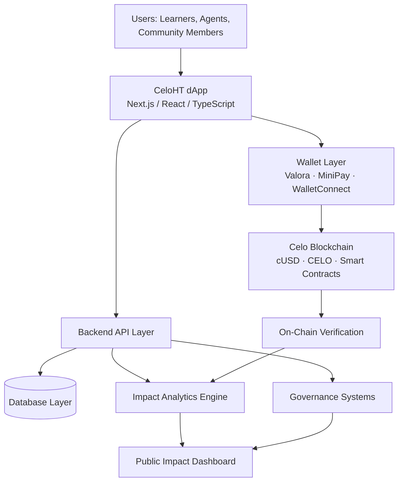
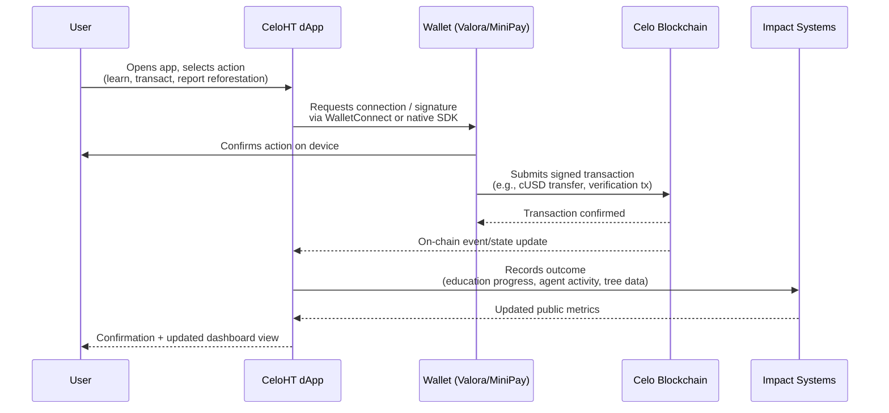
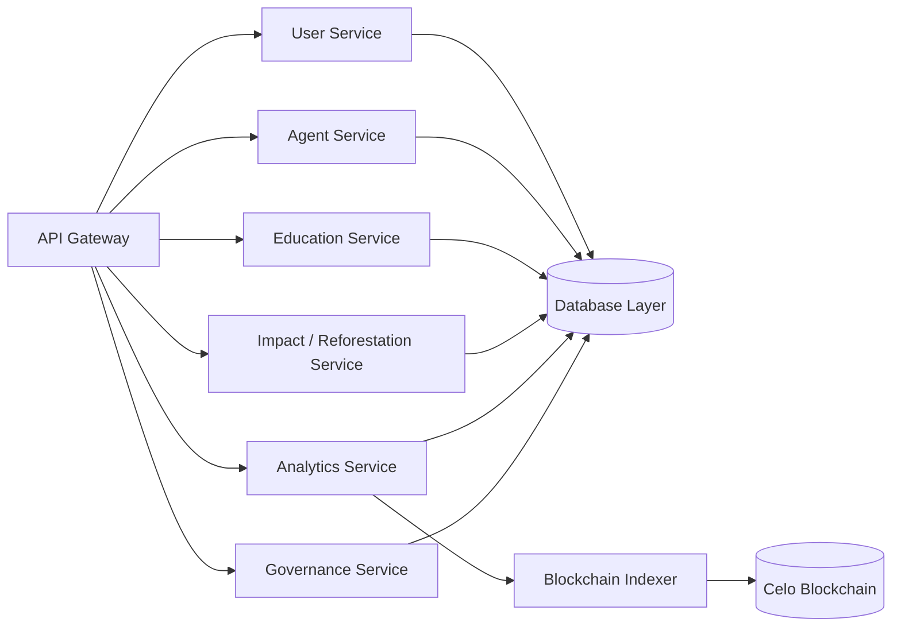
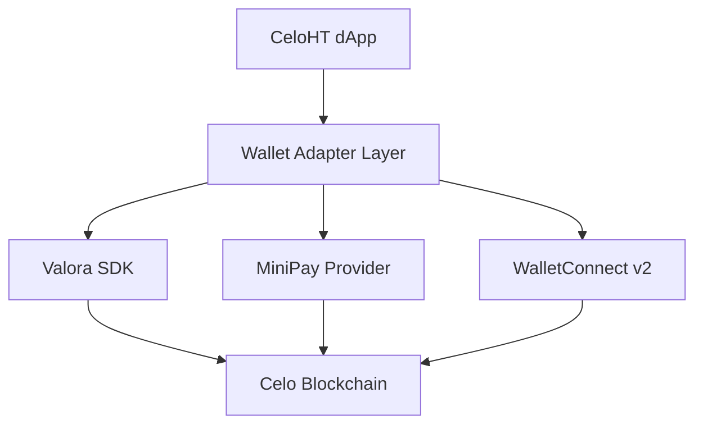
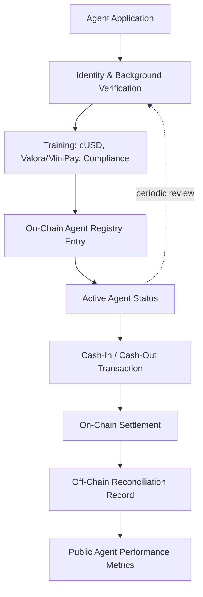
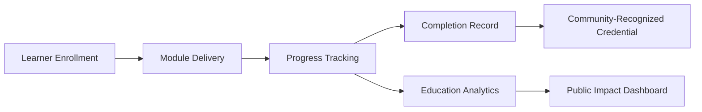
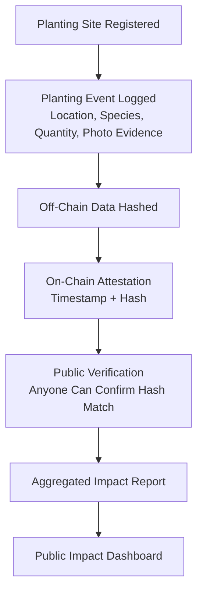
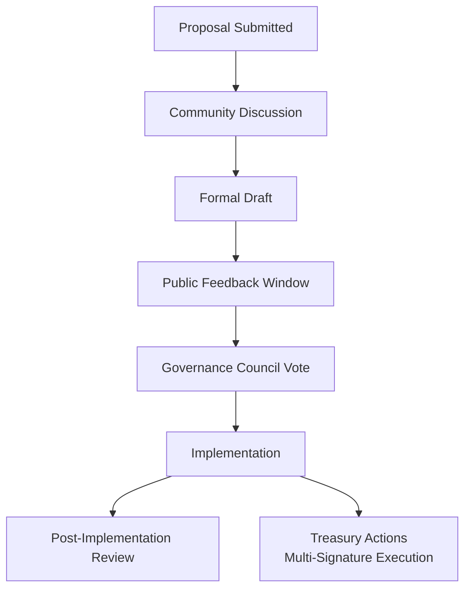
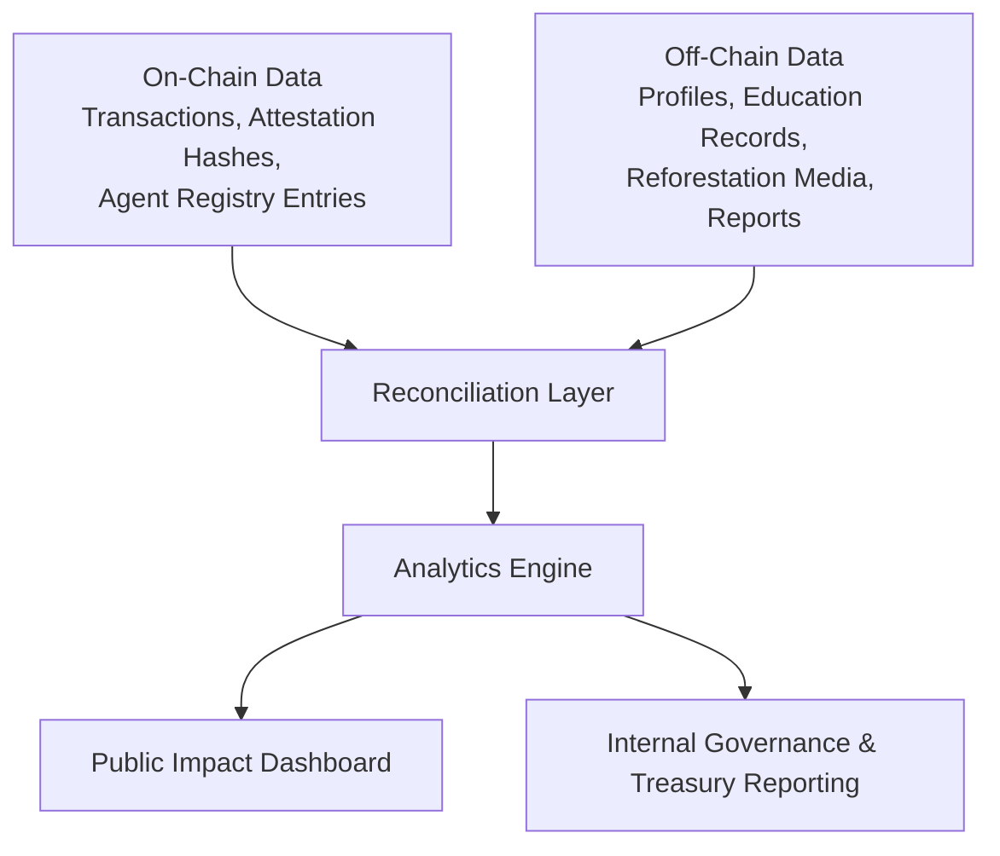
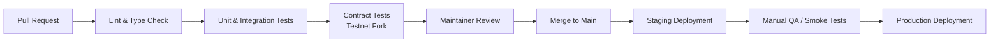

# CeloHT Architecture

**Version 1.0 · August 2026**

This document describes the technical architecture of CeloHT, an open-source Web3 impact ecosystem built on the Celo blockchain. It is intended for developers contributing to the codebase, grant reviewers and partners evaluating technical maturity, and community members who want to understand how CeloHT's systems fit together.

CeloHT does not have a token, a DAO, or an investment product. Blockchain infrastructure in this project is used exclusively as **rails for inclusion, education, and transparency** — enabling low-cost stable-value transactions, verifiable public-good reporting, and community-governed operations. Every design decision in this document is made in service of that principle.

---

## Table of Contents

1. [Introduction](#1-introduction)
2. [System Overview](#2-system-overview)
3. [Ecosystem Architecture](#3-ecosystem-architecture)
4. [Frontend Architecture](#4-frontend-architecture)
5. [Backend Architecture](#5-backend-architecture)
6. [Blockchain Layer](#6-blockchain-layer)
7. [Wallet Architecture](#7-wallet-architecture)
8. [Agent Network Architecture](#8-agent-network-architecture)
9. [Education Platform Architecture](#9-education-platform-architecture)
10. [Reforestation Impact Architecture](#10-reforestation-impact-architecture)
11. [Governance Architecture](#11-governance-architecture)
12. [Security Architecture](#12-security-architecture)
13. [Data Architecture](#13-data-architecture)
14. [Deployment Architecture](#14-deployment-architecture)
15. [Scalability Roadmap](#15-scalability-roadmap)
16. [Appendix: Technology Stack Summary](#16-appendix-technology-stack-summary)

---

## 1. Introduction

### 1.1 Purpose

This document exists to give any technical or non-technical reader — a contributor opening their first pull request, a grant committee assessing production-readiness, or a partner organization deciding whether to integrate — a single, authoritative view of how CeloHT is built. It documents current architecture as well as the design principles that constrain future changes, so that CeloHT's technical direction stays coherent as the contributor base grows.

### 1.2 Vision

CeloHT's core thesis is that blockchain technology delivers the most value to underserved communities not as a speculative asset class, but as **low-cost, borderless payment and settlement infrastructure** paired with **transparent, verifiable record-keeping**. The Celo blockchain was purpose-built for mobile-first, stablecoin-based financial access, which makes it a natural foundation for CeloHT's three pillars:

- **Education** uses blockchain concepts as literacy content and cUSD/Valora as hands-on practice tools.
- **Agent Network** uses Celo's low transaction costs and mobile-number-mapped wallets to make cash-in/cash-out genuinely usable in Haiti and the wider Caribbean.
- **Reforestation** uses on-chain and public off-chain records to make environmental impact claims independently verifiable rather than self-reported.

Every architectural layer described below is designed to make these three pillars reliable, auditable, and extensible — not to build a financial product for speculation.

---

## 2. System Overview

CeloHT is composed of five cooperating layers: the **user-facing dApp**, a **backend services layer**, the **Celo blockchain layer**, **wallet infrastructure**, and the **impact systems** that record education, agent, and reforestation outcomes.

At a glance:

| Layer | Primary responsibility | Core technologies |
|---|---|---|
| Frontend (dApp) | User interface, wallet connection, UX | Next.js, React, TypeScript, Tailwind CSS, shadcn/ui |
| Wallet Layer | Signing, custody, transaction initiation | Valora, MiniPay, WalletConnect |
| Blockchain Layer | Settlement, verification, optional smart contracts | Celo, cUSD, CELO, EVM |
| Backend Layer | APIs, data persistence, business logic | REST/GraphQL API, relational database, service modules |
| Impact Systems | Education records, agent activity, reforestation tracking | Analytics engine, public dashboard, on-chain verification |
| Governance Layer | Community decision-making, treasury oversight | Governance Council, Working Groups, proposal system |

---

## 3. Ecosystem Architecture

The end-to-end flow of a typical CeloHT interaction connects five actors in sequence: **Users → CeloHT dApp → Wallets → Celo Blockchain → Impact Systems.**

This flow is intentionally uniform across all three pillars: whether a user is completing a Web3 education module, an agent is processing a cash-in/cash-out transaction, or a community member is logging a reforestation event, the same dApp → wallet → chain → impact-system pipeline applies. This consistency keeps the codebase maintainable and makes it straightforward for new contributors to reason about any part of the system.

---

## 4. Frontend Architecture

### 4.1 User Interface

The CeloHT dApp is built with **Next.js** and **React**, written in **TypeScript** for type safety across a codebase maintained by a distributed contributor base. **Tailwind CSS** and **shadcn/ui** provide a consistent, accessible design system, keeping the visual language aligned with CeloHT's navy-and-gold brand identity while minimizing custom CSS maintenance burden.

### 4.2 Mobile-First Design

Given that the overwhelming majority of CeloHT's target users access the internet primarily through mobile devices, and that Valora and MiniPay are themselves mobile-native wallets, the dApp is built mobile-first:

- Layouts are designed at mobile breakpoints first, then progressively enhanced for tablet and desktop.
- Critical flows (wallet connect, cUSD transfer, education module completion, reforestation reporting) are optimized for low-bandwidth conditions and lightweight asset loading.
- Interface text defaults to Haitian Creole, with English as a secondary language, reflecting CeloHT's language-equity principle.

### 4.3 Wallet Connection

The frontend integrates wallet connectivity through a unified connection abstraction that supports:

- **Valora** — deep-link and QR-based connection for full-featured mobile users.
- **MiniPay** — lightweight, embedded-wallet connection optimized for feature-constrained devices and data-light regions.
- **WalletConnect** — a fallback standard protocol enabling any compatible wallet to connect.

This abstraction means new wallet providers can be added without rewriting core application logic (see Section 7).

### 4.4 User Experience Principles

- **Clarity over cleverness:** financial actions (sending cUSD, verifying an agent transaction) always show a plain-language confirmation before submission.
- **Progressive disclosure:** advanced blockchain concepts (gas fees, transaction hashes) are available but not forced on first-time users.
- **Offline resilience:** where possible, education content is cacheable for low-connectivity environments, syncing progress once connectivity resumes.

---

## 5. Backend Architecture

### 5.1 API Layer

The backend exposes a versioned API layer that mediates all interaction between the frontend, the database, and blockchain-derived data. The API layer is organized into service domains that mirror the three pillars plus core platform concerns:

### 5.2 Database Layer

CeloHT uses a relational database as the primary system of record for off-chain data — the kind of data that should never live directly on a public blockchain, either for cost, privacy, or mutability reasons. The database stores:

- User and agent profiles and relationship data.
- Education enrollment, progress, and completion records.
- Reforestation project metadata, site records, and reporting submissions.
- Aggregated analytics used to power the public dashboard.

On-chain transaction identifiers (hashes) are stored alongside their corresponding off-chain records, creating a verifiable link between what CeloHT reports and what actually settled on the Celo blockchain (see Section 13).

### 5.3 User Management

User management handles account creation, role assignment (learner, agent, ambassador, contributor), authentication, and profile data, with role-based access enforced at the API layer (see Section 12).

### 5.4 Agent Management

Agent management tracks the agent lifecycle end-to-end: application, verification, active status, transaction history summaries, and performance metrics used for community trust-building (see Section 8).

### 5.5 Education Records

Education services track curriculum structure, module completion, and — where relevant — issuance of completion records that can be referenced by community members, partners, or future employers.

### 5.6 Impact Analytics

The analytics service aggregates data across all three pillars into the metrics that power CeloHT's public dashboard: learners reached, agents active, transaction volume processed for financial-inclusion purposes, trees planted, and reforestation sites active. Analytics jobs run on a scheduled basis and reconcile off-chain records against on-chain verification data.

---

## 6. Blockchain Layer

### 6.1 Why Celo

CeloHT builds on Celo because of its mobile-first design, EVM compatibility, and native stablecoin infrastructure — properties that align directly with the constraints of the communities CeloHT serves: intermittent connectivity, feature-limited devices, and a need for price-stable, low-volatility transaction value.

### 6.2 cUSD Transactions

cUSD is CeloHT's primary unit of account for all in-ecosystem value transfer: agent cash-in/cash-out, remittance support, and any programmatic disbursement (e.g., stipends, reimbursements) the project makes. Using a stablecoin rather than a volatile asset is a deliberate architectural choice: it removes exchange-rate risk from every interaction a learner or agent has with the system.

### 6.3 CELO for Gas

Where a transaction requires network gas, CELO is used strictly as the network's native gas asset — not distributed, marketed, or treated as a CeloHT-issued asset. CeloHT does not mint, issue, or govern any token.

### 6.4 Smart Contracts

Smart contracts are used selectively, only where on-chain logic provides a genuine trust or transparency benefit that off-chain logic cannot, for example:

- **Agent verification registries** — an on-chain record that a given wallet address has completed CeloHT's agent verification process, queryable by anyone.
- **Reforestation impact attestations** — lightweight on-chain records anchoring off-chain reforestation reports to an immutable timestamp and hash, so reported impact cannot be silently altered after publication.

CeloHT deliberately avoids unnecessary on-chain complexity: contracts are kept minimal, audited (Section 12), and used only where they measurably improve verifiability over a purely off-chain approach.

### 6.5 Blockchain Verification

All cUSD transactions relevant to agent activity or programmatic disbursement are indexed by a blockchain indexer service, which reconciles on-chain transaction data against off-chain records nightly, flagging any discrepancy for manual Working Group review.

---

## 7. Wallet Architecture

CeloHT does not implement custodial wallet infrastructure. All value custody and transaction signing happen in the user's own wallet, consistent with self-custody best practice and CeloHT's non-custodial design principle.

### 7.1 Valora Integration

Valora is CeloHT's primary recommended wallet for learners and agents who want full wallet functionality: phone-number-based address resolution, in-app cUSD balance visibility, and a mature, audited mobile application.

### 7.2 MiniPay Integration

MiniPay's lightweight, embedded design makes it well suited for the lower end of the device spectrum common among CeloHT's target communities, minimizing onboarding friction for first-time crypto-wallet users.

### 7.3 WalletConnect Support

WalletConnect provides a standards-based fallback, ensuring CeloHT remains interoperable with the broader Celo and EVM wallet ecosystem rather than locking users into a single provider — an explicit architectural commitment to openness.

---

## 8. Agent Network Architecture

The Agent Network is CeloHT's human-infrastructure layer: verified community members who provide cUSD cash-in/cash-out services, bridging digital value to physical cash in communities where that bridge is otherwise unavailable.

### 8.1 Agent Onboarding

Prospective agents apply through the dApp or a designated Working Group intake process, providing identity information and completing CeloHT's financial-inclusion and compliance training modules (shared infrastructure with the Education platform, Section 9).

### 8.2 Verification

Verification combines off-chain identity/background checks (managed by the Agent Network Working Group) with an on-chain registry entry that publicly attests to an agent's verified status, allowing any community member to confirm an agent's legitimacy independently.

### 8.3 Cash-In/Cash-Out Workflow

1. A community member requests to convert cash to cUSD (cash-in) or cUSD to cash (cash-out) with a verified agent.
2. The agent initiates the transaction through the dApp, which routes the cUSD leg through the user's connected wallet.
3. The transaction settles on the Celo blockchain and is confirmed within seconds.
4. Both parties receive an in-app confirmation; the transaction is reconciled against off-chain records for the agent's activity history and community-facing performance metrics (never exposing sensitive personal data publicly).

---

## 9. Education Platform Architecture

The Education pillar delivers structured Web3, financial-literacy, and digital-skills curriculum, including CeloHT Academy content, directly through the dApp and complementary offline-friendly formats (e.g., downloadable materials).

### 9.1 Learning System

Curriculum content (including cUSD/Valora hands-on modules) is versioned alongside the documentation hub, ensuring learning material and product functionality never drift out of sync.

### 9.2 Training Records

Individual progress and completion data are stored in the education database and are available to the learner at all times; aggregate (non-identifying) statistics feed the public dashboard.

### 9.3 Community Education

Workshops and in-person community sessions are logged through the same Education service, giving CeloHT a unified view of both digital and in-person educational reach across the three pillars.

---

## 10. Reforestation Impact Architecture

Reforestation is CeloHT's environmental pillar, engineered from the outset for independently verifiable impact reporting rather than self-reported claims alone.

### 10.1 Impact Tracking

Each reforestation event is logged with location, species, quantity, participating community members, and photo evidence, stored off-chain for practical reasons (file size, privacy of participant images).

### 10.2 Tree Planting Verification

A cryptographic hash of each reforestation report is anchored on-chain, creating a tamper-evident timestamp. Anyone can independently recompute the hash of a published report and confirm it matches the on-chain record — providing verifiability without requiring the underlying media itself to live on-chain.

### 10.3 Reporting System

Aggregated reforestation metrics (trees planted, sites active, hectares restored) feed the same public dashboard used by the Education and Agent Network pillars, giving funders and partners a single, consistent place to verify impact across all of CeloHT's work.

---

## 11. Governance Architecture

CeloHT's technical architecture is built to support — not circumvent — the community governance model defined in `GOVERNANCE.md`. This section describes how governance concepts are represented in the system.

### 11.1 Community Decisions

Governance-relevant application data — proposal records, vote outcomes, meeting note links — are stored and served through the Governance Service (Section 5.1), giving the community a searchable, permanent record of decisions independent of any single maintainer's memory.

### 11.2 Proposal Process

The proposal lifecycle (idea → discussion → draft → feedback → vote → implementation → review) defined in `GOVERNANCE.md` is mirrored in the dApp's Governance module, so proposals can be tracked with the same rigor as a software release.

### 11.3 Voting Mechanisms

Voting is conducted through governance tooling operated by the Governance Council and is explicitly **not** implemented as on-chain token voting. Eligibility and thresholds follow the roles and rules defined in `GOVERNANCE.md`, keeping governance legally simple and free of token-based mechanics.

---

## 12. Security Architecture

### 12.1 Security Principles

- **Least privilege by default:** every role, service credential, and API key is scoped to the minimum access required.
- **No single point of failure for funds:** treasury operations always require multiple independent approvals.
- **Public verifiability where it matters:** impact and agent-verification data are designed to be checkable by outside parties, not just trusted internally.
- **Assume components will be attacked:** security review is built into the development process, not bolted on afterward.

### 12.2 Treasury Protection

CeloHT treasury funds are held under **multi-signature control**, requiring multiple independent, named signers to approve any disbursement above the operational thresholds defined in `GOVERNANCE.md`. No individual — including the Founder — can unilaterally move treasury funds.

### 12.3 Access Control

The backend enforces **role-based access control (RBAC)** across all services: learner, agent, contributor, maintainer, Working Group lead, and Council roles each have explicitly defined API permissions, checked on every request rather than inferred from client-side state.

### 12.4 Code Review Process

All code changes require review from at least one Maintainer before merge; changes touching smart contracts or fund-related logic require review from two Maintainers with relevant expertise, consistent with `GOVERNANCE.md` Section 13.

### 12.5 CI/CD Pipeline

Every pull request triggers an automated pipeline running linting, type checks, unit tests, and (for contract changes) test-suite execution against a local Celo testnet fork before a human review is requested.

### 12.6 Security Audits

Smart contracts are subject to independent security review before mainnet deployment, and material contract changes trigger a re-review. Audit summaries are published for community and partner visibility.

### 12.7 Incident Response

Security incidents follow the Emergency Decision process defined in `GOVERNANCE.md` Section 4.5 and Section 12: immediate containment by available Maintainers, public disclosure within 72 hours, and full Governance Council ratification within 14 days.

---

## 13. Data Architecture

CeloHT deliberately separates data into three tiers, each with different guarantees and appropriate handling:

### 13.1 On-Chain Data

Limited strictly to what genuinely benefits from public immutability: cUSD transaction settlement, agent verification registry entries, and reforestation-report attestation hashes. CeloHT deliberately keeps on-chain data minimal to control gas costs and avoid placing personal data on a public ledger.

### 13.2 Off-Chain Data

The majority of CeloHT's data — user profiles, education progress, reforestation media, governance records — lives in the off-chain database, where it can be efficiently queried, updated, and where appropriate, kept private.

### 13.3 Analytics Dashboard

The analytics engine reconciles on-chain and off-chain data nightly and publishes aggregate, non-identifying metrics to the public Impact Dashboard, giving funders, partners, and the community a live view of CeloHT's reach across all three pillars.

---

## 14. Deployment Architecture

### 14.1 GitHub Workflow

CeloHT's repositories follow a standard branch-based workflow: feature branches, pull requests against `main` (or a `develop` integration branch where applicable), mandatory review, and protected branches on production repositories (governance, dApp monorepo, smart contracts package).

### 14.2 CI/CD

### 14.3 Testing

Testing spans unit tests (business logic), integration tests (API and database interaction), and contract tests executed against a local or forked Celo testnet, ensuring on-chain logic is validated before any mainnet exposure.

### 14.4 Production Deployment

Production deployments are gated behind successful staging verification and, for contract changes, prior security review (Section 12.6). Release notes are published for every production deployment, consistent with the Transparency Policy in `GOVERNANCE.md`.

---

## 15. Scalability Roadmap

CeloHT's architecture is designed to scale along five dimensions without compromising its non-token, community-governed identity:

| Dimension | Current focus | Scaling approach |
|---|---|---|
| **More communities** | Léogâne and surrounding communes, Haiti | Modular Working Group and Ambassador structure (see `GOVERNANCE.md`) replicable to new communes and, over time, other Caribbean nations |
| **More agents** | Initial verified agent cohort | On-chain registry and standardized onboarding pipeline (Section 8) designed to onboard agents at scale without re-architecting core systems |
| **More countries** | Haiti-first | Localization-ready frontend (language and currency-display abstraction) and jurisdiction-aware Legal Working Group review before expansion |
| **More developers** | Founder-led core contributor group | Public RFC process, documented architecture (this document), and a documentation hub designed to be a top-tier onboarding resource for new open-source contributors |
| **More partnerships** | Early grant and NGO partnerships | Standardized MOU and partnership-approval workflow (`GOVERNANCE.md` Section 19) and a public Impact Dashboard that lets partners independently verify claims before and after committing funding |

As each dimension scales, the same architectural principles apply: minimal on-chain footprint, transparent off-chain reconciliation, role-based access control, and governance-first decision-making — ensuring CeloHT can grow from a single-region pilot into a regional financial-inclusion and environmental-impact ecosystem without sacrificing auditability or community trust.

---

## 16. Appendix: Technology Stack Summary

| Layer | Technologies |
|---|---|
| Blockchain | Celo, cUSD, CELO, EVM-compatible smart contracts |
| Frontend | Next.js, React, TypeScript, Tailwind CSS, shadcn/ui |
| Wallets | Valora, MiniPay, WalletConnect |
| Backend | REST/GraphQL API, relational database, service-oriented architecture |
| Analytics | Blockchain indexer, scheduled reconciliation jobs, public dashboard |
| CI/CD | Automated linting, testing, testnet contract validation, staged deployment |
| Governance tooling | Proposal tracking, vote recording, multi-signature treasury execution |

---

*This document is maintained alongside `GOVERNANCE.md` in the CeloHT governance repository. Technical questions should be raised as a GitHub Discussion or RFC in the relevant repository. This architecture will evolve through the same RFC and review process it describes — proposed changes to this document should be submitted as a Technical or Governance proposal per `GOVERNANCE.md`.*
