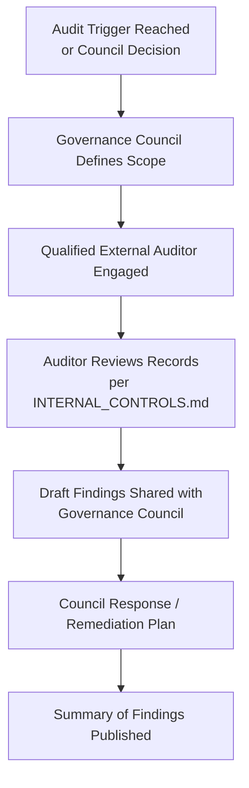

# CeloHT Audit Policy

**Version:** 1.0
**Last Updated:** August 2026
**Status:** Active

---

## Purpose

This document defines CeloHT's approach to internal review and external audit of its financial activity, including when an independent audit is triggered, how findings are published, and how CeloHT prepares for and cooperates with review. It is intended to give donors, grant reviewers, and partners a clear picture of CeloHT's current audit status and its planned trajectory, without overstating what has already occurred.

## Scope

This policy applies to all internal financial reviews and any external audit or independent review of CeloHT's treasury, financial reports, or internal controls.

## Responsibilities

| Role | Audit Policy Responsibility |
|---|---|
| Governance Council | Commissions and approves external audits; reviews findings |
| Finance Working Group | Prepares records and supports auditor requests |
| Treasury Committee | Provides treasury records and custody confirmations to auditors |

## Review Schedule

Reviewed annually per `GOVERNANCE.md` Section 21, and immediately following completion of any external audit or independent review.

---

## 1. Internal Review

- The Finance Working Group performs periodic internal reconciliation of treasury records against on-chain transaction data, consistent with `INTERNAL_CONTROLS.md` Section 5.
- The Governance Council may commission an ad hoc internal review of any financial matter at its discretion, independent of the scheduled external audit trigger described in Section 2.
- Internal review findings that identify a control weakness or discrepancy are addressed through a documented remediation plan, tracked to completion.

## 2. External Audit Framework

Consistent with `LEGAL_STATUS.md` Section 8, CeloHT commits to an annual independent financial review once its annual treasury flow exceeds $50,000 USD-equivalent, conducted by a qualified third party.

- Below this threshold, CeloHT may still commission an independent review voluntarily, at the Governance Council's discretion, particularly where requested by a major grant-making partner as a condition of funding.
- The scope of an external audit or review is defined by the Governance Council in consultation with the engaged auditor and, where applicable, the requesting partner.
- As of this document's publication date, CeloHT has not yet reached the independent-review threshold and has not yet undergone an external audit. This is stated explicitly rather than implied otherwise.

## 3. Independent Review Process

- The auditor engaged is independent of CeloHT's Governance Council, Treasury Committee, and any related party, consistent with the conflict-of-interest principles in `CONFLICT_OF_INTEREST_FINANCE.md`.
- The Governance Council responds to draft findings and, where a finding requires remediation, documents a remediation plan before the audit is considered closed.

## 4. Publication of Findings

- A summary of audit or independent review findings is published in CeloHT's documentation hub, consistent with the Transparency Policy in `GOVERNANCE.md` Section 18.
- Publication includes, at minimum: the scope of the review, the reviewing party (where the reviewing party consents to being named), key findings, and any remediation plan adopted.
- Where a finding involves sensitive information (for example, a security vulnerability under active remediation), publication follows the responsible-disclosure timing principles in `GOVERNANCE.md` Section 12.1, disclosing that a finding exists and is being addressed even where full technical detail is delayed.
- CeloHT does not publish a review or audit as "completed" or "clean" unless the underlying review has actually occurred and concluded; until then, audit status is reported as "Not Yet Available" in `FINANCIAL_REPORTS.md`.

---

*This document is maintained alongside `GOVERNANCE.md`, `LEGAL_STATUS.md`, `INTERNAL_CONTROLS.md`, `FINANCIAL_TRANSPARENCY.md`, and `FINANCIAL_REPORTS.md` in the CeloHT governance repository.*
