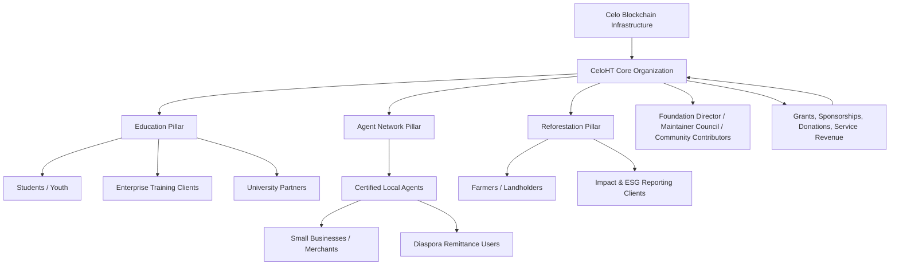
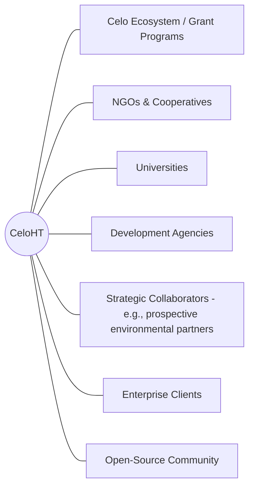
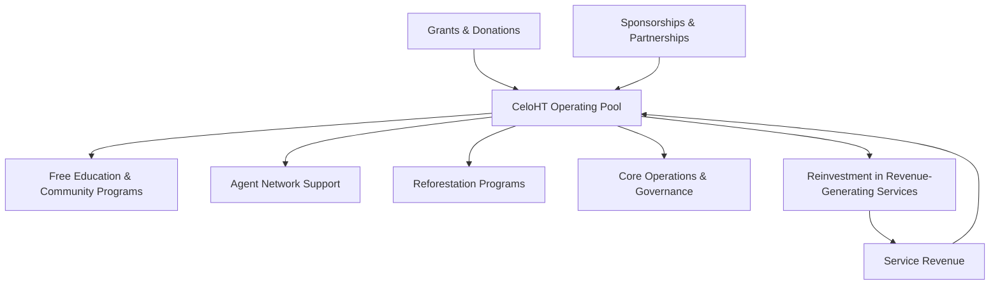
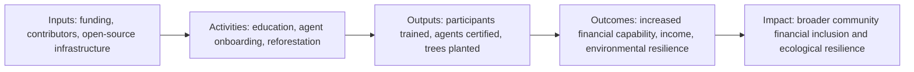
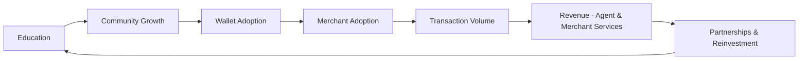
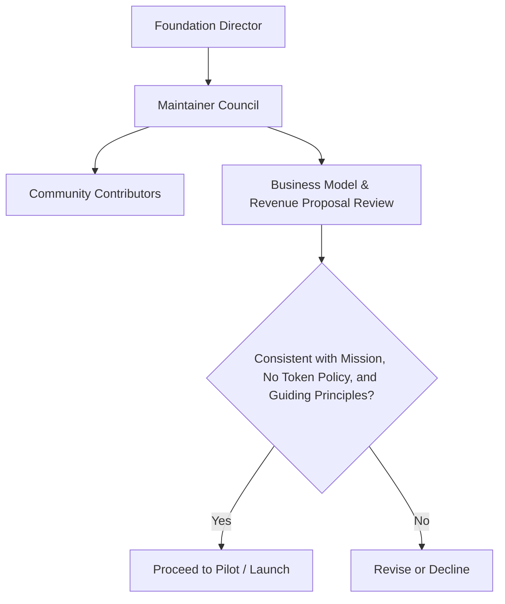

# CeloHT Business Model

**Document Type:** Strategic & Financial Governance Document
**Applies To:** CeloHT (Celo-HT) and all affiliated repositories under github.com/Celo-HT
**License:** Apache 2.0 (this document, unless otherwise noted)
**Status:** Active
**Version:** 1.0.0
**Effective Date:** 2026
**Maintained By:** CeloHT Maintainer Council, under the authority of the Foundation Director
**Contact:** contact@celoht.com | partnerships@celoht.com

> **Compliance Note:** The key words **MUST**, **MUST NOT**, **SHOULD**, **SHOULD NOT**, and **MAY** are used per [RFC 2119](https://www.ietf.org/rfc/rfc2119.txt) where obligations are stated. This document is a strategic and educational reference. It is **not** an investment prospectus, offering memorandum, or solicitation of securities. See [Compliance & Legal Framing](#29-compliance--legal-framing).

---

## Table of Contents

1. [Executive Summary](#1-executive-summary)
2. [Mission](#2-mission)
3. [Vision](#3-vision)
4. [Problem Statement](#4-problem-statement)
5. [Market Opportunity](#5-market-opportunity)
6. [Why CeloHT Exists](#6-why-celoht-exists)
7. [Hybrid Business Model Overview](#7-hybrid-business-model-overview)
8. [Business Model Canvas](#8-business-model-canvas)
9. [Ecosystem Architecture](#9-ecosystem-architecture)
10. [Stakeholder Map](#10-stakeholder-map)
11. [Value Proposition](#11-value-proposition)
12. [Customer Segments](#12-customer-segments)
13. [Community Segments](#13-community-segments)
14. [Partner Ecosystem](#14-partner-ecosystem)
15. [Revenue Streams](#15-revenue-streams)
16. [Cost Structure](#16-cost-structure)
17. [Unit Economics](#17-unit-economics)
18. [Financial Sustainability Strategy](#18-financial-sustainability-strategy)
19. [Revenue Diversification Strategy](#19-revenue-diversification-strategy)
20. [Social Impact Model](#20-social-impact-model)
21. [Growth Strategy](#21-growth-strategy)
22. [Go-to-Market Strategy](#22-go-to-market-strategy)
23. [Scaling Strategy](#23-scaling-strategy)
24. [Risk Analysis](#24-risk-analysis)
25. [Competitive Positioning](#25-competitive-positioning)
26. [SWOT Analysis](#26-swot-analysis)
27. [KPIs](#27-kpis)
28. [Financial Principles](#28-financial-principles)
29. [Compliance & Legal Framing](#29-compliance--legal-framing)
30. [Governance Alignment](#30-governance-alignment)
31. [Long-Term Vision](#31-long-term-vision)
32. [References to Related Governance Documents](#32-references-to-related-governance-documents)

---

## 1. Executive Summary

CeloHT is an open-source, community-governed Web3 initiative built on the Celo blockchain, headquartered in Léogâne, Haiti. Its mission spans three pillars — **Education**, **Agent Network**, and **Reforestation** — united by a single goal: expanding financial inclusion and digital opportunity for underserved communities while protecting the environments those communities depend on.

This document defines CeloHT's **Hybrid Business Model**: an operating structure that deliberately separates *social impact activities* (free education, community governance, open-source infrastructure, reforestation) from *revenue-generating activities* (certifications, enterprise consulting, merchant tools, developer infrastructure) — while ensuring the latter always funds and reinforces the former, never replaces it.

CeloHT does **not** issue a native token, does **not** promise financial returns, and does **not** operate as an investment vehicle. Its economic model is built on **service-based revenue**, **grant and philanthropic funding**, and **ecosystem partnerships**, following patterns used by respected open-source foundations (e.g., Linux Foundation, Mozilla, OpenSSF) rather than speculative token economies.

The model is currently in **Phase 1 (Foundation)**, transitioning toward **Phase 2 (Validation)**, where the priority is proving that a small set of revenue mechanisms can begin covering a growing share of operating costs without compromising CeloHT's free, mission-first offerings. All financial figures in this document are illustrative frameworks and placeholders, intended to be replaced with real operating data as CeloHT matures — consistent with CeloHT's standing rule against inventing unsupported figures.

---

## 2. Mission

CeloHT exists to expand **financial inclusion**, **Web3 literacy**, and **environmental stewardship** in Haiti and comparable communities, using the Celo blockchain's low-cost, mobile-first infrastructure and the existing cUSD stablecoin — without issuing any new token, security, or speculative asset.

---

## 3. Vision

A future in which any community member — regardless of banking access, formal education, or income level — can learn digital-asset literacy, transact in stable digital currency through a trusted local agent, and participate in community-led environmental restoration, within a governance model they can see, question, and influence.

---

## 4. Problem Statement

| Problem | Manifestation | Consequence |
|---|---|---|
| **Limited banking access** | Large share of the population lacks reliable access to formal banking infrastructure | Cash-dependent economy, high friction for savings, remittances, and payments |
| **Low Web3 / digital-asset literacy** | Blockchain and stablecoin concepts are unfamiliar or associated with speculation and scams | Slow, distrustful adoption of genuinely useful tools like stablecoin remittances |
| **Remittance friction** | Diaspora-to-family transfers pass through costly, slow intermediaries | Value lost to fees; delays in urgent transfers |
| **Environmental degradation** | Deforestation pressures in Haiti reduce agricultural resilience and increase disaster vulnerability | Compounding economic and ecological harm in the same communities CeloHT serves |
| **Fragmented, opaque Web3 education** | Existing crypto education is often promotional, token-focused, or inaccessible in Haitian Creole | Communities miss genuinely useful tools, or are exposed to token speculation risk instead |
| **Weak trust infrastructure for on/off ramps** | Converting cash to cUSD and back requires a trusted human interface, which is scarce | Low practical usability of stablecoin tools despite technical availability |

CeloHT's three pillars map directly onto this problem set: **Education** addresses literacy and trust; the **Agent Network** addresses the cash↔cUSD conversion gap; **Reforestation** addresses environmental resilience.

---

## 5. Market Opportunity

CeloHT operates at the intersection of four converging trends:

1. **Mobile-first stablecoin adoption** in emerging markets, where stablecoins increasingly serve as a practical hedge against currency instability and a low-cost remittance rail.
2. **Growth of the Celo ecosystem** as a mobile-first, low-fee blockchain designed explicitly for financial-inclusion use cases.
3. **Rising institutional interest in open-source, non-speculative Web3 public goods** — reflected in ecosystem grant programs, climate-tech funding, and digital-inclusion donor priorities.
4. **Demand for verifiable, transparent environmental and social impact reporting**, which favors organizations (like CeloHT) that combine on-chain transparency with community governance.

CeloHT does not claim a specific quantified market size in this document; any total-addressable-market figures used in fundraising materials **MUST** be sourced from cited, dated third-party research at the time of use, not asserted here.

---

## 6. Why CeloHT Exists

CeloHT exists because the communities it serves are simultaneously **underserved by traditional finance** and **over-targeted by speculative crypto products**. CeloHT's founding premise is that the two goals — genuine financial inclusion and responsible blockchain adoption — require an organization that:

- Refuses to issue a token or promise returns, removing the speculative incentive that distorts most crypto education.
- Is structured for community governance rather than founder or investor control.
- Builds revenue mechanisms that fund the mission rather than mechanisms (like token sales) that could compromise it.

---

## 7. Hybrid Business Model Overview

CeloHT's Hybrid Business Model rests on a strict separation between two activity types, connected by a single funding relationship: **revenue-generating activities fund social-impact activities; social-impact activities create the community, trust, and pipeline that make revenue-generating activities possible.**

**Core rule:** No revenue-generating activity MAY restrict access to CeloHT's core free educational content, wallet onboarding support, or governance participation. Monetization applies to *advanced, optional, or enterprise-tier* services layered on top of a permanently free foundation.

---

## 8. Business Model Canvas

| Block | Summary |
|---|---|
| **Key Partners** | Celo Foundation & ecosystem grant programs; local NGOs and cooperatives; educational institutions; development agencies; strategic collaborators (e.g., FreClean, subject to formal agreement per CeloHT's Partnerships Policy) |
| **Key Activities** | Curriculum development; agent recruitment & certification; open-source software development; reforestation program design; community governance facilitation |
| **Key Resources** | Open-source codebase (Apache 2.0); brand and documentation assets; trained agent network; Maintainer Council governance capacity; Celo blockchain infrastructure |
| **Value Propositions** | Free, trustworthy Web3/financial education in Haitian Creole; accessible cash↔cUSD conversion via local agents; transparent, non-speculative blockchain adoption; measurable environmental impact |
| **Customer Relationships** | Community-based trust via local agents; self-service education content; direct enterprise engagement for consulting/reporting services |
| **Channels** | celoht.com; GitHub organization; local agent network; community workshops; social media (@CeloHT / celohtofficial); partner institutions |
| **Customer Segments** | Individuals (students, youth, women entrepreneurs, farmers, merchants, diaspora); Institutions (NGOs, universities, enterprises, development agencies) |
| **Cost Structure** | Personnel/contributor stipends; curriculum & content production; agent network support tooling; governance operations; reforestation program costs; infrastructure hosting |
| **Revenue Streams** | Certifications; enterprise consulting; merchant tools; developer platform subscriptions; agent premium services; ESG/impact reporting; grants, sponsorships, donations |

---

## 9. Ecosystem Architecture

---

## 10. Stakeholder Map

| Stakeholder Group | Primary Interest | CeloHT's Commitment |
|---|---|---|
| Students & youth | Free, accessible education | No-cost core curriculum, Creole-language delivery |
| Women entrepreneurs | Economic opportunity, safe onboarding | Agent network support, non-predatory tools |
| Farmers / landholders | Environmental resilience, fair collaboration | Transparent reforestation program design |
| Merchants | Reliable payment tooling | Merchant dashboards, agent support |
| Diaspora communities | Low-cost, fast remittance-adjacent tools | Education on cUSD/Valora usage; no token speculation |
| Local agents | Fair compensation, professional growth | Certification pathway, service-fee model (Phase 3+) |
| NGOs / development agencies | Verifiable, measurable social impact | Public KPI reporting, transparent governance |
| Universities | Credible curricular partnership | Structured education partnerships, no promotional bias |
| Enterprises | Practical blockchain/stablecoin integration expertise | Non-speculative consulting grounded in the No Token Policy |
| Grant-making foundations | Responsible stewardship of funds | Financial transparency per governance documentation |
| Open-source community | Genuine public-goods contribution | Apache 2.0 licensing, public repositories, CI-verified quality |
| Maintainer Council / contributors | Sustainable, well-governed organization | Diversified funding reducing single-point dependency |

---

## 11. Value Proposition

**For individuals:** CeloHT converts an unfamiliar, often distrusted technology (blockchain/stablecoins) into a practical, locally supported tool for saving, transacting, and learning — without asking anyone to buy a token or speculate.

**For institutions:** CeloHT offers a credible, transparent, community-governed partner for financial-inclusion and climate-resilience programming, with open-source infrastructure that can be audited rather than taken on faith.

**For the Celo ecosystem:** CeloHT is a real-world adoption channel that demonstrates stablecoin utility in an underserved market, strengthening the ecosystem's public-goods narrative.

---

## 12. Customer Segments

| Segment | Description | Primary Offering |
|---|---|---|
| Individual learners | Students, youth, general public | Free core education; paid certifications (optional, advanced) |
| Women entrepreneurs | Small business owners seeking digital tools | Agent onboarding, merchant tools |
| Farmers | Rural landholders | Reforestation program participation |
| Merchants / small businesses | Local commerce accepting digital payments | Business dashboards, analytics, agent support |
| Diaspora individuals | Haitians abroad supporting family | Education on stablecoin transfer mechanics via Valora |
| Enterprises | Companies exploring blockchain/payments integration | Consulting, smart-contract advisory, digital transformation support |
| Universities | Academic institutions | Curriculum licensing, guest instruction, joint research |
| NGOs / development agencies | Program implementers and funders | Impact reporting, co-designed programs |
| Developers | Builders on Celo or CeloHT infrastructure | APIs, SDKs, documentation, infrastructure subscriptions |

---

## 13. Community Segments

Distinct from paying customer segments, CeloHT's **community segments** represent the people the mission exists to serve, most of whom will never be direct revenue sources:

- Community Contributors (open-source volunteers, translators, local organizers)
- Workshop participants and free-tier learners
- Agents in training (pre-certification)
- Reforestation program participants
- General social-media audience (@CeloHT / celohtofficial)

CeloHT's business model MUST NOT be designed in a way that pressures community segments toward monetized tiers; upgrade paths (e.g., free learner → certified professional) MUST remain optional and clearly value-additive.

---

## 14. Partner Ecosystem

Partner relationships are governed by CeloHT's dedicated Partnerships Policy (`PARTNERSHIPS.md`), which defines categories (Confirmed Partner, Strategic Collaborator, Ecosystem Participant, Supporter, Prospective Partner) and due-diligence tiers. This Business Model document references those categories but does not itself confirm or alter any relationship's status.

Illustrative partner category (prospective, unconfirmed): environmental/community-services initiatives such as FreClean MAY, subject to formal due diligence and Maintainer Council approval, become Strategic Collaborators on reforestation-adjacent programming. No such agreement is asserted as active by this document.

---

## 15. Revenue Streams

All revenue streams below are structured as **service fees for optional, advanced, or enterprise-tier offerings** layered on top of CeloHT's permanently free core mission activities. None involve token issuance, staking rewards, or promises of financial return.

### 15.1 Education Services

| Offering | Description | Target Segment |
|---|---|---|
| Professional certifications | Paid, verifiable certification for advanced Web3/financial-literacy coursework | Individuals seeking credentials |
| Corporate training | Custom workshops for company staff | Enterprises |
| University partnerships | Licensed curriculum, joint programs | Academic institutions |
| Premium educational programs | Extended mentorship, cohort-based learning | Motivated individual learners |

### 15.2 Enterprise Services

| Offering | Description |
|---|---|
| Blockchain consulting | Advisory on Celo-based integration, avoiding token-issuance products |
| Stablecoin payment integration | Technical implementation support for cUSD payment flows |
| Digital transformation advisory | Broader digitization strategy for partner organizations |
| Smart contract consulting | Security-conscious Solidity/Hardhat advisory (non-custodial, non-token) |

### 15.3 Merchant Services

| Offering | Description |
|---|---|
| Merchant onboarding (premium tier) | Expedited, supported onboarding beyond the free baseline |
| Business dashboards | Transaction visibility and reconciliation tools |
| Analytics | Aggregated, privacy-respecting sales and customer insight tools |
| Premium business tools | Advanced features for high-volume merchants |

### 15.4 Developer Platform

| Offering | Description |
|---|---|
| APIs | Programmatic access to agent-network and education-content data |
| SDKs | Developer tooling for integrating CeloHT services |
| Developer support services | Paid priority support tiers |
| Infrastructure subscriptions | Hosting/infra services for partner-built tools on CeloHT rails |

### 15.5 Community Agent Network

| Offering | Description |
|---|---|
| Agent certification | Paid professional certification pathway for agents |
| Merchant support packages | Paid premium support tier agents can offer merchants |
| Service commissions | Modest, transparently disclosed commission on agent-facilitated conversions (Phase 3+, only where legally appropriate and clearly disclosed as a service fee, never framed as investment yield) |
| Professional support packages | Ongoing coaching/support subscriptions for top-performing agents |

### 15.6 Impact Services

| Offering | Description |
|---|---|
| ESG reporting | Structured impact reports for donors/partners |
| Blockchain transparency services | On-chain reporting tooling for partner organizations |
| Environmental reporting | Reforestation outcome tracking and verification support |
| Community impact analytics | Aggregated, anonymized outcome data for institutional stakeholders |

### 15.7 Partnerships

| Offering | Description |
|---|---|
| Strategic collaborations | Joint-program cost-sharing arrangements |
| Sponsorships | Recognition-based support per Partnerships Policy Section 25 |
| Grants | Ecosystem and philanthropic grant funding |
| Donations | Individual and institutional giving |

**Mission-reinforcement principle:** Every revenue stream above either (a) directly funds a social-impact activity, (b) trains the workforce (agents, educators) who deliver social-impact activities, or (c) produces transparency artifacts (impact reports) that strengthen trust in the mission. None substitute for or gate the free core offering.

---

## 16. Cost Structure

| Cost Category | Description | Nature |
|---|---|---|
| Contributor stipends / personnel | Compensation for core maintainers, educators, agent trainers | Largely fixed |
| Curriculum & content production | Design and translation of educational materials | Semi-fixed (front-loaded per course) |
| Agent network support tooling | Software/support systems for agents | Semi-fixed |
| Governance operations | Council meetings, documentation, audits | Fixed |
| Reforestation program costs | Seedlings, land coordination, monitoring (pilot phase) | Variable, scales with program size |
| Infrastructure hosting | Website, documentation, CI/CD, APIs | Fixed, low relative to headcount costs |
| Compliance & due diligence | Partnership vetting, legal review | Semi-fixed |
| Marketing & community engagement | Social media, workshops, outreach | Variable |

---

## 17. Unit Economics

> **Note on figures:** All values below are **illustrative placeholders and formulas**, not real financial data. CeloHT MUST replace bracketed placeholders with verified figures before using this section in any external fundraising or reporting context.

### 17.1 Core Formulas

| Metric | Formula |
|---|---|
| **Cost per Trained Participant** | Total education program cost ÷ Number of participants completing the program |
| **Cost to Onboard an Agent** | (Recruitment cost + Training cost + Certification support cost) ÷ Number of agents onboarded |
| **Cost to Acquire a Merchant (CAC)** | Total merchant-acquisition spend (agent time, materials, support) ÷ Number of merchants onboarded |
| **Customer Acquisition Cost (CAC), general** | Total sales & marketing spend for a period ÷ New paying customers acquired in that period |
| **Lifetime Value (LTV)** | Average revenue per customer per period × Average customer lifespan (periods) × Gross margin % |
| **Gross Margin** | (Revenue − Direct cost of delivering the service) ÷ Revenue |
| **Monthly Recurring Revenue (MRR)** | Sum of all recurring revenue (subscriptions, premium services) normalized to a monthly figure |
| **Annual Recurring Revenue (ARR)** | MRR × 12 |
| **Burn Rate** | Total cash outflow − Total cash inflow, measured monthly |
| **Runway** | Current cash reserves ÷ Monthly burn rate |

### 17.2 Illustrative Worked Example (Placeholder Data — Not Actual CeloHT Figures)

| Metric | Illustrative Value | Basis |
|---|---|---|
| Cost per trained participant | **[$X — placeholder]** | (Curriculum cost + facilitator time) ÷ cohort size |
| Cost to onboard an agent | **[$Y — placeholder]** | Training + certification support cost ÷ agents onboarded |
| CAC (merchant) | **[$Z — placeholder]** | Agent outreach time + onboarding materials ÷ merchants signed |
| LTV (certification customer) | **[$L — placeholder]** | Avg. certification revenue × repeat-purchase rate × gross margin |
| LTV : CAC ratio target | **≥ 3:1 (industry rule of thumb, to be validated)** | Standard SaaS/education-sector benchmark, not CeloHT-specific data |
| Gross margin (education services) | **[M% — placeholder]** | (Certification fee − delivery cost) ÷ certification fee |
| MRR (illustrative structure only) | **[$MRR — placeholder]** | Sum of active premium merchant/developer subscriptions |
| ARR | **MRR × 12** | Derived |
| Burn rate | **[$B — placeholder]** | Monthly operating cost − monthly revenue |
| Runway | **[R months — placeholder]** | Reserves ÷ burn rate |

### 17.3 Interpretation Guidance

- CeloHT SHOULD track these metrics **per pillar** (Education, Agent Network, Reforestation-linked services) rather than only in aggregate, since cost and revenue dynamics differ significantly across pillars.
- Because CeloHT is a hybrid organization, **not every activity needs to break even individually** — free education can run at planned "loss" (fully grant/cross-subsidy funded) provided the overall portfolio trends toward the sustainability targets in [Section 18](#18-financial-sustainability-strategy).

---

## 18. Financial Sustainability Strategy

### 18.1 Diversified Funding Principle

CeloHT SHOULD avoid dependency on any single funding source exceeding a prudent concentration threshold (recommended: no more than 40–50% of annual budget from one source once Phase 2 is reached), consistent with standard nonprofit financial-resilience practice.

### 18.2 Illustrative Revenue Allocation Glide Path (Placeholder Targets)

| Phase | Grants & Donations | Service Revenue | Sponsorships/Partnerships |
|---|---|---|---|
| Phase 1 — Foundation (2026 Q2–Q3) | **~80% [placeholder]** | **~5% [placeholder]** | **~15% [placeholder]** |
| Phase 2 — Validation (2026 Q4–2027 Q1) | **~60% [placeholder]** | **~25% [placeholder]** | **~15% [placeholder]** |
| Phase 3 — Growth (2027) | **~40% [placeholder]** | **~45% [placeholder]** | **~15% [placeholder]** |
| Phase 4 — Maturity (2028+) | **~25% [placeholder]** | **~60% [placeholder]** | **~15% [placeholder]** |

> These percentages are **directional planning targets**, not commitments or forecasts, and MUST be replaced with actual historical data as each phase closes, per CeloHT's Financial Transparency obligations (`PARTNERSHIPS.md` Section 23; future `TREASURY.md`).

---

## 19. Revenue Diversification Strategy

1. **Sequencing:** CeloHT SHOULD launch revenue streams in order of lowest operational complexity and risk first — beginning with certifications and sponsorships, progressing toward enterprise consulting and developer-platform subscriptions as technical and governance capacity matures.
2. **Cross-subsidy discipline:** Surpluses from revenue-generating services SHOULD be explicitly earmarked, in financial reporting, toward specific social-impact line items (e.g., "certification revenue funded X reforestation seedlings").
3. **Avoiding mission drift:** Any new revenue stream proposal MUST pass a mission-alignment review (see `PARTNERSHIPS.md` Section 4, Guiding Principles) before launch, confirming it does not compromise the No Token Policy or free-access commitments.
4. **Currency and settlement:** Where practical, CeloHT SHOULD settle service revenue in cUSD to reinforce ecosystem usage and transparency, while maintaining fiat off-ramp capability for operational needs.

---

## 20. Social Impact Model

### 20.1 Theory of Change

### 20.2 Illustrative Impact Metrics (To Be Populated With Real Data)

| Pillar | Output Metric | Outcome Metric |
|---|---|---|
| Education | Participants completing core curriculum | % reporting increased confidence using digital financial tools |
| Agent Network | Certified active agents; merchants onboarded | Volume of cash↔cUSD conversions facilitated |
| Reforestation | Seedlings planted (pilot phase) | Survival rate at 12/24 months |

CeloHT MUST NOT publish impact figures that have not been measured; placeholders in this document MUST NOT be copied into public communications as if they were real results.

---

## 21. Growth Strategy

CeloHT's growth strategy is built around a **self-reinforcing flywheel** connecting its social and commercial activities:

Each turn of the flywheel is intended to lower the marginal cost of the next: a larger educated community reduces onboarding friction for wallets; wallet adoption creates demand agents can serve; agent activity generates modest service revenue; that revenue funds more education and stronger partnerships, restarting the cycle at greater scale.

---

## 22. Go-to-Market Strategy

| Phase | Focus | Primary Channel |
|---|---|---|
| Phase 1 | Local trust-building in Léogâne and surrounding communities | In-person workshops, local agent recruitment |
| Phase 2 | Regional expansion within Haiti; first enterprise/university pilots | Partner referrals, social media, documentation site |
| Phase 3 | National scaling of agent network; developer platform launch | Agent-led growth, API/developer community |
| Phase 4 | Regional (Caribbean/diaspora) expansion; institutional partnerships | Development-agency co-programs, ecosystem grants |

Go-to-market execution MUST remain consistent with the No Token Policy at every phase — no growth tactic MAY rely on speculative incentives, referral rewards framed as investment returns, or token-like point systems that could be construed as unregistered financial instruments.

---

## 23. Scaling Strategy

1. **Agent-led scaling:** The Agent Network is CeloHT's primary physical-world scaling mechanism; growth SHOULD prioritize agent density and quality over raw headcount.
2. **Curriculum modularity:** Education content SHOULD be built as reusable, translatable modules to reduce marginal cost of geographic expansion.
3. **Open-source leverage:** Because CeloHT's code and documentation are Apache 2.0 licensed, other communities or organizations MAY fork and adapt CeloHT's model, extending impact without proportional CeloHT operating cost — a deliberate public-goods scaling lever.
4. **Governance scaling:** As activity grows, the Maintainer Council SHOULD expand deliberately (see `GOVERNANCE.md`) to avoid concentration of decision-making even as the organization grows.

---

## 24. Risk Analysis

| Risk | Likelihood | Impact | Mitigation |
|---|---|---|---|
| Grant funding volatility | Medium | High | Revenue diversification glide path (Section 18) |
| Regulatory uncertainty around stablecoins in target markets | Medium | High | Strict No Token Policy; ongoing compliance monitoring; legal review before new financial products |
| Agent network fraud or misconduct | Low–Medium | High (reputational) | Agent certification, monitoring, Partnerships/Ethics policies |
| Reforestation program underperformance | Medium | Medium | Pilot-phase scoping before scaling; transparent outcome reporting |
| Key-person dependency (Foundation Director / core contributors) | Medium | High | Community governance structure; documented processes; succession planning in `GOVERNANCE.md` |
| Currency/FX volatility affecting local operations | Medium | Medium | cUSD settlement where practical; conservative reserve management |
| Reputational risk from misrepresented partnerships | Low | High | Partnerships Policy due diligence and category discipline |
| Technology risk (smart contract bugs, infra downtime) | Low–Medium | Medium | Standard engineering practices, CI/CD, security disclosure process (`SECURITY.md`) |

---

## 25. Competitive Positioning

CeloHT does not compete primarily with other blockchain projects; it competes for **trust and attention** against both (a) informal/cash-based financial systems and (b) speculative crypto products targeting the same underserved populations.

| Positioning Axis | CeloHT | Typical Token-Based Crypto Project | Traditional Microfinance NGO |
|---|---|---|---|
| Token issuance | None | Often central to model | N/A |
| Governance | Community-governed, documented | Often founder/VC controlled | Often top-down |
| Education focus | Core pillar, free | Often marketing-driven | Limited digital literacy focus |
| Environmental component | Dedicated pillar | Rare | Rare |
| Transparency | Open-source, public documentation | Variable | Often limited public reporting |
| Local presence | Agent network, in-person | Often absent | Strong, but rarely blockchain-enabled |

CeloHT's differentiated position is the **combination** of local trust infrastructure, non-speculative technology use, and radical governance transparency — a combination few organizations in either category offer simultaneously.

---

## 26. SWOT Analysis

| Strengths | Weaknesses |
|---|---|
| Strong mission clarity and No Token Policy discipline | Early-stage organization with limited operating history |
| Community governance structure builds trust | Currently grant-dependent (Phase 1) |
| Three complementary pillars (Education, Agent Network, Reforestation) | Reforestation pillar still in pilot phase |
| Open-source, auditable infrastructure | Limited paid-staff capacity |
| Local-language (Haitian Creole) delivery | Geographic concentration risk (initially Léogâne-centered) |

| Opportunities | Threats |
|---|---|
| Growing Celo ecosystem grant programs | Regulatory shifts affecting stablecoin usage |
| Institutional appetite for verifiable social/environmental impact | Reputational risk from broader crypto-market speculation and scams |
| Diaspora remittance use cases | Competition for donor/grant attention |
| Potential university and NGO partnerships | Natural disaster / climate risk affecting operations and reforestation outcomes |

---

## 27. KPIs

| KPI | Definition | Pillar |
|---|---|---|
| Active certified agents | Number of agents currently certified and active | Agent Network |
| Merchants onboarded | Cumulative merchants using CeloHT-supported tools | Agent Network |
| Cash↔cUSD conversion volume | Aggregate volume facilitated (placeholder — to be tracked) | Agent Network |
| Learners reached | Cumulative participants in free core curriculum | Education |
| Certifications issued | Paid certifications completed | Education |
| Enterprise/university partnerships signed | Count of Confirmed Partners under `PARTNERSHIPS.md` | Partnerships |
| Trees planted / survival rate | Reforestation output and outcome metrics | Reforestation |
| Revenue diversification ratio | % of budget from non-grant sources | Financial Sustainability |
| Governance participation rate | Community Contributor engagement in governance processes | Governance |

---

## 28. Financial Principles

1. CeloHT MUST maintain financial records consistent with `PARTNERSHIPS.md` Section 23 (Financial Transparency) and any future `TREASURY.md`.
2. CeloHT MUST NOT present projected, illustrative, or placeholder figures as actual results in any external communication.
3. Revenue-generating activities MUST maintain pricing that is fair, transparent, and proportionate to the value delivered — not designed to extract maximum willingness-to-pay from vulnerable populations.
4. CeloHT SHOULD maintain a prudent operating reserve (target to be set by the Maintainer Council once Phase 2 financial data exists) sufficient to sustain core mission activities through short-term funding gaps.
5. All monetized services MUST be clearly distinguished from CeloHT's free core offerings in every public-facing description.

---

## 29. Compliance & Legal Framing

This Business Model document:

- Does **not** constitute an offering of securities, tokens, or investment products.
- Does **not** promise, imply, or guarantee financial returns to any party.
- Does **not** encourage speculative trading or holding of any digital asset.
- Reinforces CeloHT's **No Token Policy**: CeloHT does not issue, plan to issue, or endorse the issuance of any native token, ICO, presale, or staking instrument.
- Uses cUSD and CELO strictly as existing, pre-built Celo-ecosystem infrastructure for payments and education — never as products CeloHT creates or controls.
- Should be read alongside `PARTNERSHIPS.md`, `GOVERNANCE.md`, and (where published) `LEGAL_STATUS.md` and `FUNDING_POLICY.md` for full compliance context.

Any commercial service described in this document (consulting, certification, enterprise integration) MUST be delivered under terms that are reviewed for consistency with applicable law in the relevant jurisdiction before public launch. CeloHT is not a licensed financial institution, and no service described here MAY be marketed in a way that implies such licensure unless separately and legitimately obtained.

---

## 30. Governance Alignment

This Business Model operates under, and must remain consistent with, CeloHT's governance structure:

1. Any new revenue stream or material pricing change MUST be reviewed by the Maintainer Council before launch.
2. The Foundation Director MUST NOT unilaterally approve new commercial offerings; approval follows the same community-governance logic as partnerships (see `PARTNERSHIPS.md` Section 22).
3. Financial outcomes SHOULD be reported to the community on a regular cadence (recommended: at least annually, aligned with the Annual Partnership Review cycle).

---

## 31. Long-Term Vision

By Phase 4 (2028+), CeloHT aims to operate as a **self-sustaining, community-governed public-goods organization** where:

- The Agent Network is largely self-funding through transparent, modest service fees.
- Education programs are majority-funded by certification and enterprise-training revenue, while remaining free at the core.
- Reforestation has moved from pilot to a scaled, outcome-verified program, potentially supported by dedicated environmental-impact partnerships and reporting-service revenue.
- CeloHT serves as a reference model — and its Apache-2.0-licensed infrastructure a reusable toolkit — for other communities pursuing non-speculative, community-governed blockchain adoption.

This vision is aspirational and directional. It does not constitute a forecast, projection, or guarantee of any specific outcome, timeline, or financial result.

---

## 32. References to Related Governance Documents

- [`GOVERNANCE.md`](./GOVERNANCE.md) — Foundation Director, Maintainer Council, and Community Contributor structure
- [`PARTNERSHIPS.md`](./PARTNERSHIPS.md) — Partnership categories, due diligence, and approval process
- [`SECURITY.md`](./SECURITY.md) — Security disclosure process
- [`WHITEPAPER.md`](./WHITEPAPER.md) — Technical and mission overview
- [`ROADMAP.md`](./ROADMAP.md) — Phase 1–4 development roadmap
- `TREASURY.md` — *(planned)* Financial management and reporting policy
- `FUNDING_POLICY.md` — *(planned)* Grant and funding acceptance criteria
- `LEGAL_STATUS.md` — *(planned)* CeloHT's legal structure and jurisdictional status
- `TRANSPARENCY.md` — *(planned)* Public reporting commitments

Where a planned document does not yet exist, this Business Model document governs strategic and financial framing on an interim basis, subordinate to `GOVERNANCE.md` in the event of any conflict.

---

*This document is licensed under Apache 2.0. For questions, contact contact@celoht.com.*
