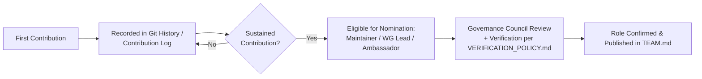

# CeloHT Contributors

**Version 1.0 · August 2026**

This document describes how individuals can contribute to CeloHT, the types of contribution recognized, how recognition works, and the eligibility requirements for progressing into roles with greater responsibility (Maintainer, Working Group Lead, Ambassador, Governance Council).

---

## Table of Contents

1. [Types of Contributors](#1-types-of-contributors)
2. [Contribution Paths](#2-contribution-paths)
3. [Recognition System](#3-recognition-system)
4. [Eligibility Requirements](#4-eligibility-requirements)

---

## 1. Types of Contributors

CeloHT recognizes several categories of contribution, consistent with the role definitions in `GOVERNANCE.md` Section 3:

| Contributor Type | Description |
|---|---|
| **Code Contributors** | Submit changes to CeloHT's software repositories (dApp, smart contracts, website, documentation hub) |
| **Documentation Contributors** | Improve or create technical documentation, governance documents, or educational material |
| **Translation Contributors** | Maintain Haitian Creole and English parity across documentation and educational content per `GOVERNANCE.md` Section 14.2 |
| **Design Contributors** | Produce visual assets, UI/UX design, and brand-consistent materials |
| **Community Contributors (Volunteers)** | Support forum moderation, event coordination, and Code of Conduct enforcement |
| **Field Contributors** | Participate in reforestation planting events and impact reporting |
| **Agent Network Contributors** | Community-based agents supporting cUSD cash-in/cash-out access, per `ARCHITECTURE.md` Section 8 |

---

## 2. Contribution Paths

1. **First contribution** — submitted through the standard pull-request or content-submission process for the relevant repository.
2. **Recorded contribution history** — every accepted contribution is recorded in Git history or the relevant repository's contribution log, forming the factual basis for any future recognition or nomination.
3. **Sustained contribution** — repeated, quality contributions over time make an individual eligible for nomination to a role with greater responsibility.
4. **Nomination and review** — nomination to Maintainer, Working Group Lead, or Ambassador status is reviewed by the Governance Council per `GOVERNANCE.md`, including the verification steps in `VERIFICATION_POLICY.md`.
5. **Confirmation and publication** — confirmed role holders are published in `TEAM.md` and `MAINTAINERS.md` as applicable, replacing the relevant "Open" or "Vacant" entry.

---

## 3. Recognition System

CeloHT recognizes contributions without implying financial compensation, equity, or token-based reward of any kind, consistent with `LEGAL_STATUS.md` and CeloHT's non-token design (`ARCHITECTURE.md` Section 6).

| Recognition | Basis |
|---|---|
| Listing in `AUTHORS.md` | Recorded, attributable contribution |
| Public acknowledgment in release notes | Contribution to a tagged release |
| Nomination eligibility for Maintainer / Working Group Lead / Ambassador | Sustained, quality contribution history |
| Ambassador or Working Group Lead appointment | Governance Council confirmation, per `GOVERNANCE.md` |
| Governance Council candidacy eligibility | Active-contributor status per `GOVERNANCE.md` Section 5.1 |

Recognition is always based on a verifiable contribution record, never on self-reported claims, informal reputation, or financial contribution to CeloHT.

---

## 4. Eligibility Requirements

| Path | Minimum Requirement |
|---|---|
| Listed as a Contributor (`AUTHORS.md`) | At least one accepted, recorded contribution |
| Nominated as Maintainer | Sustained, quality contribution record within the relevant repository; Governance Council approval |
| Nominated as Working Group Lead | Active participation within the relevant Working Group's scope; Governance Council confirmation |
| Nominated as Ambassador | Sustained community or volunteer participation; Working Group Lead nomination and Council confirmation |
| Eligible to vote in Council elections | At least one recorded contribution, moderation action, event contribution, or field activity within the preceding six months, per `GOVERNANCE.md` Section 5.1 |
| Eligible for Governance Council candidacy | Active-contributor status as above, plus willingness to complete the verification steps in `VERIFICATION_POLICY.md` |

CeloHT does not waive these requirements based on seniority, informal influence, or personal relationship to the Founder or any existing role holder.

---

*This document is maintained alongside `GOVERNANCE.md`, `TEAM.md`, `AUTHORS.md`, `MAINTAINERS.md`, and `VERIFICATION_POLICY.md` in the CeloHT governance repository.*
