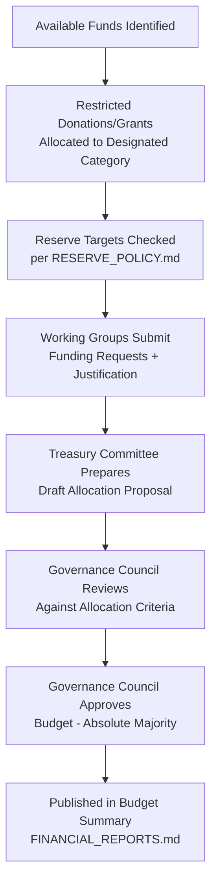

# CeloHT Fund Allocation Framework

**Version:** 1.0
**Last Updated:** August 2026
**Status:** Active — Framework Only, No Fixed Percentages

---

## Purpose

This document explains how CeloHT prioritizes available funds across its spending categories. It is deliberately structured as a decision-making framework rather than a fixed allocation formula: CeloHT does not commit to fixed percentages for each category, because funding availability, programmatic readiness, and community priorities vary over time. This document explains the criteria used to make allocation decisions in a given budget cycle, so that reviewers can evaluate the reasoning behind actual allocations once published, rather than relying on generic or fictional percentages.

## Scope

This framework applies to the annual budget process and any material in-year reallocation of funds across the categories defined in `TREASURY.md` Section 6.

## Responsibilities

| Role | Fund Allocation Responsibility |
|---|---|
| Governance Council | Approves the annual budget and any material reallocation |
| Treasury Committee | Prepares allocation proposals for Council review |
| Working Group Leads | Submit funding needs and justification for their scope |

## Review Schedule

Reviewed annually as part of the budget approval process defined in `TREASURY.md` Section 3, and whenever a material reallocation is proposed.

---

## 1. Categories Considered

| Category | What It Funds |
|---|---|
| **Education** | Curriculum development, workshops, learning materials, translation |
| **Agent Network** | Agent training, verification infrastructure, network support |
| **Reforestation** | Planting-site costs, materials, environmental reporting |
| **Technology** | Software development, infrastructure, security review |
| **Operations** | Administration, governance operations, compliance |
| **Community Growth** | Outreach, ambassador program, community events |
| **Emergency Reserve** | Allocations per `RESERVE_POLICY.md` |

This document intentionally does not assign fixed percentages to these categories. Any specific allocation percentages will appear only in an actual, dated Budget Summary (`FINANCIAL_REPORTS.md` Section 6) once approved by the Governance Council, reflecting real funding and programmatic conditions at that time.

## 2. Allocation Criteria

Allocation decisions are made by evaluating each category against a consistent set of criteria:

- **Mission alignment** — how directly the proposed spending advances CeloHT's three pillars or the operational/technical capacity that supports them.
- **Programmatic readiness** — whether the relevant Working Group has the capacity and plan to deploy funds effectively within the budget period.
- **Restricted funding obligations** — donations or grants designated for a specific category under `DONATION_POLICY.md` Section 2 are allocated to that category first, ahead of discretionary allocation.
- **Reserve adequacy** — whether the Operating and Emergency Reserves (`RESERVE_POLICY.md`) are at their target levels before discretionary funds are allocated elsewhere.
- **Community input** — feedback gathered through the Proposal Lifecycle (`GOVERNANCE.md` Section 6) and community feedback polls.
- **Prior-period performance** — whether prior allocations to a category were fully and effectively deployed, informing whether to increase, maintain, or reduce funding in the next cycle.

## 3. Allocation Process

## 4. In-Year Reallocation

- Material reallocation of approved budget between categories (beyond routine variance) requires Governance Council approval, following the same criteria in Section 2.
- Reallocation decisions are documented with the reason for the change and reflected in the next Quarterly Report.

## 5. Transparency of Allocation Decisions

Actual allocation figures, once approved, are published in the Budget Summary and referenced in each Quarterly and Annual Report per `FINANCIAL_REPORTS.md`. This document will never be amended to include illustrative or placeholder percentages; any numeric allocation data belongs exclusively in the dated financial reports where it can be tied to an actual approved budget.

---

*This document is maintained alongside `GOVERNANCE.md`, `TREASURY.md`, `RESERVE_POLICY.md`, `DONATION_POLICY.md`, and `FINANCIAL_REPORTS.md` in the CeloHT governance repository.*
