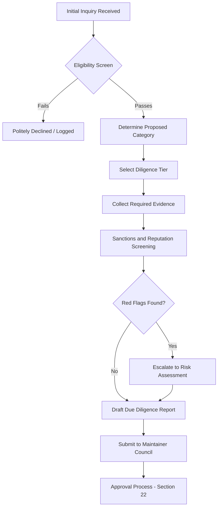
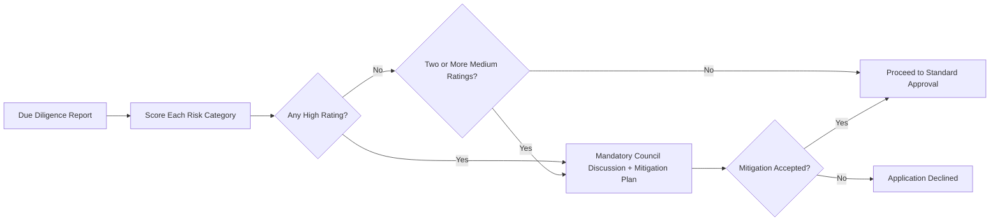
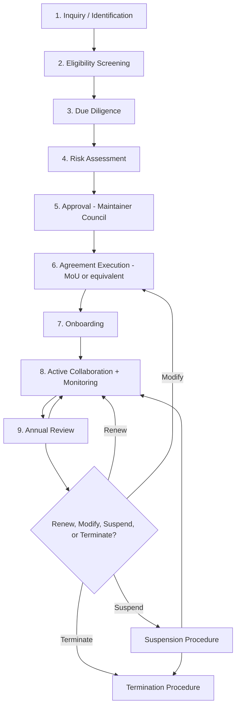
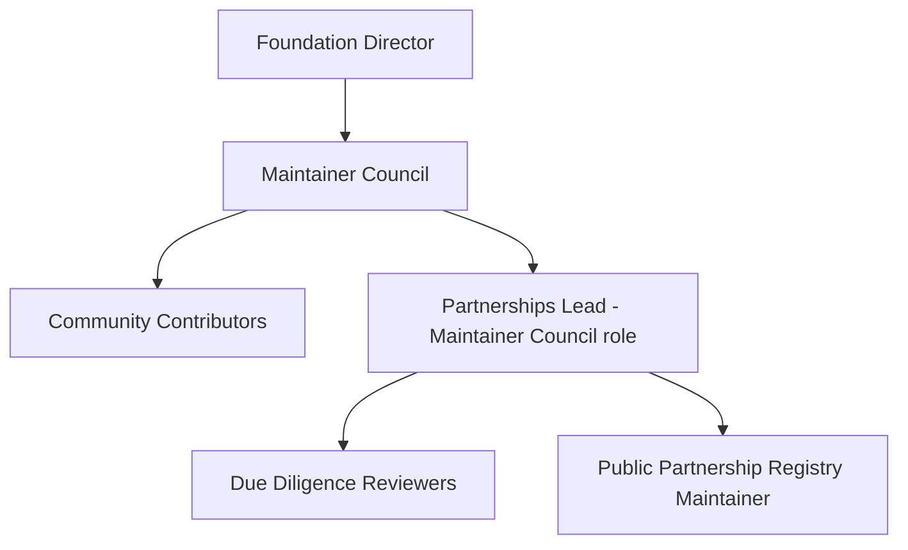
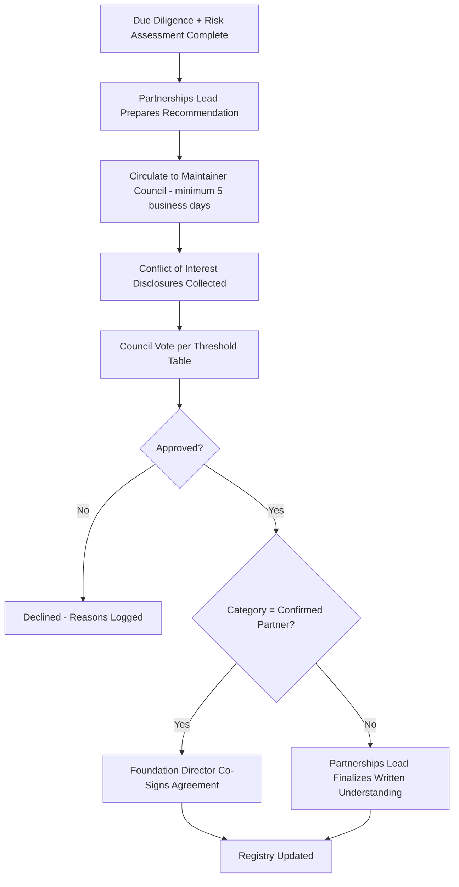
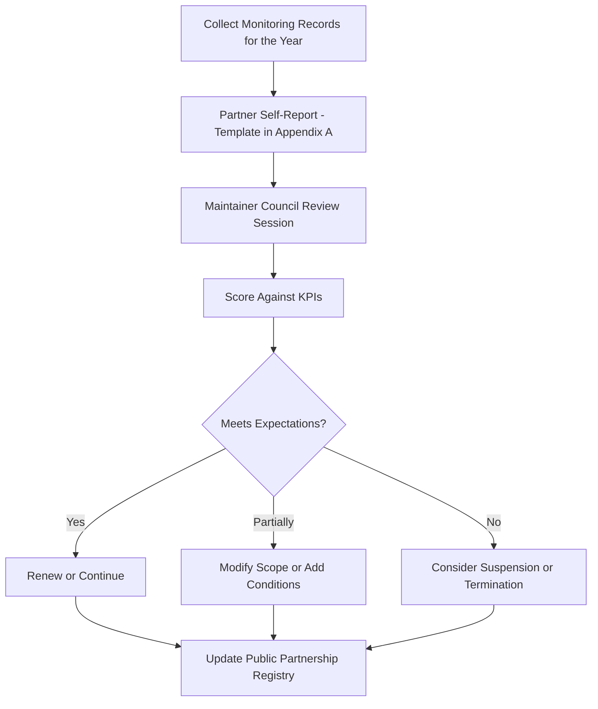

# CeloHT Partnerships Policy

**Document Type:** Governance Policy
**Applies To:** CeloHT (Celo-HT) and all affiliated repositories under github.com/Celo-HT
**License:** Apache 2.0 (this document, unless otherwise noted)
**Status:** Active
**Version:** 1.0.0
**Effective Date:** 2026
**Maintained By:** CeloHT Maintainer Council, under the authority of the Foundation Director
**Contact:** partnerships@celoht.com | contact@celoht.com

> **Compliance Note:** Throughout this document, the key words **MUST**, **MUST NOT**, **REQUIRED**, **SHALL**, **SHALL NOT**, **SHOULD**, **SHOULD NOT**, **RECOMMENDED**, **MAY**, and **OPTIONAL** are to be interpreted as described in [RFC 2119](https://www.ietf.org/rfc/rfc2119.txt).

---

## Table of Contents

1. [Executive Summary](#1-executive-summary)
2. [Purpose](#2-purpose)
3. [Partnership Vision](#3-partnership-vision)
4. [Guiding Principles](#4-guiding-principles)
5. [Strategic Objectives](#5-strategic-objectives)
6. [Partnership Categories](#6-partnership-categories)
7. [Eligibility Requirements](#7-eligibility-requirements)
8. [Due Diligence Framework](#8-due-diligence-framework)
9. [Risk Assessment Framework](#9-risk-assessment-framework)
10. [Ethics Policy](#10-ethics-policy)
11. [Anti-Corruption Policy](#11-anti-corruption-policy)
12. [Anti-Bribery Policy](#12-anti-bribery-policy)
13. [Anti-Fraud Policy](#13-anti-fraud-policy)
14. [Conflict of Interest Policy](#14-conflict-of-interest-policy)
15. [Human Rights Commitment](#15-human-rights-commitment)
16. [Environmental Sustainability Principles](#16-environmental-sustainability-principles)
17. [Data Privacy Expectations](#17-data-privacy-expectations)
18. [Compliance Requirements](#18-compliance-requirements)
19. [Partnership Lifecycle](#19-partnership-lifecycle)
20. [Governance Structure](#20-governance-structure)
21. [Roles and Responsibilities](#21-roles-and-responsibilities)
22. [Approval Process](#22-approval-process)
23. [Financial Transparency](#23-financial-transparency)
24. [Donation Transparency](#24-donation-transparency)
25. [Sponsorship Guidelines](#25-sponsorship-guidelines)
26. [In-Kind Contributions](#26-in-kind-contributions)
27. [Intellectual Property](#27-intellectual-property)
28. [Trademark and Logo Usage Policy](#28-trademark-and-logo-usage-policy)
29. [Public Communications Policy](#29-public-communications-policy)
30. [Confidentiality](#30-confidentiality)
31. [Monitoring and Evaluation](#31-monitoring-and-evaluation)
32. [Partnership KPIs](#32-partnership-kpis)
33. [Annual Partnership Review](#33-annual-partnership-review)
34. [Public Partnership Registry](#34-public-partnership-registry)
35. [Suspension Procedure](#35-suspension-procedure)
36. [Termination Procedure](#36-termination-procedure)
37. [Dispute Resolution](#37-dispute-resolution)
38. [Amendment Procedure](#38-amendment-procedure)
39. [Legal Disclaimer](#39-legal-disclaimer)
40. [Appendix A: Templates](#40-appendix-a-templates)
41. [References to Related Governance Documents](#41-references-to-related-governance-documents)

---

## 1. Executive Summary

CeloHT is a community-governed, open-source initiative built on the Celo blockchain, dedicated to advancing financial inclusion, Web3 education, and environmental sustainability in Haiti and beyond. As CeloHT matures from its Foundation phase into Validation and Growth, the organization anticipates growing interest from ecosystem participants, civil-society organizations, educational institutions, development agencies, and mission-aligned companies who wish to collaborate.

This **Partnerships Policy** establishes the single authoritative framework governing how CeloHT identifies, evaluates, approves, documents, monitors, and — where necessary — suspends or terminates relationships with external organizations. It is written to meet the diligence expectations of institutional donors, multilateral development agencies, auditors, and open-source foundations, while remaining practical for a young, community-governed, low-resource organization.

Three principles anchor this policy: **transparency** (every partnership category and its criteria are public), **caution** (no relationship is described in stronger terms than the evidence supports), and **accountability** (every partnership passes through documented due diligence, approval, and review, regardless of size).

This document explicitly does **not** create, confirm, or imply any partnership that has not been separately and formally executed. Where CeloHT references a prospective or exploratory relationship — including with FreClean — it is labeled precisely according to the category definitions in Section 6, and MUST NOT be read as evidence of a signed agreement unless the [Public Partnership Registry](#34-public-partnership-registry) states otherwise.

---

## 2. Purpose

This policy exists to:

- Provide a single, public, version-controlled reference for how CeloHT engages with external organizations.
- Protect CeloHT's **No Token Policy** and non-investment identity from being misrepresented through partnership activity.
- Give prospective partners, donors, and auditors a clear, predictable process to evaluate before engaging.
- Prevent reputational, legal, financial, and operational risk arising from undisclosed conflicts of interest, unvetted counterparties, or premature public claims of partnership.
- Establish RFC 2119-grade obligations so that Maintainer Council decisions are consistent and reviewable over time, independent of who currently holds a given role.

This policy applies to all CeloHT repositories, all official CeloHT communication channels (celoht.com, @CeloHT / celohtofficial on Facebook and Instagram, contact@celoht.com), and all individuals acting in an official capacity on behalf of CeloHT, including the Foundation Director, Maintainer Council members, and designated Community Contributors.

---

## 3. Partnership Vision

CeloHT envisions a network of aligned organizations — educational institutions, NGOs, cooperatives, local businesses, development agencies, and other Celo-ecosystem projects — collaborating transparently to expand financial inclusion, blockchain literacy, and reforestation impact in Haiti and comparable communities.

CeloHT's partnership vision is deliberately modest in the near term and ambitious in the long term:

- **Near term (Phase 1–2):** Establish a small number of well-documented, low-risk collaborations that validate CeloHT's community model.
- **Medium term (Phase 3):** Formalize a sustainable agent network supported by service-fee revenue, with partnerships that reinforce local economic activity.
- **Long term (Phase 4+):** Operate as a recognized node in the broader Celo public-goods ecosystem, capable of receiving institutional grants and co-designing programs with international development actors.

---

## 4. Guiding Principles

All CeloHT partnership activity MUST be consistent with the following principles:

1. **Truthfulness over promotion.** CeloHT MUST NOT describe a relationship as more advanced, formal, or exclusive than the underlying agreement supports.
2. **No token, no investment framing.** No partnership MAY be used to imply that CeloHT, cUSD, CELO, or any CeloHT activity constitutes an investment product, security, or guaranteed-return opportunity.
3. **Community governance first.** No single individual, including the Foundation Director, MAY unilaterally bind CeloHT to a partnership. All partnerships flow through the [Approval Process](#22-approval-process).
4. **Proportionate diligence.** The depth of due diligence SHOULD scale with the size, visibility, and risk of the proposed relationship, per the [Due Diligence Framework](#8-due-diligence-framework).
5. **Radical transparency.** Every executed partnership SHOULD appear in the [Public Partnership Registry](#34-public-partnership-registry) unless confidentiality is required and documented under [Section 30](#30-confidentiality).
6. **Reversibility.** Every partnership MUST include a documented path to suspension and termination before it is finalized.
7. **Local benefit.** Partnerships SHOULD demonstrably benefit the communities CeloHT serves, not merely CeloHT's visibility or fundraising position.

---

## 5. Strategic Objectives

CeloHT's partnership program pursues the following objectives:

| # | Objective | Primary Beneficiary |
|---|---|---|
| 1 | Expand access to blockchain and financial-literacy education | Students, youth, women entrepreneurs |
| 2 | Strengthen the CeloHT Agent Network (cash ↔ cUSD conversion, wallet onboarding) | Small businesses, merchants, diaspora |
| 3 | Scale reforestation activity beyond the current pilot phase | Farmers, local environment |
| 4 | Diversify funding through ecosystem grants and mission-aligned sponsorships | CeloHT organizational sustainability |
| 5 | Build credibility with international development and open-source institutions | CeloHT long-term legitimacy |
| 6 | Establish repeatable, auditable partnership processes | Governance maturity |

---

## 6. Partnership Categories

CeloHT uses five mutually exclusive categories. Every external relationship referenced in CeloHT materials MUST be labeled using exactly one of these categories, and that label MUST match the [Public Partnership Registry](#34-public-partnership-registry).

| Category | Definition | Public Claim Permitted | Formal Agreement Required |
|---|---|---|---|
| **Confirmed Partner** | A signed, active agreement (MoU or equivalent) defining scope, duration, and mutual obligations | Yes — full description permitted | Yes |
| **Strategic Collaborator** | An organization actively coordinating with CeloHT on specific activities, without a comprehensive formal partnership agreement | Limited — described as "collaboration," not "partnership" | Recommended (light-form agreement or written correspondence) |
| **Ecosystem Participant** | An organization operating in the same ecosystem (e.g., Celo ecosystem projects) with informal, non-exclusive interaction | Minimal — may be listed with a neutral description | No |
| **Supporter** | An individual, community, or organization providing informal encouragement, small in-kind help, or public endorsement without operational involvement | Minimal — first-name/organization credit only, with consent | No |
| **Prospective Partner** | An organization under discussion or evaluation; no commitments have been made by either party | None beyond "in discussion" | No |

**Rule:** CeloHT MUST NOT publish, imply, or allow to persist uncorrected any public statement that upgrades a relationship into a higher category than the evidence supports. Downgrading a category (e.g., from Confirmed Partner to Prospective Partner following termination) MUST occur within 5 business days of the underlying change.

**FreClean status under this policy:** As of the effective date of this document, FreClean is recorded as a **Strategic Collaborator (Prospective)** — an initiative in early-stage discussion with CeloHT regarding potential environmental and community-impact collaboration. FreClean MUST NOT be described as an "official partner," "confirmed partner," or in any language implying a signed agreement, until such an agreement exists and is reflected in the [Public Partnership Registry](#34-public-partnership-registry).

---

## 7. Eligibility Requirements

An organization is eligible for consideration under any category above the level of "Supporter" only if it satisfies **all** of the following minimum criteria. The Maintainer Council MAY apply additional criteria proportionate to risk.

1. **Legal existence.** The organization MUST be a legally recognized entity (nonprofit, cooperative, company, government body, or accredited educational institution) in at least one jurisdiction, OR be a natural person operating in a documented professional capacity (e.g., an independent educator or developer).
2. **Mission alignment.** The organization's activities MUST NOT conflict with CeloHT's No Token Policy, non-investment identity, or community-governance model.
3. **Reputational screening.** The organization MUST NOT be subject to credible, publicly documented allegations of fraud, corruption, human-rights abuse, or sanctions violations at the time of evaluation.
4. **Sanctions and watchlist status.** The organization and its principal officers MUST NOT appear on applicable international sanctions lists (e.g., OFAC SDN List, UN Security Council Consolidated List, EU Consolidated List).
5. **Capacity to fulfill obligations.** The organization MUST demonstrate a reasonable operational capacity to fulfill the specific obligations proposed (financial, technical, or logistical).
6. **Willingness to be listed.** For any category above Supporter, the organization MUST consent to appropriate disclosure in the [Public Partnership Registry](#34-public-partnership-registry), except where confidentiality is separately justified under [Section 30](#30-confidentiality).

Organizations that do not meet these criteria MAY still be engaged informally at the Ecosystem Participant or Supporter level, where risk exposure is lowest.

---

## 8. Due Diligence Framework

### 8.1 Diligence Tiers

| Tier | Applies To | Minimum Review |
|---|---|---|
| **Tier 1 — Light** | Supporters, Ecosystem Participants | Public reputation check, mission-alignment review |
| **Tier 2 — Standard** | Strategic Collaborators | Tier 1 + legal-existence verification, sanctions screening, point-of-contact verification |
| **Tier 3 — Enhanced** | Confirmed Partners, any relationship involving funds transfer, data sharing, or co-branding | Tier 2 + financial review, reference checks, written risk assessment, Maintainer Council vote |

### 8.2 Due Diligence Checklist (Tier 2 and Tier 3)

| Item | Required Evidence | Responsible Role |
|---|---|---|
| Legal registration | Certificate of incorporation / registration number, or equivalent | Partnerships Lead |
| Sanctions screening | Screening result against applicable lists | Partnerships Lead |
| Mission-alignment review | Written summary against Guiding Principles | Maintainer Council reviewer |
| Financial capacity (if funds involved) | Bank reference or audited financials, where proportionate | Treasury role holder |
| Reference check | At least one independent reference for Tier 3 | Partnerships Lead |
| Point-of-contact verification | Confirmed named contact with title and organizational email | Partnerships Lead |
| Conflict-of-interest screen | Cross-check against CeloHT COI disclosures | Maintainer Council |
| Risk assessment | Completed Risk Assessment (Section 9 / Appendix A template) | Maintainer Council reviewer |

### 8.3 Due Diligence Workflow



All due diligence records MUST be retained for a minimum of five (5) years following the end of the relationship, subject to applicable data-protection law.

---

## 9. Risk Assessment Framework

### 9.1 Risk Categories

CeloHT evaluates proposed partnerships against six risk categories: **Legal**, **Financial**, **Reputational**, **Operational**, **Compliance**, and **Community Impact**.

### 9.2 Risk Matrix

| Risk Category | Low | Medium | High |
|---|---|---|---|
| **Legal** | Standard, reviewed agreement; established jurisdiction | Unfamiliar jurisdiction or novel contract terms | Unclear legal status; jurisdiction with weak rule of law |
| **Financial** | No funds transfer, or small, transparent amount | Moderate funds transfer with standard controls | Large funds transfer, opaque source of funds, or crypto-to-fiat complexity |
| **Reputational** | No adverse history found | Minor unresolved public criticism | Credible allegations of fraud, abuse, or sanctions exposure |
| **Operational** | Partner has demonstrated capacity | Partner is early-stage but plausible | Partner has no track record or verifiable capacity |
| **Compliance** | Fully within No Token Policy and applicable law | Requires legal review before proceeding | Conflicts with No Token Policy or applicable law |
| **Community Impact** | Clear, direct benefit to target communities | Indirect or unclear benefit | Risk of harm or exploitation of target communities |

### 9.3 Risk Assessment Workflow



Any proposed partnership with an unmitigated **High** rating in any category MUST NOT proceed to approval.

---

## 10. Ethics Policy

CeloHT partners and prospective partners MUST:

- Operate with honesty, integrity, and respect for the communities CeloHT serves.
- Avoid any activity that exploits financial illiteracy, economic vulnerability, or limited digital literacy among CeloHT's target users (students, farmers, merchants, women entrepreneurs, diaspora communities).
- Refrain from using CeloHT's name, mission, or community relationships to promote unrelated financial products, token sales, or speculative schemes.
- Disclose, promptly and in writing, any material change in ownership, leadership, legal status, or mission that could affect the basis of the partnership.

CeloHT reserves the right to decline or exit any relationship that, in the Maintainer Council's reasonable judgment, is inconsistent with these ethical commitments, even where no law has been broken.

---

## 11. Anti-Corruption Policy

1. Partners MUST NOT offer, give, solicit, or accept any improper advantage in connection with a CeloHT partnership.
2. CeloHT representatives MUST NOT use their position to obtain personal benefit from a partner in exchange for favorable treatment in the approval, monitoring, or renewal process.
3. All payments, grants, and in-kind contributions between CeloHT and a partner MUST be documented, traceable, and consistent with the purpose stated in the governing agreement.
4. Any Maintainer Council member who becomes aware of suspected corruption involving a CeloHT partnership MUST report it under the process described in [Section 14](#14-conflict-of-interest-policy) and, where applicable, to the Foundation Director.
5. Facilitation payments of any kind are prohibited, regardless of local custom or perceived necessity.

---

## 12. Anti-Bribery Policy

1. No CeloHT representative or partner representative MAY offer or accept cash, cryptocurrency, gifts, hospitality, or other benefits intended to improperly influence a partnership decision.
2. Reasonable, proportionate, and transparently disclosed hospitality (e.g., a modest working meal during an in-person meeting) is permitted and SHOULD be logged if it exceeds a nominal value threshold to be set by the Maintainer Council.
3. Partners engaged through third-party intermediaries (agents, consultants, brokers) remain subject to this policy, and CeloHT MUST perform reasonable diligence on such intermediaries.
4. Violations MUST be treated as grounds for immediate suspension pending investigation, per [Section 35](#35-suspension-procedure).

---

## 13. Anti-Fraud Policy

1. Partners MUST NOT misrepresent their identity, credentials, financial position, or intended use of funds or resources provided by or through CeloHT.
2. CeloHT MUST NOT misrepresent the status, scale, or maturity of any partnership in fundraising, marketing, or public communications.
3. Any suspected fraudulent activity connected to a partnership MUST be documented and escalated to the Maintainer Council within 48 hours of discovery.
4. Confirmed fraud is grounds for immediate termination under [Section 36](#36-termination-procedure) and, where appropriate, referral to relevant authorities.

---

## 14. Conflict of Interest Policy

1. A conflict of interest exists whenever a Foundation Director, Maintainer Council member, or Community Contributor involved in a partnership decision has a financial, familial, or other personal interest in the outcome.
2. Any individual with a potential conflict of interest MUST disclose it in writing before participating in discussion or voting on the relevant partnership, using the template in [Appendix A](#40-appendix-a-templates).
3. An individual with a disclosed conflict MUST recuse themselves from the vote and SHOULD recuse themselves from substantive deliberation, unless the Maintainer Council determines their input is necessary and documents that decision.
4. All conflict-of-interest disclosures MUST be retained in the governance record for a minimum of five (5) years.
5. Failure to disclose a known conflict of interest is a governance violation and MAY result in removal from the Maintainer Council, per [GOVERNANCE.md](./GOVERNANCE.md).

---

## 15. Human Rights Commitment

CeloHT partnerships MUST be consistent with internationally recognized human rights standards, including non-discrimination, freedom from exploitation, and respect for the dignity of the communities served. Specifically:

- Partners MUST NOT engage in forced labor, child labor, or human trafficking in any part of their operations connected to the partnership.
- Partnerships MUST NOT be used to collect, sell, or exploit personal data from vulnerable populations, including low-income or minimally banked individuals.
- CeloHT SHOULD prioritize partnerships that expand access and opportunity for historically underserved groups, including women entrepreneurs, rural farmers, and diaspora communities, consistent with CeloHT's target-user mission.
- Any credible allegation of a human-rights violation by a partner MUST trigger an immediate risk review under [Section 9](#9-risk-assessment-framework) and MAY result in suspension.

---

## 16. Environmental Sustainability Principles

Given CeloHT's Reforestation pillar, environmental integrity is a first-order partnership criterion:

1. Partners engaged in environmental or land-use activity MUST provide a good-faith description of their environmental practices and any relevant permits or community agreements.
2. CeloHT MUST NOT enter a partnership that would result in deforestation, land degradation, or harm to the ecosystems its Reforestation pillar seeks to protect.
3. Reforestation-related partnerships MUST respect the current **pilot-phase** status of this pillar; no partner communication MAY describe reforestation operations as fully scaled or operational until the Maintainer Council formally updates this status.
4. Where feasible, CeloHT SHOULD favor partners who can demonstrate measurable environmental outcomes (e.g., trees planted and verified, survival rate tracking) over unverifiable claims.

---

## 17. Data Privacy Expectations

1. Partners handling any personal data of CeloHT users, agents, or community members MUST process that data lawfully, transparently, and only for the purpose disclosed at collection.
2. CeloHT MUST NOT share personal data with a partner absent a documented legal basis and, where required, user consent.
3. Partners MUST implement reasonable technical and organizational safeguards to protect shared data against unauthorized access, loss, or misuse.
4. Any data breach affecting CeloHT users or shared data MUST be reported to CeloHT (security@celoht.com, privacy@celoht.com) without undue delay, and in any case within 72 hours of the partner becoming aware.
5. Data-sharing terms MUST be documented in the governing partnership agreement; no informal or verbal data-sharing arrangement is permitted for Tier 2 or Tier 3 relationships.

---

## 18. Compliance Requirements

Partners MUST comply with:

- All applicable anti-money-laundering (AML) and counter-terrorist-financing (CTF) laws in relevant jurisdictions.
- Applicable sanctions regimes (e.g., OFAC, UN, EU) as verified during due diligence.
- Haitian law governing nonprofit, cooperative, or commercial activity, where the partner operates in or with Haiti.
- CeloHT's **No Token Policy**: no partner activity conducted under the CeloHT name may involve issuance of a native token, ICO, presale, staking token, or any solicitation implying guaranteed financial returns.
- Applicable open-source licensing terms (Apache 2.0) when a partnership involves use or modification of CeloHT code.

CeloHT MUST decline or terminate any partnership where continued compliance cannot be reasonably assured.

---

## 19. Partnership Lifecycle



Every stage of the lifecycle MUST be recorded in the CeloHT governance repository, with dated entries sufficient for an external auditor to reconstruct the history of the relationship.

---

## 20. Governance Structure

CeloHT partnerships are governed within the organization's existing three-tier structure:



- The **Foundation Director** holds ultimate accountability for CeloHT's mission integrity but does not have unilateral authority to approve partnerships; see [Section 22](#22-approval-process).
- The **Maintainer Council** is the primary decision-making body for partnership approval, suspension, and termination.
- **Community Contributors** MAY originate partnership proposals and participate in due diligence but MUST NOT approve partnerships independently.
- This structure mirrors and is subordinate to [GOVERNANCE.md](./GOVERNANCE.md); in the event of any conflict, GOVERNANCE.md controls.

---

## 21. Roles and Responsibilities

| Role | Key Responsibilities | Approval Authority |
|---|---|---|
| **Foundation Director** | Mission-integrity oversight; tie-breaking vote where Council rules require; final signatory on Confirmed Partner agreements | Signatory, not sole approver |
| **Maintainer Council** | Reviews due diligence and risk assessments; votes to approve, suspend, or terminate partnerships; maintains this policy | Primary approval body |
| **Partnerships Lead** (Council role) | Coordinates inquiries, due diligence, and drafting of agreements; maintains the Public Partnership Registry | Recommends, does not unilaterally approve |
| **Due Diligence Reviewers** | Conduct Tier 1–3 diligence; document findings | Non-voting |
| **Community Contributors** | May refer prospective partners; may assist with monitoring and KPI tracking | None |
| **Treasury Role Holder** | Verifies financial capacity; oversees financial-transparency obligations for funded partnerships | Non-voting, advisory |

---

## 22. Approval Process

### 22.1 Approval Thresholds

| Category | Minimum Approval |
|---|---|
| Supporter | Partnerships Lead sign-off (logged) |
| Ecosystem Participant | Partnerships Lead + one Maintainer Council member |
| Strategic Collaborator | Majority vote of the Maintainer Council |
| Confirmed Partner | Two-thirds (2/3) vote of the Maintainer Council + Foundation Director signature |

### 22.2 Approval Workflow



### 22.3 Timelines

- Tier 1 diligence and approval SHOULD complete within 10 business days of a complete application.
- Tier 2 diligence and approval SHOULD complete within 20 business days.
- Tier 3 diligence and approval SHOULD complete within 45 business days, given the enhanced review required.

These are target service levels, not binding deadlines; the Maintainer Council MAY extend timelines where diligence is incomplete.

---

## 23. Financial Transparency

1. Any partnership involving a transfer of funds to or from CeloHT MUST be recorded in CeloHT's financial records consistent with [TREASURY.md](./TREASURY.md).
2. CeloHT MUST publish, at minimum annually, an aggregate summary of partnership-related funding received and disbursed.
3. No partnership funds MAY be commingled with undisclosed personal accounts of any Foundation Director, Maintainer Council member, or Community Contributor.
4. Where legally and practically feasible, CeloHT SHOULD use transparent, traceable payment rails (including on-chain cUSD transactions where appropriate) for partnership-related transfers.

---

## 24. Donation Transparency

1. Donations received in connection with a partnership MUST be logged with donor name (or documented anonymity request), amount, date, and designated purpose.
2. CeloHT MUST NOT accept donations that carry conditions inconsistent with the No Token Policy or CeloHT's mission.
3. Anonymous donations above a threshold set by the Maintainer Council MUST undergo enhanced source-of-funds review before acceptance.
4. Donors MAY request a written acknowledgment; CeloHT SHOULD provide one within 10 business days.

---

## 25. Sponsorship Guidelines

1. Sponsorships (financial or in-kind support in exchange for recognition) MUST be documented in a short written agreement specifying deliverables (e.g., logo placement, event mention) and duration.
2. CeloHT MUST NOT grant a sponsor any editorial control over educational content, governance decisions, or technical direction.
3. Sponsorship recognition MUST NOT imply endorsement of the sponsor's products or services beyond the sponsorship itself.
4. GitHub Sponsors and comparable platform-based sponsorships are treated as **Supporter**-tier by default unless the sponsoring entity separately enters a higher-category agreement.

---

## 26. In-Kind Contributions

1. In-kind contributions (equipment, venue space, volunteer time, professional services) MUST be logged with an estimated fair value and contributor name.
2. In-kind contributions above a materiality threshold set by the Maintainer Council SHOULD undergo the same due-diligence tier as an equivalent cash contribution.
3. CeloHT MUST retain the right to decline in-kind contributions that create dependency risk, reputational risk, or conflict with the No Token Policy.

---

## 27. Intellectual Property

1. CeloHT's documentation, brand assets, and original code are licensed under **Apache 2.0** unless a specific file states otherwise; partners MUST comply with the license terms when using CeloHT materials.
2. Partnership agreements MUST specify ownership of any jointly developed intellectual property, including curricula, tools, or datasets.
3. CeloHT MUST NOT claim ownership over a partner's pre-existing intellectual property absent a written assignment or license.
4. Any use of a partner's intellectual property by CeloHT MUST be limited to the scope agreed in writing.

---

## 28. Trademark and Logo Usage Policy

1. The CeloHT name and logo (navy-and-gold mark) are CeloHT's brand assets and MUST NOT be modified, recolored, or combined with another organization's mark to imply a relationship that has not been approved under this policy.
2. A partner MAY display the CeloHT logo only after (a) the partnership has been approved per [Section 22](#22-approval-process), and (b) specific usage terms (placement, sizing, context) have been agreed in writing, consistent with CeloHT's brand guidelines repository.
3. Similarly, CeloHT MUST NOT display a partner's or prospective partner's logo (including the FreClean mark) in a way that implies a Confirmed Partner relationship unless that status is accurate and reflected in the [Public Partnership Registry](#34-public-partnership-registry). Where a logo is shown for identification purposes only (e.g., "organizations we are in discussion with"), the accompanying text MUST state the correct category (e.g., "Strategic Collaborator — Prospective").
4. Neither party may alter the other's logo, colors, or proportions. Logo files MUST be used only in their approved, unmodified form.
5. Logo usage rights terminate automatically upon suspension or termination of the underlying partnership, and any party must remove the other's marks from active materials within 30 days.

---

## 29. Public Communications Policy

1. Any public statement (social media, press release, website update) referencing a partner MUST be reviewed against the correct category label before publication.
2. Partners MUST NOT issue public statements on CeloHT's behalf, and CeloHT MUST NOT issue statements on a partner's behalf, without prior written approval from the other party.
3. Joint communications SHOULD be co-drafted and approved by both parties' authorized representatives before release.
4. In the event of a factual error in a public communication about a partnership, the publishing party MUST issue a correction within 5 business days of discovery.

---

## 30. Confidentiality

1. Parties MAY agree to keep specific commercial, technical, or personal details confidential, even where the existence of a relationship is disclosed in the [Public Partnership Registry](#34-public-partnership-registry) at a general level.
2. Confidentiality provisions MUST NOT be used to conceal information that would otherwise be required for financial transparency, donation transparency, or compliance reporting under this policy.
3. Confidentiality obligations SHOULD survive termination of the partnership for a period specified in the governing agreement (recommended: 2–5 years, proportionate to sensitivity).
4. Maintainer Council members reviewing confidential information remain bound by the [Conflict of Interest Policy](#14-conflict-of-interest-policy) and MUST NOT use confidential partner information for personal benefit.

---

## 31. Monitoring and Evaluation

1. Every Strategic Collaborator and Confirmed Partner relationship MUST have a designated Maintainer Council monitor responsible for tracking progress against agreed objectives.
2. Monitoring SHOULD occur at least quarterly for Confirmed Partners and semi-annually for Strategic Collaborators, at minimum through a short written check-in.
3. Material deviations from agreed scope, budget, or timeline MUST be logged and, where significant, escalated to the full Maintainer Council.
4. Monitoring records feed directly into the [Annual Partnership Review](#33-annual-partnership-review).

---

## 32. Partnership KPIs

| KPI | Definition | Applies To |
|---|---|---|
| **Activation Rate** | % of agreed activities that commenced within 90 days of agreement execution | Confirmed Partners |
| **Community Reach** | Number of individuals directly served through the partnership (students trained, agents onboarded, trees planted, etc.) | All active partnerships |
| **Financial Accountability** | % of disbursed funds with complete supporting documentation | Funded partnerships |
| **Compliance Incidents** | Number of documented compliance or ethics concerns raised | All partnerships |
| **Renewal / Satisfaction** | Whether both parties indicate willingness to continue at Annual Review | Strategic Collaborators, Confirmed Partners |
| **Public Transparency Score** | Whether registry entry, financial disclosures, and communications are complete and current | All active partnerships |

### KPI Dashboard Template

| Partner Name | Category | Activation Rate | Community Reach | Compliance Incidents | Status |
|---|---|---|---|---|---|
| *[Placeholder — populate at Annual Review]* | | | | | |

---

## 33. Annual Partnership Review

### 33.1 Process



### 33.2 Annual Review Scorecard

| Criterion | Weight | Score (1–5) | Notes |
|---|---|---|---|
| Mission alignment maintained | 25% | | |
| KPI performance | 25% | | |
| Financial/reporting accountability | 20% | | |
| Compliance and ethics record | 20% | | |
| Community feedback | 10% | | |

A composite score below a threshold set by the Maintainer Council (recommended: 2.5/5) MUST trigger a formal discussion of suspension or termination.

---

## 34. Public Partnership Registry

1. CeloHT MUST maintain a **Public Partnership Registry** — a machine-readable and human-readable list (e.g., `PARTNERSHIP_REGISTRY.md` or equivalent structured file in the CeloHT documentation repository) recording, for every relationship above Supporter tier: organization name, category, date approved, scope summary, and status (Active, Suspended, Terminated, Expired).
2. The registry MUST be updated within 10 business days of any category change, suspension, or termination.
3. The registry is the single source of truth; any discrepancy between marketing materials and the registry MUST be resolved in favor of the registry, and the marketing materials corrected.

### Registry Entry Template

| Organization | Category | Date Approved | Scope Summary | Status | Registry Last Updated |
|---|---|---|---|---|---|
| *[Placeholder]* | *[Confirmed / Strategic Collaborator / Ecosystem Participant]* | *[YYYY-MM-DD]* | *[One-sentence scope]* | *[Active / Suspended / Terminated]* | *[YYYY-MM-DD]* |

> **Current entries as of this document's effective date:** No Confirmed Partners have been formally executed. FreClean is recorded as a Strategic Collaborator (Prospective) pending further scoping; this entry MUST be updated once discussions conclude, in either direction.

---

## 35. Suspension Procedure

1. Any Maintainer Council member MAY propose suspension of a partnership where there is credible concern of a compliance, ethics, financial, or reputational issue.
2. Suspension requires a simple majority vote of the Maintainer Council and takes effect immediately upon vote, pending investigation.
3. During suspension: (a) no new funds, data, or logo usage rights MAY be exchanged; (b) existing public materials referencing the partnership MUST be flagged as "Under Review"; (c) the partner MUST be notified in writing within 3 business days, except where notification itself would compromise an investigation.
4. Suspension MUST be resolved within 60 days through either reinstatement (full Council vote) or escalation to termination.

---

## 36. Termination Procedure

1. A partnership MAY be terminated by mutual agreement, expiration of its agreed term, or unilateral action following a suspension, ethics violation, or sustained failure to meet KPIs.
2. Unilateral termination by CeloHT requires a two-thirds (2/3) Maintainer Council vote, except in cases of confirmed fraud, corruption, or legal violation, where the Foundation Director MAY act immediately, subject to Council ratification within 10 business days.
3. Upon termination: (a) all logo and trademark usage rights terminate per [Section 28](#28-trademark-and-logo-usage-policy); (b) outstanding financial obligations MUST be settled or documented; (c) the Public Partnership Registry MUST be updated within 10 business days; (d) a brief, factual Termination Report MUST be filed using the [Appendix A template](#40-appendix-a-templates).
4. Termination does not, by itself, waive confidentiality or data-protection obligations, which survive per [Section 30](#30-confidentiality) and [Section 17](#17-data-privacy-expectations).

---

## 37. Dispute Resolution

1. Parties SHOULD first attempt good-faith negotiation between designated representatives.
2. If unresolved within 30 days, parties SHOULD proceed to structured mediation using a mutually agreed neutral mediator before pursuing formal legal action.
3. The governing law and forum for any dispute MUST be specified in the individual partnership agreement; in the absence of a specified forum, disputes are presumed to be governed by the laws applicable to CeloHT's principal place of operation, without prejudice to a partner's statutory rights.
4. Nothing in this section limits either party's right to seek urgent injunctive relief where necessary to prevent irreparable harm (e.g., misuse of trademarks or data).

---

## 38. Amendment Procedure

1. This policy MAY be amended by a majority vote of the Maintainer Council.
2. Material amendments (affecting approval thresholds, categories, or compliance obligations) SHOULD be published with at least 15 days' advance notice via the CeloHT documentation repository before taking effect, except where urgent legal or safety concerns require immediate effect.
3. Every amendment MUST be recorded with a version number, date, and summary of changes in a changelog section of this document or the repository's release notes.
4. Existing partnership agreements remain governed by the version of this policy in effect at the time of their approval, unless the agreement itself provides for automatic updates.

---

## 39. Legal Disclaimer

This document is a governance and policy instrument published by CeloHT for transparency and operational consistency. It does **not** constitute legal advice, a binding contract with any third party, or a solicitation of investment. CeloHT does not issue a native token, is not a security-issuing entity, and makes no guarantee of financial return in connection with any partnership described or contemplated herein.

Nothing in this document should be construed as confirming a partnership, sponsorship, or endorsement that has not been separately and formally executed and reflected in the [Public Partnership Registry](#34-public-partnership-registry). References to FreClean or any other organization in this document describe, at most, a category of relationship as defined in [Section 6](#6-partnership-categories) and MUST NOT be interpreted as evidence of a signed agreement.

Organizations considering a formal relationship with CeloHT are encouraged to seek their own independent legal, financial, and tax advice. CeloHT reserves the right to amend this policy, and any individual partnership terms, as provided in [Section 38](#38-amendment-procedure).

---

## 40. Appendix A: Templates

### A.1 Partnership Proposal Template

```markdown
# Partnership Proposal

**Organization Name:**
**Legal Status / Jurisdiction:**
**Primary Contact (Name, Title, Email):**
**Proposed Category:** [Supporter / Ecosystem Participant / Strategic Collaborator / Confirmed Partner]
**Summary of Proposed Collaboration:**
**Alignment with CeloHT Mission:**
**Resources Requested from CeloHT:**
**Resources/Value Offered to CeloHT:**
**Proposed Duration:**
**Funds or In-Kind Contributions Involved (Y/N, describe):**
**Data Sharing Involved (Y/N, describe):**
**Submitted By / Date:**
```

### A.2 Memorandum of Understanding (MoU) Template

```markdown
# Memorandum of Understanding

**Between:** CeloHT ("CeloHT") and [Partner Organization Name] ("Partner")
**Effective Date:**
**Term / Duration:**

## 1. Purpose
[Describe shared objective]

## 2. Scope of Collaboration
[Specific activities, deliverables, timeline]

## 3. Roles and Responsibilities
- CeloHT will:
- Partner will:

## 4. Resources and Funding
[Describe any funds, in-kind contributions; reference Sections 23-26 of PARTNERSHIPS.md]

## 5. Intellectual Property and Branding
[Reference Sections 27-28 of PARTNERSHIPS.md]

## 6. Data Privacy
[Reference Section 17 of PARTNERSHIPS.md]

## 7. Confidentiality
[Reference Section 30 of PARTNERSHIPS.md]

## 8. Compliance
Both parties affirm compliance with applicable law and CeloHT's No Token Policy.

## 9. Term, Suspension, and Termination
[Reference Sections 35-36 of PARTNERSHIPS.md]

## 10. Dispute Resolution
[Reference Section 37 of PARTNERSHIPS.md]

## 11. Signatures
CeloHT Foundation Director: ______________  Date: ______
Partner Authorized Representative: ______________  Date: ______
```

### A.3 Due Diligence Report Template

```markdown
# Due Diligence Report

**Organization:**
**Diligence Tier:** [1 / 2 / 3]
**Reviewer(s):**
**Date:**

## Legal Existence
[Evidence reviewed]

## Sanctions and Reputation Screening
[Result]

## Mission Alignment
[Summary]

## Financial Capacity (if applicable)
[Summary]

## Reference Check (if applicable)
[Summary]

## Red Flags Identified
[None / Describe]

## Recommendation
[Proceed / Proceed with Conditions / Decline]
```

### A.4 Risk Assessment Template

```markdown
# Risk Assessment

**Organization:**
**Date:**
**Assessor:**

| Risk Category | Rating (Low/Med/High) | Notes | Mitigation (if applicable) |
|---|---|---|---|
| Legal | | | |
| Financial | | | |
| Reputational | | | |
| Operational | | | |
| Compliance | | | |
| Community Impact | | | |

**Overall Recommendation:**
```

### A.5 Annual Partnership Review Template

```markdown
# Annual Partnership Review

**Organization:**
**Category:**
**Review Period:**
**Reviewer(s):**

## KPI Summary
[Reference Section 32]

## Scorecard
| Criterion | Score (1-5) | Notes |
|---|---|---|
| Mission alignment | | |
| KPI performance | | |
| Financial/reporting accountability | | |
| Compliance and ethics record | | |
| Community feedback | | |

## Composite Score:

## Recommendation
[Renew / Modify / Suspend / Terminate]
```

### A.6 Conflict of Interest Disclosure Template

```markdown
# Conflict of Interest Disclosure

**Name:**
**Role at CeloHT:**
**Related Partnership Matter:**
**Nature of Interest:**
[Financial / Familial / Other — describe]

**Recusal Confirmed:** [Yes / No]
**Date:**
**Signature:**
```

### A.7 Partnership Termination Report Template

```markdown
# Partnership Termination Report

**Organization:**
**Category at Time of Termination:**
**Date of Termination:**
**Reason for Termination:**
[Mutual agreement / Expiration / Non-performance / Ethics violation / Other]

**Outstanding Obligations Settled:** [Yes / No — describe]
**Logo/Trademark Rights Revoked:** [Yes / No / N/A]
**Public Registry Updated:** [Yes — date]
**Approved By:**
```

---

## 41. References to Related Governance Documents

This policy operates alongside, and is subordinate to, the following CeloHT governance documents (where a referenced file does not yet exist in the repository, it is noted as **planned**):

- [`GOVERNANCE.md`](./GOVERNANCE.md) — Foundation Director, Maintainer Council, and Community Contributor structure
- [`CODE_OF_CONDUCT.md`](./CODE_OF_CONDUCT.md) — Community behavior standards
- [`SECURITY.md`](./SECURITY.md) — Security disclosure process
- `FUNDING_POLICY.md` — *(planned)* Grant and funding acceptance criteria
- `LEGAL_STATUS.md` — *(planned)* CeloHT's legal structure and jurisdictional status
- `ETHICS.md` — *(planned)* Organization-wide ethics code
- `TREASURY.md` — *(planned)* Financial management and reporting policy
- `TRANSPARENCY.md` — *(planned)* Public reporting commitments
- `RISK_MANAGEMENT.md` — *(planned)* Organization-wide risk framework
- [`WHITEPAPER.md`](./WHITEPAPER.md) — Technical and mission overview
- [`ROADMAP.md`](./ROADMAP.md) — Phase 1–4 development roadmap

Where a planned document does not yet exist, this Partnerships Policy governs on an interim basis for matters within its scope.

---

*This document is licensed under Apache 2.0. For questions, corrections, or partnership inquiries, contact partnerships@celoht.com.*
