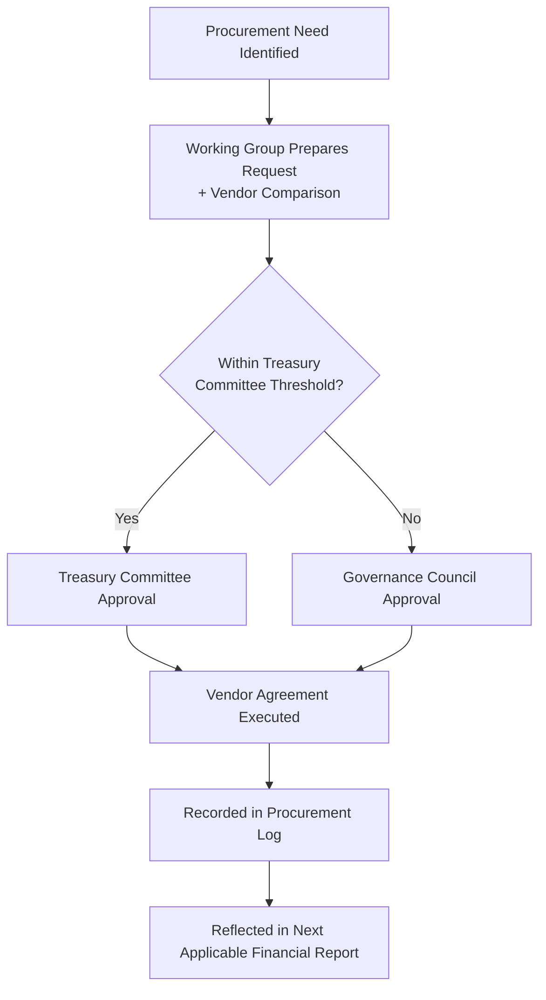

# CeloHT Procurement Policy

**Version:** 1.0
**Last Updated:** August 2026
**Status:** Active

---

## Purpose

This document defines how CeloHT selects vendors and service providers, ensures competitive and fair purchasing practices, manages conflicts of interest in procurement, and documents procurement decisions for accountability and audit purposes.

## Scope

This policy applies to any purchase of goods or services made using CeloHT treasury funds, regardless of amount, and to every individual with purchasing or vendor-selection authority under `GOVERNANCE.md` and `TREASURY.md`.

## Responsibilities

| Role | Procurement Responsibility |
|---|---|
| Requesting Working Group | Identifies need, prepares procurement request |
| Treasury Committee | Reviews procurement requests against this policy and available budget |
| Governance Council | Approves procurement above the threshold defined in `EXPENSE_APPROVAL_POLICY.md` |
| Legal Working Group | Reviews vendor agreements for compliance with `LEGAL_STATUS.md` |

## Review Schedule

Reviewed annually per `GOVERNANCE.md` Section 21, and immediately following any procurement-related dispute or irregularity.

---

## 1. Vendor Selection

Vendor selection is based on documented, comparable criteria, which typically include:

- Ability to deliver the required goods or services to the specification and timeline needed.
- Cost, evaluated relative to comparable alternatives rather than in isolation.
- Reliability and, where relevant and available, verifiable track record.
- Alignment with CeloHT's mission and values, including data protection and ethical standards where applicable.

Vendor selection criteria and the basis for each selection decision are documented at the time of decision, not reconstructed afterward.

## 2. Competitive Purchasing

- Purchases above the threshold defined in `EXPENSE_APPROVAL_POLICY.md` require, where practicable, comparison of at least two alternative vendors or quotes before selection.
- Where competitive comparison is not practicable (for example, a sole-source technical dependency), the requesting Working Group documents the reason in the procurement request.
- Recurring vendor relationships are periodically reassessed to confirm continued cost-effectiveness and fit, rather than renewed automatically without review.

## 3. Conflict of Interest

Procurement decisions are subject to the disclosure and recusal rules defined in `CONFLICT_OF_INTEREST_FINANCE.md` and `GOVERNANCE.md` Section 10:

- Any individual involved in a procurement decision must disclose a relevant relationship with a candidate vendor (ownership interest, family relationship, employment).
- An individual with a disclosed conflict may provide relevant information but may not participate in the final vendor-selection decision.
- Procurement decisions involving a disclosed conflict are documented with the recusal explicitly noted.

## 4. Procurement Approval

Approval thresholds mirror the expense-approval tiers defined in `EXPENSE_APPROVAL_POLICY.md`.

## 5. Documentation Requirements

Every procurement decision above the minimum documentation threshold defined in `INTERNAL_CONTROLS.md` is recorded with:

- The business need and requesting Working Group.
- Vendors considered and the basis for selection (or the reason competitive comparison was not practicable).
- Any conflict-of-interest disclosure and its resolution.
- The approving individual(s) and date of approval.
- The resulting agreement or purchase order, retained per the record-retention rules in `INTERNAL_CONTROLS.md`.

---

*This document is maintained alongside `GOVERNANCE.md`, `TREASURY.md`, `EXPENSE_APPROVAL_POLICY.md`, `CONFLICT_OF_INTEREST_FINANCE.md`, and `INTERNAL_CONTROLS.md` in the CeloHT governance repository.*
