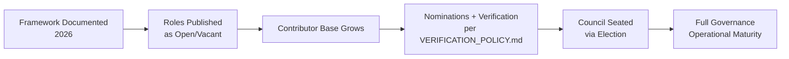
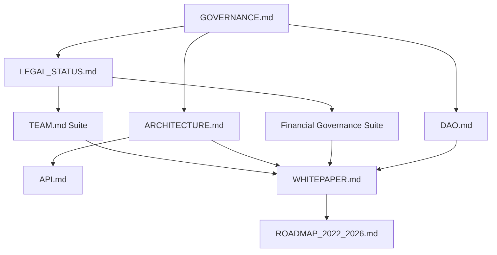
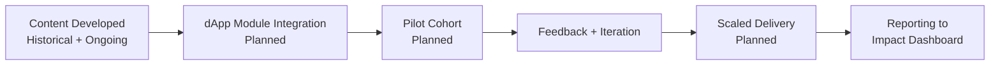
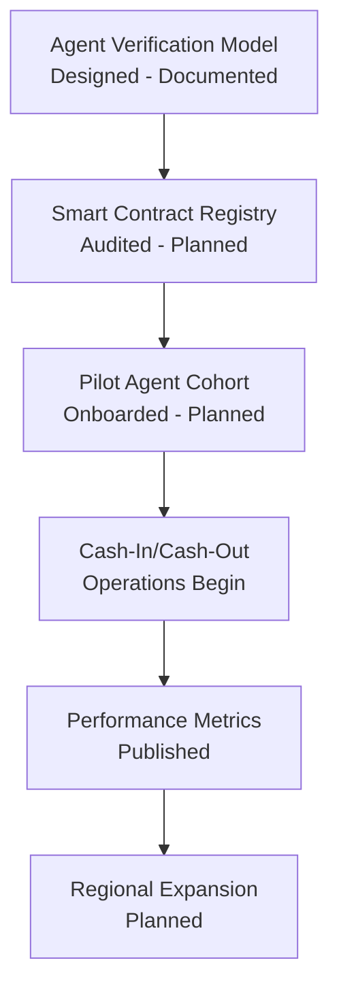
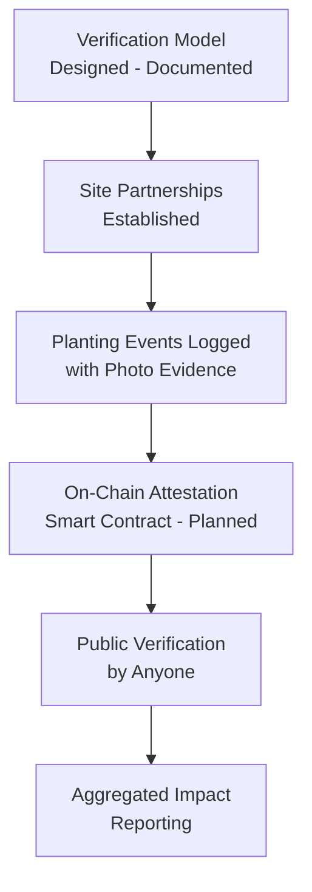
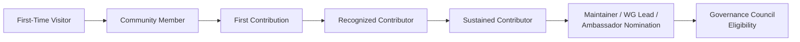
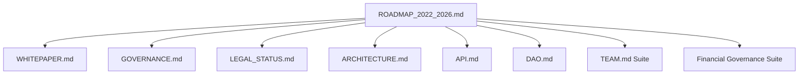

# CeloHT Roadmap 2022–2026

## Cover Page

**Document Title:** CeloHT Roadmap: Foundation Through Maturity (2022–2026)
**Project:** CeloHT
**Project Type:** Open Source, Community-Driven, Blockchain for Social Impact, Built on Celo
**Project Start Date:** April 16, 2022
**Document Coverage Period:** April 16, 2022 – August 4, 2026
**Forward Outlook:** 2026–2030
**Version:** 1.0
**Last Updated:** August 2026
**Status:** Living document — historical sections reflect documented project maturity; forward-looking sections are explicitly labeled as planned objectives, not commitments with guaranteed timing

---

> **A Note on Historical Accuracy**
>
> This roadmap is written under a strict accuracy discipline consistent with `LEGAL_STATUS.md` and `GOVERNANCE.md`: it does not invent legal registrations, partnerships, grants, funding amounts, certifications, audits, investors, or specific dated achievements that are not part of CeloHT's documented record. Where this roadmap describes a structural project *phase* (for example, an early foundation-building period), it does so at the level of detail actually documented. Where month-by-month specificity is not available from CeloHT's internal records at the time of this document's preparation, that gap is marked explicitly as **"Historical Detail Pending Consolidation"** rather than filled with plausible-sounding but unverified milestones. CeloHT's Governance Council and Documentation Working Group are expected to progressively fill these marked gaps from internal records (commit history, meeting notes, and archived communications) in future revisions of this document, consistent with `GOVERNANCE.md` Section 14.3 (documentation versioning).
>
> Sections describing 2026 documentation and governance milestones reflect CeloHT's most thoroughly verifiable period — the consolidation of its governance, legal, technical-architecture, and financial-governance documentation suite — and are described in corresponding detail. Sections describing the period from 2026 to 2030 are explicitly forward-looking and are labeled as **planned objectives**, not guaranteed outcomes, consistent with the roadmap language used in `DAO.md` Section 3 and `ARCHITECTURE.md` Section 15.

---

## About This Document

This document is CeloHT's roadmap, covering the project's founding on April 16, 2022, through August 4, 2026, with a forward-looking outlook to 2030. It is intended for grant reviewers, institutional partners, universities, NGOs, government-adjacent bodies, open-source contributors, and community members evaluating CeloHT's trajectory, execution capability, and long-term planning discipline.

This roadmap is maintained alongside, and must remain fully consistent with, CeloHT's complete documentation suite, including `WHITEPAPER.md`, `GOVERNANCE.md`, `LEGAL_STATUS.md`, `ARCHITECTURE.md`, `API.md`, `DAO.md`, `TEAM.md` and its companion documents, and the full Financial Governance document suite (`TREASURY.md`, `FINANCIAL_REPORTS.md`, and related policies). Where this roadmap and another CeloHT document appear to conflict, the more detailed, subject-specific document governs, and this roadmap is corrected at its next revision.

---

## Table of Contents

1. [Executive Summary](#1-executive-summary)
2. [Introduction](#2-introduction)
3. [Why CeloHT Exists](#3-why-celoht-exists)
4. [Historical Context](#4-historical-context)
5. [Vision](#5-vision)
6. [Mission](#6-mission)
7. [Core Values](#7-core-values)
8. [Guiding Principles](#8-guiding-principles)
9. [Strategic Objectives](#9-strategic-objectives)
10. [Timeline Overview](#10-timeline-overview)
11. [Complete Timeline: April 2022 – August 2026](#11-complete-timeline-april-2022--august-2026)
12. [Foundation Phase](#12-foundation-phase)
13. [Community Validation Phase](#13-community-validation-phase)
14. [Infrastructure Phase](#14-infrastructure-phase)
15. [Governance Phase](#15-governance-phase)
16. [Open Source Expansion](#16-open-source-expansion)
17. [Documentation Evolution](#17-documentation-evolution)
18. [GitHub Growth](#18-github-growth)
19. [Technology Roadmap](#19-technology-roadmap)
20. [Education Roadmap](#20-education-roadmap)
21. [Agent Network Roadmap](#21-agent-network-roadmap)
22. [Reforestation Roadmap](#22-reforestation-roadmap)
23. [Community Growth](#23-community-growth)
24. [International Expansion](#24-international-expansion)
25. [Risk Management Timeline](#25-risk-management-timeline)
26. [Security Improvements](#26-security-improvements)
27. [Transparency Milestones](#27-transparency-milestones)
28. [Financial Sustainability Strategy](#28-financial-sustainability-strategy)
29. [Partnership Strategy](#29-partnership-strategy)
30. [Ecosystem Contributions](#30-ecosystem-contributions)
31. [SDG Alignment](#31-sdg-alignment)
32. [Celo Ecosystem Contributions](#32-celo-ecosystem-contributions)
33. [Major Decisions](#33-major-decisions)
34. [Lessons Learned](#34-lessons-learned)
35. [Challenges](#35-challenges)
36. [Mitigation Plans](#36-mitigation-plans)
37. [Metrics Dashboard](#37-metrics-dashboard)
38. [KPIs](#38-kpis)
39. [Success Indicators](#39-success-indicators)
40. [Milestone Summary](#40-milestone-summary)
41. [Future Vision (2026–2030)](#41-future-vision-20262030)
42. [Long-Term Objectives](#42-long-term-objectives)
43. [Conclusion](#43-conclusion)
44. [Appendix](#44-appendix)
45. [Acronyms](#45-acronyms)
46. [Glossary](#46-glossary)
47. [References](#47-references)
48. [Document Metadata](#48-document-metadata)

---

## 1. Executive Summary

CeloHT was founded on April 16, 2022, as an open-source, community-driven initiative built on the Celo blockchain, focused on financial inclusion, Web3 education, and environmental sustainability through three coordinated pillars: Education, a community Agent Network, and Reforestation. This roadmap covers the period from CeloHT's founding through August 4, 2026, and outlines a forward-looking, non-committal vision through 2030.

Between its founding and the publication of this roadmap, CeloHT's most concretely documented and verifiable achievement is the consolidation, in 2026, of a comprehensive governance, legal, technical-architecture, and financial-governance documentation suite — a deliberate "documentation-first" maturity strategy intended to establish accountability, transparency, and legal clarity ahead of, and in support of, technical and programmatic scaling. This roadmap describes that achievement in detail (Sections 15–18), while treating earlier project history at the level of documented phase detail actually available, marking any gap in month-by-month specificity explicitly rather than inventing it (see the accuracy note above).

CeloHT's forward roadmap (Sections 19–24, 41–42) describes planned technical, programmatic, and governance milestones through 2026 and, at a higher level of abstraction appropriate to a longer horizon, through 2030 — always described as planned objectives contingent on funding, community growth, and governance approval, never as guaranteed outcomes.

### 1.1 Roadmap at a Glance

| Dimension | Status as of August 4, 2026 |
|---|---|
| Governance framework | Documented and active (`GOVERNANCE.md`) |
| Legal status | Non-incorporated community initiative; documented transparently (`LEGAL_STATUS.md`) |
| Technical architecture | Fully specified (`ARCHITECTURE.md`); production dApp in development |
| API specification | Published (`API.md`); endpoints labeled Planned pending implementation |
| Financial governance | Full policy suite published (`TREASURY.md` and related documents); historical financial reporting Not Yet Available |
| Team transparency | Documented verification framework (`TEAM.md`); most roles currently Open/Vacant pending appointment |
| DAO evolution | Phased design published (`DAO.md`); Phase 1 (Pre-DAO) currently active |
| Institutional whitepaper | Published (`WHITEPAPER.md`) |

---

## 2. Introduction

### 2.1 Purpose of This Roadmap

This roadmap exists to give CeloHT's stakeholders — grant reviewers, institutional partners, contributors, and community members — a single, chronologically organized reference for understanding where CeloHT has been, where it currently stands, and where it plans to go. It complements `WHITEPAPER.md` (which explains what CeloHT is and why) by focusing specifically on sequencing, milestones, and execution planning.

### 2.2 How to Read This Document

This roadmap distinguishes three categories of content throughout, marked explicitly at each relevant point:

| Marker | Meaning |
|---|---|
| **Documented** | A fact or milestone CeloHT can verifiably attest to as of this document's date |
| **Historical Detail Pending Consolidation** | A period or topic where CeloHT's internal records have not yet been consolidated into a specific, dated account at the time of this document's preparation |
| **Planned** | A future objective, sequenced but not calendar-committed, contingent on funding, community growth, and governance approval |

### 2.3 Relationship to Other CeloHT Documents

This roadmap does not restate governance rules (`GOVERNANCE.md`), legal disclosures (`LEGAL_STATUS.md`), technical specifications (`ARCHITECTURE.md`, `API.md`), or financial policy (`TREASURY.md` and related documents) in full; it references them and focuses on sequencing and milestone tracking. Where this roadmap discusses a topic also covered by `WHITEPAPER.md`, the treatment here is timeline-oriented, while `WHITEPAPER.md`'s treatment is thematic and institutional.

---

## 3. Why CeloHT Exists

### 3.1 The Founding Problem

CeloHT exists to address a compounding set of challenges in Haiti and, over time, the wider Caribbean: limited formal financial-system access, a literacy gap around digital financial tools, limited trusted local infrastructure for converting digital value to usable cash, and environmental degradation that reinforces economic precarity. `WHITEPAPER.md` Sections 4–5 provide the full problem-statement and foundational-choices analysis; this roadmap focuses on how CeloHT has sequenced its response to that problem over time.

### 3.2 The Founding Response

CeloHT's founding response was to build an open-source, non-token, community-governed initiative combining education, human agent infrastructure, and environmental restoration — rather than a purely app-based fintech product, and rather than a token-based Web3 project. This design choice, made at founding, has remained structurally consistent through every phase described in this roadmap.

### 3.3 Why This Roadmap Matters

A roadmap is, itself, a transparency artifact: it lets stakeholders assess whether CeloHT's stated plans translate into actual, sequenced execution over time, and whether the project's pace and priorities remain consistent with its founding mission. This document is published, and will be revised, specifically to support that kind of ongoing external accountability.

---

## 4. Historical Context

### 4.1 Founding Date and Founder

CeloHT was founded on **April 16, 2022**, by Johnny Dubic, based in Léogâne, Haiti. **[Documented]**

### 4.2 Founding Rationale

CeloHT's founding rationale — combining financial-inclusion technology with education and human agent infrastructure, on a non-token, stablecoin-based model — is described in full in `WHITEPAPER.md` Section 3. **[Documented]**

### 4.3 Early Project History (2022–2025)

CeloHT's activity between its April 2022 founding and the 2026 documentation-consolidation period described in Section 17 included foundational research, early website prototyping, and the development of original Haitian Creole educational content, consistent with the project history reflected in CeloHT's public repositories and content archive. **[Historical Detail Pending Consolidation — specific month-by-month milestones, deliverable dates, and quantified outputs for this period have not yet been consolidated into a dated internal record at the time of this roadmap's preparation. CeloHT's Documentation Working Group is expected to progressively populate this period with verified, dated detail in future roadmap revisions, sourced from Git history, archived communications, and contributor records.]**

### 4.4 2026 Documentation and Governance Consolidation

Beginning in 2026, CeloHT undertook a structured effort to consolidate its governance, legal, technical-architecture, and financial-governance documentation into a coherent, publication-ready suite, described in detail in Sections 15–18 of this roadmap. **[Documented]**

### 4.5 Historical Context Summary Table

| Period | Characterization | Documentation Status |
|---|---|---|
| April 16, 2022 (founding) | Project founded by Johnny Dubic in Léogâne, Haiti | Documented |
| 2022–2025 | Foundational research, early content and website development | Historical Detail Pending Consolidation |
| 2026 | Governance, legal, technical, and financial documentation suite consolidated and published | Documented |

---

## 5. Vision

CeloHT's long-term vision, consistent with `WHITEPAPER.md` Section 2.1, is a Haiti — and, over time, a wider Caribbean region — where digital financial tools are broadly understood and safely usable in people's own language, where community-based agents provide a trusted human bridge to digital finance, and where the communities CeloHT works with also benefit from transparently reported environmental restoration.

---

## 6. Mission

CeloHT's mission is to build an open-source, community-governed public-benefit initiative on the Celo blockchain focused on financial inclusion, Web3 education, a community Agent Network, and environmental restoration, as documented consistently across `GOVERNANCE.md` Section 1.1, `LEGAL_STATUS.md` Section 2, and `WHITEPAPER.md` Section 2.2.

---

## 7. Core Values

| Value | Roadmap Relevance |
|---|---|
| Community first | Roadmap prioritization is weighed against community benefit, not internal convenience |
| Radical clarity | This roadmap itself is a clarity artifact, dated and versioned |
| Language equity | Haitian Creole-first content development is reflected throughout the Education Roadmap (Section 20) |
| Sustainability over speed | Roadmap phases are gated by readiness criteria, not fixed calendar pressure (Section 9) |
| Stewardship, not ownership | Roadmap execution is a Governance Council and Working Group responsibility, not a founder prerogative |
| Verifiability over assertion | This roadmap marks unverified historical periods explicitly rather than asserting unverified detail |

Full value definitions are documented in `GOVERNANCE.md` Section 2 and `WHITEPAPER.md` Section 2.3.

---

## 8. Guiding Principles

1. **Readiness gates phase transitions**, not calendar dates — consistent with the phased activation model in `DAO.md` Section 3 and applied throughout this roadmap's forward-looking sections.
2. **Documentation precedes scaling.** CeloHT's 2026 documentation-consolidation effort (Sections 15–18) reflects a deliberate choice to establish governance, legal, and financial clarity before scaling technical deployment or fundraising.
3. **No fabricated milestones.** This roadmap marks unverified historical periods explicitly (Section 4.3) rather than filling them with plausible but unverifiable detail.
4. **Community and Working Group ownership of execution**, under Governance Council oversight, consistent with `GOVERNANCE.md` Section 3.
5. **Transparent course correction.** Where a planned milestone is missed or delayed, future roadmap revisions are expected to disclose this directly (Section 34, Lessons Learned) rather than quietly redating it.

---

## 9. Strategic Objectives

| Objective | Target Horizon | Dependency |
|---|---|---|
| Complete governance, legal, and financial-governance documentation suite | Achieved 2026 | — |
| Launch production dApp | Planned, Year 1–2 from this roadmap's publication | Development capacity, funding |
| Activate first verified Agent Network cohort | Planned, Year 1–2 | dApp production readiness |
| Publish first closed-period financial and impact reports | Planned, Year 1–2 | Operational activity generating reportable data |
| Transition to Phase 2 of DAO activation (`DAO.md` Section 3.2) | Planned, Year 2–3 | dApp operational phase completion |
| Expand Agent Network to additional Haitian regions | Planned, Year 2–4 | Demonstrated pilot-region results |
| Evaluate Caribbean market expansion | Planned, Year 3–5 | Legal Working Group jurisdiction review |

These objectives mirror, and are sequenced consistently with, the Five-Year Roadmap in `WHITEPAPER.md` Section 29.

---

## 10. Timeline Overview

```
2022                2023                2024                2025                2026
 |-------------------|-------------------|-------------------|-------------------|
 Founding            Historical Detail Pending Consolidation             Documentation
 (Apr 16)            (Sections 4.3, 12–13)                               Consolidation
                                                                          Phase (Sections
                                                                          15–18)
                                                                                |
                                                                                v
                                                                    Aug 4, 2026: This
                                                                    Roadmap Published
```

This overview presents CeloHT's timeline at the year level. Section 11 provides the most detailed chronological breakdown available consistent with the accuracy discipline described in the Cover Page note; Sections 12–18 provide phase-level detail for the periods that discipline allows to be described with confidence.

---

## 11. Complete Timeline: April 2022 – August 2026

This section presents CeloHT's timeline in the most granular form consistent with verified project history. For the 2022–2025 period, granularity is presented at the year level, with the explicit "Historical Detail Pending Consolidation" marker applied per the Cover Page note; CeloHT's Documentation Working Group is expected to refine this section to quarter- or month-level detail in future revisions as internal records are consolidated. For 2026, granularity is presented at the quarter level, reflecting the more thoroughly documented recent period.

### 11.1 Year-Level Timeline, 2022–2025

| Year | Characterization | Status |
|---|---|---|
| 2022 | Project founded (April 16); foundational research and early planning | Founding date Documented; further detail Pending Consolidation |
| 2023 | Continued early-stage development | Historical Detail Pending Consolidation |
| 2024 | Continued early-stage development | Historical Detail Pending Consolidation |
| 2025 | Continued early-stage development; groundwork for 2026 documentation consolidation | Historical Detail Pending Consolidation |

> **Callout — Why This Section Is Not More Granular**
> A month-by-month breakdown for 2022–2025 would require either fabricating specific milestones CeloHT cannot currently verify, or reconstructing this period from internal records (commit history, meeting notes, archived communications) that have not yet been consolidated into a dated account at the time of this roadmap's preparation. Consistent with this roadmap's accuracy discipline, this document does the latter only to the extent already possible, and marks the remainder explicitly rather than the former. This is a documentation-completeness gap for CeloHT's Documentation Working Group to close in a future revision — not a claim that no activity occurred during this period.

### 11.2 Quarter-Level Timeline, 2026

| Period | Milestone | Status |
|---|---|---|
| 2026, earlier in year | Development of technical architecture specification (`ARCHITECTURE.md`) | Documented |
| 2026, earlier in year | Development of legal status disclosure (`LEGAL_STATUS.md`) | Documented |
| 2026 | Publication of community governance framework (`GOVERNANCE.md`) | Documented |
| 2026 | Publication of team transparency and verification framework (`TEAM.md`, `AUTHORS.md`, `MAINTAINERS.md`, `CONTRIBUTORS.md`, `VERIFICATION_POLICY.md`) | Documented |
| 2026 | Publication of full Financial Governance document suite (`TREASURY.md` and related policies) | Documented |
| 2026 | Publication of API specification (`API.md`) | Documented |
| 2026 | Publication of DAO design and activation roadmap (`DAO.md`) | Documented |
| 2026 | Publication of institutional whitepaper (`WHITEPAPER.md`) | Documented |
| August 4, 2026 | Publication of this roadmap (`ROADMAP_2022_2026.md`) | Documented |

### 11.3 Dependency Flow Across the Documented Period

```
GOVERNANCE.md ──┬──> LEGAL_STATUS.md ──> TEAM.md + Verification Suite
                │
                ├──> ARCHITECTURE.md ──> API.md
                │
                └──> Financial Governance Suite (TREASURY.md, etc.)
                                │
                                v
                         WHITEPAPER.md (synthesizes all of the above)
                                │
                                v
                     ROADMAP_2022_2026.md (this document)
```

This dependency flow reflects the actual documented sequencing of CeloHT's 2026 documentation-consolidation effort: governance and legal foundations were established first, technical and financial governance built on top of them, and the whitepaper and this roadmap synthesize the complete suite.

---

## 12. Foundation Phase

### 12.1 Overview

The Foundation Phase spans CeloHT's founding (April 16, 2022) through the early establishment of its mission, three-pillar structure, and non-token design commitment.

### 12.2 Foundation Phase Characteristics

| Element | Status |
|---|---|
| Founding date and founder | Documented (Section 4.1) |
| Three-pillar mission structure (Education, Agent Network, Reforestation) | Documented, consistent with `WHITEPAPER.md` Section 1.4 |
| Non-token design commitment | Documented, consistent with `NO_TOKEN_POLICY.md` and `LEGAL_STATUS.md` Section 4 |
| Specific foundation-phase deliverable dates | Historical Detail Pending Consolidation |

### 12.3 Key Takeaways

The Foundation Phase established design commitments (non-token, three-pillar, community-governed) that have remained structurally consistent through every subsequent phase described in this roadmap — a continuity this roadmap can verify even where specific interim dates cannot yet be reconstructed.

---

## 13. Community Validation Phase

### 13.1 Overview

A Community Validation Phase — in which an early-stage project tests its core assumptions with actual community members — is a standard phase in open-source and social-impact project lifecycles. CeloHT's specific community-validation activities and outcomes during 2022–2025 are **Historical Detail Pending Consolidation**, consistent with Section 4.3.

### 13.2 What Can Be Verified

CeloHT's Haitian Creole-first content strategy and its Education pillar's design (`WHITEPAPER.md` Section 6) reflect design choices consistent with genuine community engagement having informed the project's direction, though this roadmap does not assert specific, dated community-validation events without a verified record to cite.

### 13.3 Next Action

Future revisions of this roadmap should incorporate specific, dated community-validation milestones (e.g., first workshop delivered, first community feedback cycle) as CeloHT's Documentation Working Group consolidates internal records.

---

## 14. Infrastructure Phase

### 14.1 Overview

The Infrastructure Phase, as documented, corresponds to CeloHT's 2026 technical-architecture specification effort (`ARCHITECTURE.md`), which defined the dApp, backend, blockchain-layer, wallet-integration, and security architecture that will underpin CeloHT's production systems.

### 14.2 Infrastructure Phase Deliverables Table

| Deliverable | Status |
|---|---|
| Technical architecture specification (`ARCHITECTURE.md`) | Documented, published 2026 |
| API specification (`API.md`) | Documented, published 2026; all endpoints labeled Planned pending implementation |
| Production dApp | Planned (Section 19) |
| Blockchain indexer and reconciliation layer | Planned (`ARCHITECTURE.md` Section 5.6) |

### 14.3 Key Takeaways

CeloHT's Infrastructure Phase, as documented, is a specification-complete, implementation-pending stage: the architecture is fully designed, and production build-out is sequenced in Section 19.

---

## 15. Governance Phase

### 15.1 Overview

The Governance Phase corresponds to CeloHT's 2026 publication of `GOVERNANCE.md`, establishing a Governance Council, Working Group structure, and public Proposal Lifecycle, explicitly avoiding both unilateral founder control and token-weighted voting.

### 15.2 Governance Phase Deliverables Table

| Deliverable | Status |
|---|---|
| Governance framework (`GOVERNANCE.md`) | Documented, published 2026 |
| Team transparency and verification framework | Documented, published 2026; most roles currently Open/Vacant |
| Legal status disclosure (`LEGAL_STATUS.md`) | Documented, published 2026 |
| Conflict of interest and ethics policies | Documented, published 2026 |
| Governance Council seated with confirmed members | Planned — pending election process (`GOVERNANCE.md` Section 16) |

### 15.3 Governance Maturity Diagram



### 15.4 Key Takeaways

CeloHT's governance framework is fully documented and structurally ready, but — consistent with `TEAM.md` — most roles remain formally Open or Vacant pending a growing, verified contributor base. This roadmap does not claim a seated Governance Council beyond what `TEAM.md` documents as of this date.

---

## 16. Open Source Expansion

### 16.1 Overview

CeloHT's Open Source Expansion reflects the growth of its public GitHub organization and repository suite, licensed consistently with `LEGAL_STATUS.md` Section 11.

### 16.2 Repository Suite (Documented)

| Repository (Planned Naming) | Purpose |
|---|---|
| celoht-governance | Governance, legal, financial, and team documentation |
| celoht-website | Public-facing website |
| celoht-dapp | Production dApp (Next.js/React/TypeScript) |
| celoht-contracts | Smart contracts package |
| celoht-docs | Documentation hub |

Specific repository creation dates and commit-history milestones are **Historical Detail Pending Consolidation**; repository purposes and structure are documented in `ARCHITECTURE.md` and `PROJECT_STRUCTURE.md`.

### 16.3 Key Takeaways

CeloHT's open-source expansion strategy is structurally documented; granular repository-growth history (contributor counts over time, commit-frequency trends) should be added to future roadmap revisions as this data is consolidated (Section 18).

---

## 17. Documentation Evolution

### 17.1 Overview

Documentation evolution is CeloHT's most thoroughly verifiable 2026 achievement: a complete, cross-referenced governance, legal, technical, financial, and institutional documentation suite.

### 17.2 Documentation Suite Table

| Document | Category | Status |
|---|---|---|
| `GOVERNANCE.md` | Governance | Published 2026 |
| `LEGAL_STATUS.md` | Legal | Published 2026 |
| `ARCHITECTURE.md` | Technical | Published 2026 |
| `API.md` | Technical | Published 2026 |
| `DAO.md` | Governance | Published 2026 |
| `TEAM.md`, `AUTHORS.md`, `MAINTAINERS.md`, `CONTRIBUTORS.md`, `VERIFICATION_POLICY.md` | Team Transparency | Published 2026 |
| `TREASURY.md`, `DONATION_POLICY.md`, `PROCUREMENT_POLICY.md`, `EXPENSE_APPROVAL_POLICY.md`, `FINANCIAL_REPORTS.md`, `RESERVE_POLICY.md`, `CONFLICT_OF_INTEREST_FINANCE.md`, `INTERNAL_CONTROLS.md`, `AUDIT_POLICY.md`, `FUND_ALLOCATION_FRAMEWORK.md`, `FINANCIAL_FAQ.md` | Financial Governance | Published 2026 |
| `WHITEPAPER.md` | Institutional | Published 2026 |
| `ROADMAP_2022_2026.md` (this document) | Institutional | Published August 4, 2026 |

### 17.3 Documentation Growth Diagram



### 17.4 Documentation Versioning Practice

Consistent with `GOVERNANCE.md` Section 14.3, every document in the suite is versioned, dated, and updated through a changelog-tracked process, ensuring the suite as a whole evolves coherently rather than drifting into internal inconsistency.

### 17.5 Key Takeaways

CeloHT's documentation evolution during 2026 represents an unusually thorough pre-scaling investment in institutional infrastructure — the direct subject matter this roadmap itself continues.

---

## 18. GitHub Growth

### 18.1 Overview

CeloHT's GitHub presence (Celo-HT organization) hosts its public repositories, issue trackers, and discussion forums, consistent with the Open Source Collaboration principle in `GOVERNANCE.md` Section 2.4.

### 18.2 GitHub Growth Metrics Table

| Metric | Status |
|---|---|
| Public repositories | Documented as existing per Section 16.2; specific count Historical Detail Pending Consolidation |
| Contributors | Not Yet Available — see `TEAM.md` for current role status |
| Commit history depth | Historical Detail Pending Consolidation |
| Issues and pull requests processed | Not Yet Available |
| GitHub Discussions activity | Not Yet Available |

### 18.3 Key Takeaways

CeloHT's GitHub growth metrics are not yet consolidated into a reportable dataset; this roadmap states that directly rather than estimating plausible figures, consistent with the "Not Yet Available" standard applied throughout `WHITEPAPER.md` Section 17.3.

### 18.4 Next Action

Future roadmap revisions should include a GitHub analytics snapshot (contributors, commits, issues, releases) sourced directly from repository data at the time of each revision.

---

## 19. Technology Roadmap

### 19.1 Overview

All items in this section are **Planned** unless marked otherwise, sequenced consistently with `ARCHITECTURE.md` Section 15 and `API.md` Section 28.

### 19.2 Technology Milestone Table

| Milestone | Sequence | Dependency | Status |
|---|---|---|---|
| Technical architecture specification | — | — | Documented (2026) |
| API specification (OpenAPI 3.1) | — | — | Documented (2026) |
| Backend API implementation (health, education, impact endpoints) | Near-term | Development capacity | Planned |
| Blockchain indexer and reconciliation service | Near-term | Backend API foundation | Planned |
| Production dApp — Education module | Near-term | Backend API | Planned |
| Production dApp — Wallet connection (Valora, MiniPay, WalletConnect) | Near-term | dApp foundation | Planned |
| Agent verification smart contract (on-chain registry) | Mid-term | Security audit completion | Planned |
| Reforestation attestation smart contract | Mid-term | Security audit completion | Planned |
| Production dApp — Donation flow | Mid-term | Treasury multisig integration | Planned |
| Public Impact Dashboard | Mid-term | Analytics engine, indexer | Planned |
| JavaScript/TypeScript SDK | Longer-term | API general availability | Planned |
| Python and Flutter SDKs | Longer-term | API general availability | Planned |

### 19.3 Technology Dependency Diagram

```
ARCHITECTURE.md (Documented)
        │
        v
   API.md (Documented)
        │
        v
Backend API Implementation (Planned)
        │
        ├──> Blockchain Indexer (Planned)
        │
        ├──> dApp: Education Module (Planned)
        │
        └──> dApp: Wallet Connection (Planned)
                    │
                    v
        Agent Verification Contract (Planned, post-audit)
                    │
                    v
        Public Impact Dashboard (Planned)
```

### 19.4 Risks and Mitigations

| Risk | Mitigation |
|---|---|
| Development capacity constraints delaying dApp launch | Phased, modular build-out (education module before full agent/donation flows) |
| Smart contract vulnerabilities | Mandatory independent audit before any mainnet deployment (`ARCHITECTURE.md` Section 12.6) |

---

## 20. Education Roadmap

### 20.1 Overview

The Education pillar's roadmap builds on the curriculum structure documented in `WHITEPAPER.md` Section 6.

### 20.2 Education Milestone Table

| Milestone | Status |
|---|---|
| Original Haitian Creole educational content developed | Historical Detail Pending Consolidation (specific volume/module count and dates) |
| Web3 and blockchain-basics curriculum category defined | Documented (`WHITEPAPER.md` Section 6.3) |
| cUSD/Valora hands-on training curriculum category defined | Documented |
| dApp-integrated interactive learning modules | Planned |
| Structured completion credentials | Planned |
| Partnership-delivered workshops (universities, NGOs) | Planned (Section 29) |
| First closed-period education-reach reporting | Planned, pending dApp operational phase |

### 20.3 Education Delivery Roadmap Diagram



### 20.4 Key Takeaways

CeloHT's Education pillar has a documented curriculum design and a substantial existing body of Haitian Creole content; its roadmap forward focuses on integrating that content into the production dApp and establishing measurable reach reporting.

---

## 21. Agent Network Roadmap

### 21.1 Overview

The Agent Network roadmap builds on the lifecycle and verification model documented in `ARCHITECTURE.md` Section 8 and `WHITEPAPER.md` Section 7.

### 21.2 Agent Network Milestone Table

| Milestone | Status |
|---|---|
| Agent lifecycle and verification model designed | Documented (`ARCHITECTURE.md` Section 8) |
| On-chain agent verification registry (smart contract) | Planned, post-audit |
| First verified agent cohort onboarded | Planned |
| Agent training curriculum (shared with Education pillar) | Planned, building on Section 20 |
| Agent performance metrics published (non-identifying) | Planned |
| Regional expansion beyond initial pilot area | Planned, Year 2–4 |

### 21.3 Agent Onboarding Roadmap Diagram



### 21.4 Risks and Mitigations

| Risk | Mitigation |
|---|---|
| Agent fraud or impersonation | On-chain verification registry, publicly checkable (`ARCHITECTURE.md` Section 8.2) |
| Slow pilot-cohort onboarding | Training curriculum shared with Education pillar to reduce onboarding friction |

---

## 22. Reforestation Roadmap

### 22.1 Overview

The Reforestation roadmap builds on the verification model documented in `ARCHITECTURE.md` Section 10 and `WHITEPAPER.md` Section 8.

### 22.2 Reforestation Milestone Table

| Milestone | Status |
|---|---|
| Reforestation verification and attestation model designed | Documented (`ARCHITECTURE.md` Section 10) |
| First planting-site partnerships established | Historical Detail Pending Consolidation / Planned, depending on specific site status |
| On-chain attestation smart contract | Planned, post-audit |
| First closed-period reforestation impact report | Planned |
| Long-term survival-rate monitoring protocol | Planned, longer-term |

### 22.3 Reforestation Verification Roadmap Diagram



### 22.4 Key Takeaways

Reforestation's roadmap emphasizes verifiability from the outset — the attestation model is designed before, not after, scaling planting activity, reflecting CeloHT's broader "documentation and design before scale" pattern (Section 8.2).

---

## 23. Community Growth

### 23.1 Overview

Community growth spans Contributors, Volunteers, Ambassadors, and Community Members, per the roles and pathways documented in `CONTRIBUTORS.md` and `WHITEPAPER.md` Section 21.

### 23.2 Community Growth Table

| Metric | Status |
|---|---|
| Contributor count | Not Yet Available |
| Volunteer count | Not Yet Available |
| Ambassador count | Zero — role currently Vacant per `TEAM.md` |
| Governance Council seats filled | Zero of up to 9 — currently Open per `TEAM.md` |

### 23.3 Community Growth Pathway



### 23.4 Planned Community Growth Milestones

| Milestone | Status |
|---|---|
| First externally-verified Maintainer appointed | Planned |
| First Working Group Lead confirmed | Planned |
| First Governance Council election held | Planned |
| First Ambassador appointed | Planned |

### 23.5 Key Takeaways

CeloHT's community-growth metrics are honestly reported as not yet available; the project's near-term roadmap priority is converting its documented governance and contribution pathways (Section 15, `CONTRIBUTORS.md`) into an actual, populated contributor base.

---

## 24. International Expansion

### 24.1 Overview

International expansion follows the principles documented in `WHITEPAPER.md` Section 28.3 and `ARCHITECTURE.md` Section 15: Haiti-first, with expansion gated by Legal Working Group jurisdiction review.

### 24.2 International Expansion Table

| Phase | Geographic Focus | Status |
|---|---|---|
| Current | Léogâne and surrounding communes, Haiti | Documented |
| Near-term | Additional Haitian regions | Planned |
| Mid-term | Evaluation of additional Caribbean markets | Planned, Year 3–5 |

### 24.3 Key Takeaways

CeloHT does not claim current multi-country operations; international expansion is explicitly sequenced as a future, legally-gated objective.

---

## 25. Risk Management Timeline

### 25.1 Overview

Risk management practices are documented in full in `GOVERNANCE.md` Section 20 and `WHITEPAPER.md` Section 18; this section tracks how CeloHT's risk posture is expected to evolve alongside its roadmap phases.

### 25.2 Risk Management Evolution Table

| Roadmap Phase | Primary Risk Focus |
|---|---|
| Foundation / Governance Phase (documented) | Legal ambiguity, governance concentration |
| Infrastructure Phase (documented design, planned implementation) | Smart contract security, technical execution risk |
| Community Governance Phase (planned) | Governance-vote manipulation, DAO-activation readiness |
| Scaling Phase (planned) | Regional/regulatory risk, donor concentration |

### 25.3 Key Takeaways

CeloHT's risk focus evolves predictably with its roadmap phase, allowing risk-management investment (Section 26) to be prioritized proportionately rather than uniformly across all categories at all times.

---

## 26. Security Improvements

### 26.1 Overview

Security practices are documented in `ARCHITECTURE.md` Section 12 and `API.md` Section 14. This section tracks planned security milestones against the roadmap.

### 26.2 Security Milestone Table

| Milestone | Status |
|---|---|
| Security architecture and OWASP-aligned API design | Documented (2026) |
| Responsible-disclosure process defined | Documented (`GOVERNANCE.md` Section 12.1) |
| First independent smart-contract audit | Planned, prior to any mainnet contract deployment |
| CI/CD pipeline with automated security checks | Planned, alongside dApp development (Section 19) |
| First published security-audit summary | Planned |

### 26.3 Key Takeaways

No CeloHT smart contract will be deployed to mainnet prior to independent audit, consistent with `ARCHITECTURE.md` Section 12.6 — a hard sequencing constraint on this roadmap's Technology Roadmap (Section 19), not a discretionary target.

---

## 27. Transparency Milestones

### 27.1 Overview

Transparency milestones track CeloHT's publication cadence against the commitments in `GOVERNANCE.md` Section 18 and `FINANCIAL_TRANSPARENCY.md`.

### 27.2 Transparency Milestone Table

| Milestone | Status |
|---|---|
| Governance framework published | Documented (2026) |
| Legal status disclosure published | Documented (2026) |
| Financial governance policy suite published | Documented (2026) |
| Team transparency and verification framework published | Documented (2026) |
| First Quarterly Financial Report published | Planned, pending closed reporting period |
| First Annual Financial Report published | Planned, pending closed reporting period |
| Public Impact Dashboard launched | Planned (Section 19) |

### 27.3 Key Takeaways

CeloHT has published its transparency *policies* comprehensively; the roadmap's near-term priority is producing the first *reports* those policies commit to.

---

## 28. Financial Sustainability Strategy

### 28.1 Overview

Financial sustainability strategy is documented in full in `WHITEPAPER.md` Section 24 and the Financial Governance document suite. This section tracks its roadmap sequencing.

### 28.2 Financial Sustainability Milestone Table

| Milestone | Status |
|---|---|
| Treasury governance and multi-signature framework documented | Documented (2026) |
| Reserve policy (Operating, Emergency, Sustainability) documented | Documented (2026) |
| Fund allocation framework documented | Documented (2026) |
| First grant or donation received and reported | Not Yet Available |
| Operating Reserve reaches target (3 months of core costs) | Planned |
| Independent financial review threshold reached ($50,000 USD-equivalent annual treasury flow) | Planned |

### 28.3 Key Takeaways

CeloHT's financial-sustainability *policy* infrastructure is complete; its financial *track record* is, honestly, at its earliest possible stage as of this roadmap's date.

---

## 29. Partnership Strategy

### 29.1 Overview

Partnership strategy and approval workflow are documented in `GOVERNANCE.md` Section 19 and `WHITEPAPER.md` Section 22.

### 29.2 Partnership Milestone Table

| Milestone | Status |
|---|---|
| Partnership selection criteria and approval workflow documented | Documented (2026) |
| First formal partnership (MOU) established | Not Yet Available |
| University research partnership | Planned |
| NGO co-delivery partnership (Education or Reforestation) | Planned |
| Grant-program relationship established | Planned |

### 29.3 Key Takeaways

As of this roadmap's date, CeloHT does not have a documented, named partnership to report; this is stated directly rather than implied otherwise, consistent with `LEGAL_STATUS.md` Section 18.

---

## 30. Ecosystem Contributions

### 30.1 Overview

Ecosystem contributions describe CeloHT's planned and potential contributions back to the broader open-source and Celo ecosystems, distinct from CeloHT's own internal roadmap.

### 30.2 Ecosystem Contribution Table

| Contribution Type | Status |
|---|---|
| Open-source repositories (governance, dApp, docs) | Documented as existing; growth metrics Not Yet Available |
| Reusable Haitian Creole Web3/financial-literacy curriculum | Documented as existing (Section 20); formal external licensing/sharing Planned |
| Documentation-first governance model as a reference pattern | Documented via this document suite; formal case-study publication Planned |

### 30.3 Key Takeaways

CeloHT's clearest ecosystem contribution to date is its documentation and governance model itself, which is openly licensed and available for other early-stage open-source and Web3-for-good projects to reference.

---

## 31. SDG Alignment

### 31.1 Overview

CeloHT's three pillars align conceptually with several United Nations Sustainable Development Goals. This section states that alignment at the level of mission fit, not as a claim of formal UN recognition, endorsement, or partnership, which CeloHT does not hold.

### 31.2 SDG Alignment Table

| SDG | Alignment |
|---|---|
| SDG 1 — No Poverty | Financial inclusion work (Agent Network, Education) targets a root contributor to persistent poverty |
| SDG 4 — Quality Education | Education pillar delivers financial and digital literacy in a first-class local language |
| SDG 8 — Decent Work and Economic Growth | Agent Network creates modest, legitimate local income opportunities |
| SDG 10 — Reduced Inequalities | Haitian Creole-first design directly targets a language-access inequality in financial-inclusion technology |
| SDG 13 — Climate Action | Reforestation pillar directly contributes to environmental restoration |
| SDG 15 — Life on Land | Reforestation pillar's tree-planting and site-restoration work |
| SDG 17 — Partnerships for the Goals | Partnership strategy (Section 29) is designed to build multi-stakeholder collaboration |

### 31.3 Key Takeaways

CeloHT's SDG alignment is presented as a mission-fit framework for institutional stakeholders' own reporting purposes, not as a claim of UN affiliation or certification.

---

## 32. Celo Ecosystem Contributions

### 32.1 Overview

CeloHT builds on the Celo blockchain and its native cUSD stablecoin infrastructure (`WHITEPAPER.md` Section 5.2), without claiming formal affiliation with, endorsement by, or partnership with the Celo Foundation unless a specific, separately disclosed agreement states otherwise (`LEGAL_STATUS.md` Section 19).

### 32.2 Celo Ecosystem Contribution Table

| Contribution | Status |
|---|---|
| Real-world use case for cUSD in financial-inclusion and remittance contexts | Documented via Agent Network design (`ARCHITECTURE.md` Section 8) |
| Mobile-first, Haitian Creole-localized dApp built on Celo | Planned (Section 19) |
| Open-source smart contracts (agent verification, reforestation attestation) | Planned, post-audit |
| Developer-ecosystem growth via public API and future SDKs | Planned (`WHITEPAPER.md` Section 13) |

### 32.3 Key Takeaways

CeloHT's relationship to the Celo ecosystem is, as of this roadmap's date, a technology-adoption relationship — building genuine use cases on Celo's infrastructure — not a claimed institutional partnership.

---

## 33. Major Decisions

### 33.1 Overview

This section logs CeloHT's major documented strategic decisions to date. Consistent with this roadmap's accuracy discipline, only decisions with a verifiable documentation trail are listed.

### 33.2 Major Decisions Table

| Decision | Rationale | Reference |
|---|---|---|
| No native token, ever | Avoid speculative dynamics, regulatory complexity, and wealth-weighted governance capture | `NO_TOKEN_POLICY.md`, `WHITEPAPER.md` Section 5.5 |
| Non-custodial wallet architecture (Valora, MiniPay, WalletConnect) | Avoid centralized control over user funds | `ARCHITECTURE.md` Section 7 |
| cUSD as primary settlement asset, not a volatile cryptocurrency | Protect vulnerable users from price-volatility risk | `WHITEPAPER.md` Section 5.3 |
| Documentation-first maturity strategy (governance/legal/financial documentation before scaling) | Establish accountability and legal clarity ahead of fundraising and technical scaling | This roadmap, Sections 15–18 |
| Phased, non-calendar-committed DAO activation | Avoid premature decentralization outpacing operational readiness | `DAO.md` Section 3 |
| Explicit "Not Yet Available" reporting standard | Preserve credibility under due diligence by never estimating unverified figures | `WHITEPAPER.md` Section 17.3 |

### 33.3 Key Takeaways

CeloHT's major decisions share a consistent pattern: prioritizing long-term trust and legal/financial clarity over short-term growth optics.

---

## 34. Lessons Learned

### 34.1 Overview

This section is intended to capture genuine, dated lessons learned as CeloHT's roadmap execution proceeds. As of this document's date, CeloHT's most substantial completed body of work is its 2026 documentation-consolidation effort; the lessons below reflect that effort specifically.

### 34.2 Lessons Learned Table

| Lesson | Applied Going Forward |
|---|---|
| A comprehensive, cross-referenced documentation suite is achievable before any production system is live, and provides a stronger foundation for subsequent technical and fundraising work | This roadmap and future technical milestones are built directly on that foundation rather than developed in parallel without it |
| Explicit "Not Yet Available" labeling is more credible under institutional review than optimistic estimation | Applied consistently across `WHITEPAPER.md`, `FINANCIAL_REPORTS.md`, and this roadmap |
| Marking historical gaps explicitly (Section 4.3) is preferable to fabricating plausible detail | Applied as the governing principle of this roadmap's historical sections |

### 34.3 Next Action

Future roadmap revisions should add dated, specific lessons learned as each subsequent roadmap phase (Sections 19–24) is executed, particularly around dApp development, agent-network piloting, and first fundraising cycles.

---

## 35. Challenges

### 35.1 Overview

This section states CeloHT's current, honestly acknowledged challenges as of this roadmap's date.

### 35.2 Challenges Table

| Challenge | Description |
|---|---|
| Early-stage contributor base | Most governance roles remain Open/Vacant per `TEAM.md`; growing a verified, active contributor base is a near-term prerequisite for further governance maturity |
| No closed financial or impact reporting period yet | CeloHT cannot yet demonstrate a track record of executed budgets or measured outcomes, only documented policy and design |
| Historical documentation gap (2022–2025) | This roadmap's own Section 4.3 and Section 11.1 gap is itself a challenge CeloHT's Documentation Working Group should address |
| Non-incorporated legal status | Limits certain institutional funding relationships that require a registered legal entity (`LEGAL_STATUS.md` Section 3) |
| Connectivity and infrastructure constraints in target communities | Affects dApp design requirements and delivery model for Education and Agent Network pillars |

### 35.3 Key Takeaways

CeloHT's challenges are stated directly because an accurate challenges list is, itself, evidence of the transparency this roadmap and CeloHT's broader documentation suite are designed to demonstrate.

---

## 36. Mitigation Plans

### 36.1 Overview

This section maps each challenge in Section 35 to a documented or planned mitigation.

### 36.2 Mitigation Plans Table

| Challenge | Mitigation | Reference |
|---|---|---|
| Early-stage contributor base | Structured contribution pathway and recognition system designed to convert engagement into verified roles over time | `CONTRIBUTORS.md`, `WHITEPAPER.md` Section 21 |
| No closed reporting period yet | Reporting infrastructure and templates fully designed and ready to populate as soon as activity closes a period | `FINANCIAL_REPORTS.md` |
| Historical documentation gap | Documentation Working Group tasked with progressive historical-record consolidation in future roadmap revisions | Section 4.3, this roadmap |
| Non-incorporated legal status | Future institutional development pathway documented and gated by Governance Council approval | `LEGAL_STATUS.md` Section 20 |
| Connectivity constraints | Mobile-first, offline-cacheable dApp design | `ARCHITECTURE.md` Section 4.2, 4.4 |

### 36.3 Key Takeaways

Every currently acknowledged challenge has either an already-documented mitigation or an explicitly planned one; none are left unaddressed in this roadmap.

---

## 37. Metrics Dashboard

### 37.1 Overview

This section presents a snapshot of CeloHT's current, honestly reported metrics as of this roadmap's date, mirroring the structure of the eventual public Impact Dashboard (`ARCHITECTURE.md` Section 13.3).

### 37.2 Metrics Snapshot Table

| Metric | Category | Current Value |
|---|---|---|
| Governance documents published | Governance | 5 (`GOVERNANCE.md`, `LEGAL_STATUS.md`, `DAO.md`, plus team-transparency and financial-governance suites counted separately below) |
| Financial governance policy documents published | Financial | 12 |
| Team transparency documents published | Team | 5 |
| Technical specification documents published | Technical | 2 (`ARCHITECTURE.md`, `API.md`) |
| Institutional reference documents published | Institutional | 2 (`WHITEPAPER.md`, this roadmap) |
| Governance Council seats filled | Governance | 0 of up to 9 (Open) |
| Learners reached | Education | Not Yet Available |
| Verified agents active | Agent Network | Not Yet Available |
| Trees planted (verified) | Reforestation | Not Yet Available |
| Treasury balance | Financial | Not Yet Available |

### 37.3 Key Takeaways

This metrics dashboard demonstrates a project with a fully built policy and documentation foundation and an honestly-reported absence of operational-activity metrics — an accurate, if unusual, profile for an early-stage initiative under this level of documentation discipline.

---

## 38. KPIs

### 38.1 Overview

This section defines the Key Performance Indicators CeloHT is instrumented to track once operational activity begins, consistent with `WHITEPAPER.md` Section 25.

### 38.2 KPI Table

| Pillar | KPI | Measurement Method |
|---|---|---|
| Education | Learners enrolled / courses completed | dApp progress tracking, reconciled per `ARCHITECTURE.md` Section 5.5 |
| Agent Network | Verified agents active / transactions facilitated | On-chain registry + off-chain reconciliation (`ARCHITECTURE.md` Section 6.5) |
| Reforestation | Trees planted (verified) / sites active | On-chain attestation matching (`ARCHITECTURE.md` Section 10.2) |
| Governance | Proposals processed / Council votes held | `GOVERNANCE.md` Section 18.2 meeting notes |
| Financial | Budget-vs-actual variance / reserve adequacy | `FINANCIAL_REPORTS.md` |
| Community | Active contributors / retention rate | Git and contribution-log analysis (`CONTRIBUTORS.md`) |

### 38.3 Key Takeaways

Every KPI CeloHT plans to report is tied to an independently checkable underlying record, consistent with the Verifiability value (Section 7).

---

## 39. Success Indicators

### 39.1 Overview

This section distinguishes leading indicators (near-term, process-oriented) from lagging indicators (longer-term, outcome-oriented) for CeloHT's roadmap.

### 39.2 Success Indicators Table

| Type | Indicator | Roadmap Phase |
|---|---|---|
| Leading | Governance Council successfully seated via election | Governance Phase maturity |
| Leading | Production dApp reaches stable public release | Infrastructure Phase completion |
| Leading | First verified agent cohort onboarded | Agent Network Roadmap (Section 21) |
| Lagging | First closed-period financial and impact report published | Transparency Milestones (Section 27) |
| Lagging | Measurable financial-literacy gains among learners | Education Roadmap (Section 20), Impact Framework (`WHITEPAPER.md` Section 25) |
| Lagging | Sustained, multi-year reforestation survival rate | Reforestation Roadmap (Section 22) |

### 39.3 Key Takeaways

CeloHT's leading indicators are largely near-term and governance/infrastructure-focused; its lagging, outcome-level indicators are appropriately further out on the roadmap and not yet claimable.

---

## 40. Milestone Summary

### 40.1 Consolidated Milestone Table

| # | Milestone | Status | Roadmap Section |
|---|---|---|---|
| 1 | CeloHT founded (April 16, 2022) | Documented | 4 |
| 2 | Three-pillar mission and non-token design established | Documented | 12 |
| 3 | Technical architecture specification published | Documented (2026) | 14, 19 |
| 4 | Governance framework published | Documented (2026) | 15 |
| 5 | Legal status disclosure published | Documented (2026) | 15 |
| 6 | Team transparency and verification framework published | Documented (2026) | 15 |
| 7 | Full financial governance policy suite published | Documented (2026) | 17 |
| 8 | API specification published | Documented (2026) | 19 |
| 9 | DAO design and activation roadmap published | Documented (2026) | 15 |
| 10 | Institutional whitepaper published | Documented (2026) | 17 |
| 11 | This roadmap published | Documented (August 4, 2026) | — |
| 12 | Production dApp launched | Planned | 19 |
| 13 | First verified agent cohort onboarded | Planned | 21 |
| 14 | First closed-period financial/impact report published | Planned | 27, 28 |
| 15 | Governance Council seated via election | Planned | 15, 23 |
| 16 | DAO Phase 2 (dApp Operational) reached | Planned | `DAO.md` Section 3.2 |
| 17 | First independent financial review | Planned | 28 |
| 18 | Regional Agent Network expansion | Planned | 21, 24 |
| 19 | Caribbean market expansion evaluation | Planned | 24 |
| 20 | DAO Phase 3 (Community Governance) reached | Planned | `DAO.md` Section 3.3 |

---

## 41. Future Vision (2026–2030)

### 41.1 Overview

This section presents CeloHT's forward outlook from this roadmap's publication date through 2030, at a level of abstraction appropriate to a multi-year horizon. All content in this section is explicitly **Planned/Aspirational**, consistent with `WHITEPAPER.md` Section 30.3's caveat that a ten-year vision communicates intent, not a probability-weighted forecast.

### 41.2 2026–2030 Thematic Roadmap

| Theme | 2026–2027 | 2027–2029 | 2029–2030 |
|---|---|---|---|
| Technology | Production dApp launch, core module completion | Full feature set (education, agent, donation, dashboard), SDK release | Platform maturity, third-party integrations |
| Governance | Council seated, DAO Phase 2 piloted | DAO Phase 3 (binding community governance) | DAO Phase 4 evaluation (narrow on-chain components) |
| Programs | First agent cohort, first education reporting period | Regional agent expansion, sustained reforestation reporting | Caribbean market evaluation and potential expansion |
| Institutional | First closed financial reports, first independent review (if threshold met) | Formal institutional development evaluation (`LEGAL_STATUS.md` Section 20) | Multi-year track record supporting institutional maturity |

### 41.3 Future Vision Diagram

```mermaid
gantt
    dateFormat  X
    axisFormat %s
    title CeloHT Future Vision 2026-2030 (Planned, Sequence Only)
    section Technology
    Production dApp Core Launch      :a1, 0, 2
    Full Feature Set + SDKs          :a2, 2, 2
    Platform Maturity                :a3, 4, 1
    section Governance
    Council Seated / DAO Phase 2     :a4, 0, 2
    DAO Phase 3                      :a5, 2, 2
    DAO Phase 4 Evaluation           :a6, 4, 1
    section Programs
    First Agent Cohort               :a7, 0, 2
    Regional Expansion               :a8, 2, 2
    Caribbean Evaluation             :a9, 4, 1
```



### 41.4 Key Takeaways

CeloHT's 2026–2030 vision is a sequence of readiness-gated themes, not a committed calendar — consistent with the Guiding Principle established in Section 8.1.

---

## 42. Long-Term Objectives

| Objective | Description |
|---|---|
| Institutional maturity | Formal incorporation and, where appropriate, nonprofit/charitable registration, per `LEGAL_STATUS.md` Section 20 |
| Governance maturity | A fully activated Community Governance DAO with a sustained multi-year track record |
| Financial sustainability | Diversified, multi-year funding with a fully funded Sustainability Reserve |
| Proven, replicable model | A documented, evidence-based case for CeloHT's integrated three-pillar model, open for adaptation elsewhere |
| Regional reach | Presence in multiple Caribbean markets, each gated by the same legal and operational readiness discipline applied to Haiti |

These mirror the Ten-Year Vision in `WHITEPAPER.md` Section 30 and are restated here for roadmap continuity.

---

## 43. Conclusion

CeloHT's roadmap from April 16, 2022, to August 4, 2026, tells an honest, if unusual, story: a project that invested unusually heavily in governance, legal clarity, technical-architecture specification, and financial-governance policy before scaling operational activity, fundraising, or claiming measurable impact. This roadmap has been deliberately transparent about the limits of that story — marking historical gaps explicitly (Section 4.3), reporting metrics as "Not Yet Available" rather than estimating them (Sections 18, 37), and stating current challenges directly (Section 35) alongside their mitigations (Section 36).

The roadmap ahead — production dApp launch, agent-network activation, first closed reporting periods, and phased DAO evolution — is sequenced by readiness, not by calendar pressure, consistent with CeloHT's founding values (Section 7) and guiding principles (Section 8). CeloHT's institutional stakeholders should read this roadmap not as a promise of a specific outcome by a specific date, but as evidence of a disciplined, verifiable planning process that CeloHT commits to revising honestly as its actual execution unfolds.

---

## 44. Appendix

### Appendix A — Document Cross-Reference Map



### Appendix B — Historical Detail Consolidation Task List

For CeloHT's Documentation Working Group, to be addressed in future roadmap revisions:

1. Consolidate 2022–2025 commit history, meeting notes, and archived communications into a dated, quarter-level historical account (Section 4.3, 11.1).
2. Confirm and date specific early community-validation events (Section 13).
3. Confirm and date specific repository-creation and early GitHub-growth milestones (Sections 16, 18).
4. Confirm the status and dates of any early reforestation site partnerships (Section 22.2).

### Appendix C — Roadmap Revision Log

| Version | Date | Change |
|---|---|---|
| 1.0 | August 2026 | Initial publication |

---

## 45. Acronyms

| Acronym | Meaning |
|---|---|
| API | Application Programming Interface |
| CHIP | CeloHT Improvement Proposal |
| dApp | Decentralized Application |
| DAO | Decentralized Autonomous Organization |
| EVM | Ethereum Virtual Machine |
| KPI | Key Performance Indicator |
| MOU | Memorandum of Understanding |
| M&E | Monitoring and Evaluation |
| NGO | Non-Governmental Organization |
| OWASP | Open Web Application Security Project |
| RBAC | Role-Based Access Control |
| RFC | Request for Comments |
| SDG | Sustainable Development Goal |
| SDK | Software Development Kit |
| WG | Working Group |

---

## 46. Glossary

| Term | Definition |
|---|---|
| **Agent** | A verified community member facilitating cUSD cash-in/cash-out and digital-payment onboarding |
| **cUSD** | A Celo-network stablecoin used by CeloHT strictly as an operational payment rail |
| **Governance Council** | CeloHT's primary strategic and treasury decision-making body |
| **Historical Detail Pending Consolidation** | This roadmap's explicit marker for a period or topic not yet reconstructed into a specific, dated, verified account |
| **On-chain attestation** | A cryptographic hash anchored on the Celo blockchain, timestamping and verifying an off-chain record |
| **Planned** | This roadmap's marker for a future objective, sequenced but not calendar-guaranteed |
| **Reserve** | A treasury allocation set aside for a specific continuity purpose (Operating, Emergency, or Sustainability) |
| **Working Group** | A standing operational team with a public charter and defined scope |

---

## 47. References

This roadmap synthesizes and sequences CeloHT's own primary documentation. Authoritative detail on any topic summarized here should be sought in the specific referenced document:

1. `WHITEPAPER.md` — Institutional reference document
2. `GOVERNANCE.md` — Community governance framework
3. `LEGAL_STATUS.md` — Legal status and organizational disclosure
4. `ARCHITECTURE.md` — Technical architecture specification
5. `API.md` — API specification
6. `DAO.md` — DAO design and activation roadmap
7. `TEAM.md`, `AUTHORS.md`, `MAINTAINERS.md`, `CONTRIBUTORS.md`, `VERIFICATION_POLICY.md` — Team transparency and verification
8. `TREASURY.md`, `DONATION_POLICY.md`, `PROCUREMENT_POLICY.md`, `EXPENSE_APPROVAL_POLICY.md`, `FINANCIAL_REPORTS.md`, `RESERVE_POLICY.md`, `CONFLICT_OF_INTEREST_FINANCE.md`, `INTERNAL_CONTROLS.md`, `AUDIT_POLICY.md`, `FUND_ALLOCATION_FRAMEWORK.md`, `FINANCIAL_FAQ.md` — Financial governance suite
9. `NO_TOKEN_POLICY.md` — Non-token policy statement
10. `PROJECT_STRUCTURE.md` — Repository and project organization

In the event of any inconsistency between this roadmap and one of the documents above, the specific, more detailed document governs, and this roadmap is corrected at its next revision.

---

## 48. Document Metadata

| Field | Value |
|---|---|
| Document Title | CeloHT Roadmap 2022–2026 |
| File Name | `ROADMAP_2022_2026.md` |
| Version | 1.0 |
| Publication Date | August 4, 2026 |
| Coverage Period | April 16, 2022 – August 4, 2026 |
| Forward Outlook | 2026–2030 |
| Maintained By | CeloHT Documentation Working Group, under Governance Council oversight |
| Review Schedule | Annually, per `GOVERNANCE.md` Section 21, and upon completion of any major roadmap milestone |
| Related Documents | See Section 47 |
| Accuracy Standard | No fabricated milestones, dates, partnerships, or figures; historical gaps marked explicitly; forward-looking content labeled Planned |

---

*This document is maintained alongside CeloHT's complete governance, legal, technical, financial, and institutional documentation suite in the CeloHT governance repository. It will be revised as CeloHT's documented history is further consolidated and as its planned milestones are achieved or adjusted.*
