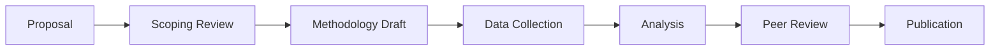

# Style Guide

**Summary:** Writing and formatting standards for CeloHT Research documents.
**Purpose:** Consistency across a repository written by many different contributors over time.
**Scope:** All Markdown documents in this repository.
**Audience:** Authors, editors, reviewers.

## Writing Principles

- **Plain language first.** A policy analyst, a developer, and a community organizer should all be able to follow the main argument without a glossary open in another tab.
- **State the method before the finding.** Readers should know how you know something before they're asked to believe it.
- **Numbers need units and dates.** "47 active agents" needs to say as of when.
- **Hedge honestly.** "Suggests" and "indicates" aren't weaker than "proves" — they're more accurate for most social-science findings, and CeloHT prefers accuracy to confidence.
- **Avoid promotional language.** This is a research repository, not a marketing one — see the tone contrast with the Brand repository's `VOICE_AND_TONE.md`, which governs different content entirely.

## Document Structure

Every substantive document includes, in this order: Title, Summary, Purpose, Scope, Audience, Definitions (where needed), Content, Examples (where applicable), Best Practices (where applicable), References, Related Documents, Revision History, License.

## Formatting Conventions

- **Headings:** sentence case, not Title Case (`## Data collection process`, not `## Data Collection Process`) — exception: this document and other top-level policy docs use Title Case in headers matching their established pattern; area-specific research documents should default to sentence case for readability
- **Tables:** used for any comparison of 3+ items across 2+ dimensions
- **Callouts:** use blockquotes (`>`) for methodology caveats, status notes, and important context that shouldn't be missed
- **Diagrams:** Mermaid syntax for flowcharts and process diagrams, embedded directly in Markdown
- **Dates:** ISO 8601 (`2026-08-02`), not ambiguous formats
- **Numbers:** spell out zero through nine in prose; use numerals for 10+ and for anything with a unit (e.g. "3 regions" not "three regions" when adjacent to other numeric data in the same sentence)

## Mermaid Diagram Example

## Badges

Use standard shields.io-style badges only for genuinely useful status information (license, review status) — not decoratively.

## Tone

Direct, precise, and unhurried. Avoid hedge-stacking (piling on qualifiers until a sentence says nothing) as much as avoiding overconfidence — both fail the reader.

## Language

English is the primary language for this repository, consistent with the main documentation repository's language policy. See [TRANSLATION_GUIDE.md](https://github.com/Celo-HT/CeloHT/blob/main/TRANSLATION_GUIDE.md) in that repository if translating research summaries for community use.

## Automatic Table of Contents

Longer documents (roughly 1,500+ words) should include a table of contents near the top, either hand-maintained or generated via the repository's TOC automation — see [.github/workflows/](./.github/workflows/).

## Related Documents

- [RESEARCH_GUIDELINES.md](./RESEARCH_GUIDELINES.md)
- [templates/](./templates/)

## Revision History

See [CHANGELOG](./CHANGELOG.md).

## License

[Apache 2.0](./LICENSE)
