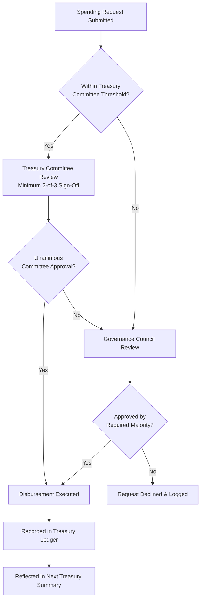

# CeloHT Treasury Policy

**Version:** 1.0
**Last Updated:** August 2026
**Status:** Active

---

## Purpose

This document defines how CeloHT's treasury is governed, controlled, and reported on. It translates the treasury principles established in `GOVERNANCE.md` Section 8 and `LEGAL_STATUS.md` Section 9 into an operational policy suitable for due-diligence review by donors, grant reviewers, and partners.

## Scope

This policy applies to all assets held in CeloHT's name — fiat holdings, cUSD balances, and any other asset received or held for programmatic use — regardless of the account, wallet, or custody arrangement in which they are held.

## Responsibilities

| Role | Treasury Responsibility |
|---|---|
| Governance Council | Approves treasury policy, annual budget, and disbursements above Council-level thresholds |
| Treasury Committee | Executes approved disbursements; maintains multi-signature custody per Section 4 |
| Finance Working Group | Reconciles records, prepares treasury reporting |
| Founder | One voice among Council members; holds no unilateral treasury authority |

## Review Schedule

Reviewed annually per `GOVERNANCE.md` Section 21, and immediately upon any material change to custody arrangements or approval thresholds.

---

## 1. Treasury Purpose

CeloHT's treasury exists solely to fund the project's programmatic and operational activity across its three pillars (Education, Agent Network, Reforestation) and the technology and governance infrastructure that supports them. Treasury funds are never held for speculative investment purposes and are never distributed as profit to any individual, consistent with `LEGAL_STATUS.md` Section 9.

## 2. Treasury Governance

Treasury governance follows the structure defined in `GOVERNANCE.md` Section 8:

- A **Treasury Committee** of three members, drawn from the Governance Council and Finance Working Group, manages day-to-day operations.
- No single Treasury Committee member may unilaterally authorize a disbursement.
- The Governance Council holds ultimate authority over treasury policy and any disbursement above the Committee-level threshold defined in `EXPENSE_APPROVAL_POLICY.md`.

## 3. Treasury Approval Workflow

Every request, regardless of outcome, is logged. Declined requests are recorded with the reason for decline, preserving a complete decision record for audit purposes.

## 4. Multi-Signature Policy (Framework)

CeloHT's treasury custody is designed around multi-signature control, consistent with `LEGAL_STATUS.md` Section 9 and `GOVERNANCE.md` Section 12.2:

- No individual holds sole signing authority over treasury funds.
- Disbursements above the Treasury Committee threshold require independent approval from multiple named signers before execution.
- Signer composition, specific custody infrastructure, and technical implementation details are determined by the Treasury Committee and ratified by the Governance Council; as this is a framework document, it does not publish specific wallet addresses, signer identities, or account numbers, which are addressed operationally and, where appropriate for security reasons, disclosed selectively rather than published in full public detail.
- Any change to signer composition is logged and reported in the next Treasury Summary (`FINANCIAL_REPORTS.md`).

## 5. Asset Custody

- CeloHT holds programmatic funds primarily in cUSD, consistent with its use as an operational settlement currency rather than a speculative asset (`LEGAL_STATUS.md` Section 9).
- Fiat holdings, where applicable, are held in accounts consistent with CeloHT's current legal status as described in `LEGAL_STATUS.md` Section 3; specific banking or custodial relationships are disclosed as they are established, and are marked "Not Yet Available" until then.
- Custody arrangements are reviewed periodically by the Governance Council for security and appropriateness as CeloHT's institutional form develops (`LEGAL_STATUS.md` Section 20).

## 6. Spending Categories

Treasury spending is categorized consistently across all financial reporting to support comparability over time:

| Category | Description |
|---|---|
| Education | Curriculum development, workshop delivery, learning materials |
| Agent Network | Agent training, verification support, network operations |
| Reforestation | Planting-site costs, materials, field reporting |
| Technology | Software development, infrastructure, security review |
| Operations | Administrative costs, governance operations, compliance |
| Community Growth | Outreach, ambassador support, community events |
| Emergency Reserve | Allocations to and use of the reserve defined in `RESERVE_POLICY.md` |

Category definitions and allocation reasoning are further detailed in `FUND_ALLOCATION_FRAMEWORK.md`.

## 7. Treasury Security

- Access to treasury custody infrastructure is restricted to Treasury Committee members and is subject to the access-control principles in `ARCHITECTURE.md` Section 12.3.
- Treasury Committee membership changes trigger a mandatory security review of custody access.
- Suspected treasury security incidents are handled under the Emergency Decision process in `GOVERNANCE.md` Section 4.5 and reported per `GOVERNANCE.md` Section 12.

## 8. Reporting

Treasury activity is reported through:

- The **Treasury Summary**, published quarterly (template in `FINANCIAL_REPORTS.md`).
- The **Quarterly Report** and **Annual Report**, which incorporate treasury data alongside broader financial and programmatic reporting.
- Ad hoc disclosure of any material treasury event (large disbursement, security incident, custody change) as it occurs.

As of this document's publication date, CeloHT's treasury activity is in early formation. Historical treasury figures are marked "Not Yet Available" where no reporting period has yet closed, rather than populated with placeholder figures.

---

*This document is maintained alongside `GOVERNANCE.md`, `LEGAL_STATUS.md`, `FINANCIAL_TRANSPARENCY.md`, `RESERVE_POLICY.md`, `INTERNAL_CONTROLS.md`, and `FUND_ALLOCATION_FRAMEWORK.md` in the CeloHT governance repository.*
