# CeloHT Whitepaper

**Version:** 1.0
**Last Updated:** August 2026
**Document Type:** Institutional Reference Document
**Status:** Living document, updated as CeloHT's programs, governance, and technical infrastructure mature

---

## About This Document

This whitepaper is CeloHT's primary institutional reference document. It is written for grant reviewers, institutional partners, universities, NGOs, government-adjacent bodies, open-source contributors, blockchain developers, auditors, researchers, and social-impact stakeholders evaluating CeloHT for funding, partnership, contribution, or academic study.

This document distinguishes, throughout, between **verified current facts** (what CeloHT has actually built, published, or established as of this document's date) and **future goals** (what CeloHT plans to build, pending funding, community growth, and governance approval). Where a claim describes a plan rather than a completed fact, this document says so explicitly, using language such as "planned," "targeted," or "under development." This document contains no fabricated statistics: where a metric does not yet exist, it is marked **Not Yet Available** rather than estimated or invented.

CeloHT is a non-incorporated, open-source, community-governed initiative as of this document's date (see `LEGAL_STATUS.md`). It does not issue a token, has never conducted a token sale, and is not an investment product (see `NO_TOKEN_POLICY.md`). Nothing in this whitepaper should be read as an offer of securities, an investment solicitation, or a promise of financial return.

This whitepaper is maintained alongside, and must remain consistent with, CeloHT's full documentation suite: `README.md`, `ROADMAP.md`, `ARCHITECTURE.md`, `API.md`, `DAO.md`, `GOVERNANCE.md`, `LEGAL_STATUS.md`, `NO_TOKEN_POLICY.md`, `FUNDING_POLICY.md`, `SECURITY.md`, `SMART_CONTRACTS.md`, `PROJECT_STRUCTURE.md`, `TEAM.md`, `CONTRIBUTING.md`, `CODE_OF_CONDUCT.md`, `RISK_MANAGEMENT.md`, `TRANSPARENCY.md`, and `TREASURY.md`. Where this whitepaper summarizes a topic covered in greater operational detail elsewhere, it references the authoritative document rather than duplicating and risking drift from it.

---

## Table of Contents

1. [Executive Summary](#1-executive-summary)
2. [Vision, Mission, and Core Values](#2-vision-mission-and-core-values)
3. [History of CeloHT](#3-history-of-celoht)
4. [Problem Statement and Global Context](#4-problem-statement-and-global-context)
5. [Foundational Choices: Why Haiti, Why Celo, Why Stablecoins, Why Open Source](#5-foundational-choices)
6. [The Education Ecosystem](#6-the-education-ecosystem)
7. [The Agent Ecosystem](#7-the-agent-ecosystem)
8. [The Reforestation Ecosystem](#8-the-reforestation-ecosystem)
9. [The Integrated Impact Model](#9-the-integrated-impact-model)
10. [Technology Stack and Architecture](#10-technology-stack-and-architecture)
11. [Infrastructure, Security, and Identity](#11-infrastructure-security-and-identity)
12. [Wallet Integration](#12-wallet-integration)
13. [Developer Experience, API Strategy, and Future SDKs](#13-developer-experience-api-strategy-and-future-sdks)
14. [Governance](#14-governance)
15. [DAO Evolution](#15-dao-evolution)
16. [Treasury](#16-treasury)
17. [Transparency](#17-transparency)
18. [Risk Management](#18-risk-management)
19. [Legal Considerations and Compliance Principles](#19-legal-considerations-and-compliance-principles)
20. [Ethics](#20-ethics)
21. [Community, Volunteer, and Ambassador Programs](#21-community-volunteer-and-ambassador-programs)
22. [Partnership Strategy](#22-partnership-strategy)
23. [Grant Strategy](#23-grant-strategy)
24. [Financial Sustainability](#24-financial-sustainability)
25. [Monitoring and Evaluation, KPIs, and Impact Framework](#25-monitoring-and-evaluation-kpis-and-impact-framework)
26. [Environmental Impact](#26-environmental-impact)
27. [Social Impact](#27-social-impact)
28. [Scaling Strategy and International Expansion](#28-scaling-strategy-and-international-expansion)
29. [Five-Year Roadmap](#29-five-year-roadmap)
30. [Ten-Year Vision](#30-ten-year-vision)
31. [Case Studies](#31-case-studies)
32. [Frequently Asked Questions](#32-frequently-asked-questions)
33. [Glossary](#33-glossary)
34. [References](#34-references)
35. [Appendices](#35-appendices)

---

## 1. Executive Summary

### 1.1 Overview

CeloHT is an open-source, community-governed initiative built on the Celo blockchain, working to expand financial inclusion, digital and financial literacy, and environmental restoration in Haiti and, over time, the wider Caribbean. CeloHT organizes its work around three interconnected pillars — **Education**, a community **Agent Network**, and **Reforestation** — unified by a single conviction: that durable financial inclusion requires literacy, trusted local infrastructure, and a stable environment in which communities can build long-term prosperity, together.

### 1.2 What CeloHT Is, Precisely

CeloHT is an open-source software and community-education project. It is not a bank, not a cryptocurrency exchange, not an investment company, not a security issuer, not a token issuer, not a DAO with legal personality, and not a for-profit company (`LEGAL_STATUS.md` Section 4). CeloHT has no native token, has never conducted a token sale, and does not plan to create one (`NO_TOKEN_POLICY.md`). Every use of blockchain technology within CeloHT is justified by a concrete transparency, cost, or accessibility benefit for the communities it serves — never as a speculative or financial-return mechanism.

### 1.3 Objectives of This Whitepaper

This whitepaper exists to give any institutional stakeholder — a grant committee, a university research partner, a diaspora-focused NGO, a government-adjacent development body, or a blockchain developer — a single, comprehensive, internally consistent reference for understanding what CeloHT is, why it is built the way it is, how it is governed, and where it is going. It draws together, and remains fully consistent with, CeloHT's complete documentation suite listed above.

### 1.4 Summary of the Three Pillars

| Pillar | Core Activity | Primary Technology Enablers |
|---|---|---|
| **Education** | Web3, financial-literacy, and digital-skills training delivered primarily in Haitian Creole | dApp learning modules, CeloHT Academy content series, community workshops |
| **Agent Network** | Community-based agents providing cUSD cash-in/cash-out and onboarding support | Valora, MiniPay, on-chain agent verification registry |
| **Reforestation** | Community-driven tree planting with transparent, independently verifiable impact reporting | On-chain attestation hashes, public Impact Dashboard |

### 1.5 Summary of Governance and Legal Posture

CeloHT is governed through a documented framework (`GOVERNANCE.md`) built around a Governance Council, Working Groups, and a public proposal lifecycle — not unilateral founder control and not token-weighted voting. As of this document's date, CeloHT is not incorporated, does not hold nonprofit or tax-exempt status in any jurisdiction, and does not hold government or regulatory approval of any kind (`LEGAL_STATUS.md` Section 3). This is stated plainly, not as a limitation to be minimized, but as an accurate description of an early-stage initiative with a defined, publicly documented path toward greater institutional formality (`LEGAL_STATUS.md` Section 20).

### 1.6 Summary of Current Development Status

As of this document's date, CeloHT has published a complete governance, legal, technical-architecture, financial-governance, and team-transparency documentation suite, and has built foundational open-source repositories, educational content, and a static project website. CeloHT's backend API, production dApp, and Agent Network infrastructure are in active design and early development, with implementation status tracked explicitly per component in `ARCHITECTURE.md` and `API.md`. This whitepaper does not claim operational maturity CeloHT has not yet reached; Section 29 (Five-Year Roadmap) describes the path from the current documentation-and-design-complete stage toward full operational maturity.

### 1.7 Who Should Read This Document

| Audience | Primary Sections of Interest |
|---|---|
| Grant reviewers and institutional funders | Executive Summary, Financial Sustainability, Grant Strategy, Monitoring and Evaluation |
| University and research partners | Problem Statement, Technology Stack, Impact Framework, Case Studies |
| NGOs and development-sector partners | Education, Agent, and Reforestation Ecosystems, Partnership Strategy |
| Blockchain and open-source developers | Technology Stack, Architecture, API Strategy, Developer Experience |
| Auditors and compliance reviewers | Legal Considerations, Governance, Treasury, Risk Management |
| Community members and prospective contributors | Community Programs, Governance, Roadmap |

---

## 2. Vision, Mission, and Core Values

### 2.1 Vision

CeloHT's long-term vision is a Haiti — and, in time, a wider Caribbean region — where digital financial tools are broadly understood and safely usable in people's own language; where community-based agents provide a trusted, human bridge between digital value and everyday cash needs; and where the communities CeloHT works with also benefit from active, transparently reported environmental restoration.

### 2.2 Mission

CeloHT's mission, as stated consistently across its documentation (`GOVERNANCE.md` Section 1.1, `LEGAL_STATUS.md` Section 2), is to build an open-source, community-governed public-benefit initiative on the Celo blockchain focused on financial inclusion, Web3 education, a community Agent Network, and environmental restoration.

### 2.3 Core Values

| Value | Description |
|---|---|
| **Community first** | Decisions are evaluated by their impact on the communities CeloHT serves, not the benefit of any individual |
| **Radical clarity** | Rules, budgets, and decisions are written down, dated, and published |
| **Language equity** | Haitian Creole is a first-class language for governance, documentation, and education |
| **Sustainability over speed** | CeloHT prefers a slower, well-governed pace of growth to a faster, fragile one |
| **Stewardship, not ownership** | Roles in CeloHT are held on behalf of the community, never as personal property |
| **Verifiability over assertion** | Claims are backed by public, checkable records — on-chain attestations, published reports, open repositories — rather than by trust alone |

### 2.4 Why These Values Matter to CeloHT's Stakeholders

For a grant reviewer, these values translate into a predictable governance and reporting cadence (Sections 14 and 17). For a developer, they translate into a genuinely open codebase and a documented contribution path (`CONTRIBUTING.md`). For the communities CeloHT serves, they translate into content and support delivered in their own language, by people accountable to a public governance process rather than to a single founder's discretion.

---

## 3. History of CeloHT

### 3.1 Founding Context

CeloHT was founded by Johnny Dubic, based in Léogâne, Haiti, out of a conviction that financial-inclusion technology delivers the most value to underserved communities when paired with genuine literacy and a trustworthy human network — not when deployed as a purely technical intervention. The project's founding design choices — a non-token architecture, Haitian Creole as a first-class documentation language, and a three-pillar structure spanning education, human agent infrastructure, and environmental work — trace directly to that founding conviction.

### 3.2 Early Development

CeloHT's earliest work centered on foundational research, a static website prototype communicating the project's mission and three-pillar structure, and an extensive body of original Haitian Creole educational content covering blockchain fundamentals, Web3 concepts, and financial literacy. This early content-first approach reflects CeloHT's premise that education must precede — and accompany — any technical deployment, not follow it as an afterthought.

### 3.3 Governance and Documentation Maturity

CeloHT subsequently developed a complete governance and institutional-documentation suite: `GOVERNANCE.md` (community governance framework), `LEGAL_STATUS.md` (legally neutral organizational-status disclosure), `ARCHITECTURE.md` (technical architecture), `TEAM.md` and its companion documents (team transparency and verification policy), a full Financial Governance document suite (treasury, procurement, expense approval, financial reporting, reserves, conflict of interest, internal controls, audit policy, and fund allocation), `API.md` (API specification), and `DAO.md` (a phased plan for future community-governance evolution). This documentation-first maturity model — establishing accountability, transparency, and legal-clarity infrastructure before scaling technical deployment or fundraising — is itself a deliberate CeloHT design choice, informed by common due-diligence gaps identified in early-stage Web3 and open-source projects.

### 3.4 Present Stage

As of this document's date, CeloHT sits at the transition between its documentation-and-design-complete stage and its dApp-operational phase (see `DAO.md` Section 3 for the related governance-activation roadmap, and Section 29 of this whitepaper for the corresponding five-year roadmap). This whitepaper is published at this stage specifically to give institutional stakeholders an accurate, comprehensive picture of a project that is early in its operational life but has invested deliberately and unusually heavily in governance, legal clarity, and architectural planning before scaling.

---

## 4. Problem Statement and Global Context

### 4.1 The Financial Inclusion Gap

Across much of the developing world, and acutely in Haiti, a substantial share of the population remains outside formal financial systems: without a bank account, without accessible credit, and without a safe way to receive remittances or save value that is not eroded by local currency instability. This gap is not primarily a technology gap — mobile phone penetration in Haiti is significant — it is a combination of a **trust gap** (limited confidence in unfamiliar financial tools), a **literacy gap** (limited exposure to how digital financial tools actually work), and an **infrastructure gap** (limited local, human points of contact for converting digital value to usable cash and back).

### 4.2 Why Technology Alone Does Not Solve This

Global experience across the Web3 and mobile-money sectors shows a consistent pattern: financial-inclusion technology deployed without accompanying education and human support infrastructure achieves limited, often shallow adoption. Users who do not understand what they are using are vulnerable to error, fraud, and abandonment of the tool after initial difficulty. CeloHT's three-pillar design is a direct response to this pattern: technology (the Agent Network and dApp), paired deliberately with education (the Education pillar) and delivered by a network of trusted local agents rather than a purely app-based, self-service model.

### 4.3 The Environmental Dimension

Financial inclusion and environmental resilience are connected in communities like those CeloHT serves: economic precarity and environmental degradation (deforestation, soil erosion, reduced agricultural resilience) frequently reinforce each other. CeloHT's Reforestation pillar reflects a view that a financial-inclusion initiative operating in this context has a responsibility to engage with, not ignore, the environmental conditions its target communities live within.

### 4.4 The Global Context of Web3 for Public Benefit

CeloHT operates within a broader global movement applying blockchain infrastructure to public-benefit rather than purely speculative use cases — a movement that includes the Celo Foundation's own mobile-first, stablecoin-centered design philosophy, and comparable public-benefit blockchain initiatives worldwide. CeloHT positions itself within this movement specifically, not within the token-speculation or DeFi-yield segment of the Web3 ecosystem.

---

## 5. Foundational Choices

### 5.1 Why Haiti

Haiti combines significant unmet financial-inclusion need, a large and economically engaged diaspora whose remittances represent a substantial share of national income, high mobile-phone penetration relative to formal banking penetration, and — critically for CeloHT's founding team — direct, lived local context and language fluency (Haitian Creole) that is frequently absent from international financial-inclusion projects designed and delivered in a foreign language by a foreign team. CeloHT is designed from a Haiti-first, Haitian-Creole-first foundation, not adapted from a foreign-market product after the fact.

### 5.2 Why Celo

Celo was selected as CeloHT's blockchain foundation because of its mobile-first design philosophy, its EVM compatibility (lowering the barrier for future developer contribution and tooling reuse), and its native stablecoin infrastructure (cUSD), which directly supports CeloHT's core design principle of avoiding exposure of vulnerable users to price-volatile assets. Celo's low transaction costs are particularly relevant to CeloHT's Agent Network use case, where transaction fees that are trivial in absolute terms can represent a meaningful barrier for low-value, high-frequency cash-in/cash-out activity.

### 5.3 Why Stablecoins

CeloHT's use of cUSD, rather than a volatile cryptocurrency, reflects a considered position: financial-inclusion tools for economically vulnerable populations should not introduce new forms of financial risk. A stablecoin allows CeloHT's Agent Network and education programs to demonstrate real, practical digital-payment functionality without asking a first-time user to absorb exchange-rate risk as the cost of participation.

### 5.4 Why Open Source

CeloHT publishes its software, governance documents, and educational materials under open licenses (`LEGAL_STATUS.md` Section 11) for three reasons: it allows the value CeloHT creates to remain available to the public rather than becoming proprietary; it allows external audit and verification of CeloHT's claims, consistent with the Verifiability value in Section 2.3; and it allows other organizations and communities — in Haiti, the wider Caribbean, or elsewhere — to adapt CeloHT's model to their own context without starting from zero.

### 5.5 Why No Token

CeloHT's decision not to issue a token is foundational, not incidental. A token-based design would introduce speculative dynamics, regulatory complexity, and a governance-capture risk (wealth-weighted voting) directly at odds with CeloHT's community-governance and financial-inclusion mission. This decision is documented in full in `NO_TOKEN_POLICY.md` and reaffirmed throughout `LEGAL_STATUS.md`, `GOVERNANCE.md`, and `DAO.md`.

---

## 6. The Education Ecosystem

### 6.1 Executive Summary

CeloHT's Education pillar delivers Web3, blockchain, financial-literacy, and digital-skills training, primarily in Haitian Creole, through a combination of dApp-based learning modules (planned; see `ARCHITECTURE.md` Section 9), community workshops, and an extensive published content series (the CeloHT Academy).

### 6.2 Objectives

- Build genuine financial literacy before or alongside a learner's first contact with digital-payment tools, rather than after.
- Deliver content in Haitian Creole as a first-class language, not a secondary translation.
- Create a reusable, open-source curriculum that other communities and organizations can adapt.

### 6.3 Curriculum Structure

| Category | Example Content |
|---|---|
| Web3 and blockchain basics | What a blockchain is, what a wallet is, custody and key-management fundamentals |
| cUSD and Valora/MiniPay training | Practical, hands-on modules on sending, receiving, and safeguarding cUSD |
| Financial literacy | Budgeting, savings discipline, remittance management, fraud awareness |
| Digital skills | Basic smartphone literacy, internet safety, account security |

### 6.4 Delivery Workflow

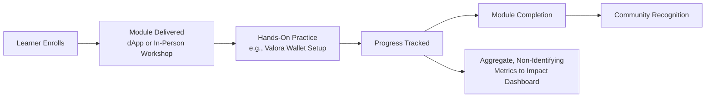

### 6.5 Best Practices Applied

- Content is developed and reviewed for accuracy before publication, consistent with `GOVERNANCE.md` Section 14 (Documentation Governance).
- Haitian Creole and English versions are maintained as co-equal, not translation-of-convenience, per `GOVERNANCE.md` Section 14.2.
- Offline-friendly formats are prioritized given variable connectivity in target communities (`ARCHITECTURE.md` Section 4.4).

### 6.6 Risks and Mitigations

| Risk | Mitigation |
|---|---|
| Content becomes outdated as the Celo ecosystem evolves | Documentation versioning and scheduled review cycles (`GOVERNANCE.md` Section 14.3) |
| Low completion rates in low-connectivity environments | Offline-cacheable content design (`ARCHITECTURE.md` Section 4.4) |
| Language quality drift between Creole and English versions | Documentation Working Group reconciliation process (`GOVERNANCE.md` Section 14.2) |

### 6.7 Key Takeaways

Education is not a supporting feature of CeloHT — it is the pillar that makes the Agent Network and broader financial-inclusion goal achievable rather than merely accessible.

### 6.8 Future Outlook

Planned development includes dApp-integrated interactive modules, structured completion credentials recognized within the CeloHT community, and expanded partnership-delivered workshops (Section 22).

---

## 7. The Agent Ecosystem

### 7.1 Executive Summary

The Agent Network is CeloHT's human-infrastructure layer: verified community members who provide cUSD cash-in/cash-out services, bridging digital value and physical cash in communities where that bridge is otherwise limited or absent.

### 7.2 Objectives

- Provide a trusted, local, human point of contact for digital-payment access.
- Create a transparent, independently verifiable agent-verification system.
- Generate a modest, sustainable local-income opportunity tied to legitimate financial-inclusion service delivery.

### 7.3 Agent Lifecycle

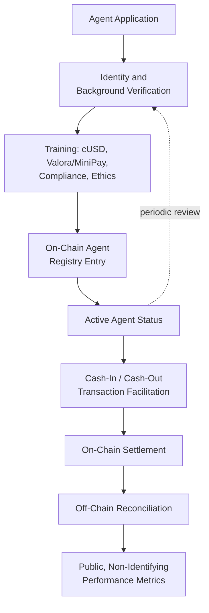

### 7.4 Trust and Verification Model

Agent verification combines off-chain identity and background review (`ARCHITECTURE.md` Section 8.2, `VERIFICATION_POLICY.md`) with an on-chain registry entry, allowing any community member to independently confirm an agent's verified status without relying on CeloHT's word alone.

### 7.5 Best Practices Applied

- Segregation between agent identity verification and transaction execution, consistent with the internal-controls principles in `INTERNAL_CONTROLS.md`.
- Public, non-identifying performance reporting rather than exposing individual transaction-level personal data (`LEGAL_STATUS.md` Section 16).

### 7.6 Risks and Mitigations

| Risk | Mitigation |
|---|---|
| Agent impersonation or fraud | On-chain verification registry, publicly checkable (`ARCHITECTURE.md` Section 8.2) |
| Liquidity shortfalls at the agent level | Agent training on liquidity management; planned agent support tools |
| Regulatory ambiguity around cash-handling activity | Legal Working Group monitoring (`LEGAL_STATUS.md` Section 13), compliance-first design |

### 7.7 Key Takeaways

The Agent Network is the point at which CeloHT's education and technology investments become tangible, everyday utility for a community member who may never open the dApp directly.

### 7.8 Future Outlook

Planned expansion includes additional regions within Haiti, expanded agent support tooling, and — pending regulatory review — potential extension to additional Caribbean markets (Section 28).

---

## 8. The Reforestation Ecosystem

### 8.1 Executive Summary

CeloHT's Reforestation pillar coordinates and transparently reports on community tree-planting and environmental-restoration activity, engineered from the outset for independently verifiable impact claims rather than self-reported statistics alone.

### 8.2 Objectives

- Engage the same communities served by Education and Agent Network programs in tangible environmental restoration.
- Make every reported planting event independently verifiable.
- Build a long-term, transparent environmental-impact record.

### 8.3 Verification Workflow

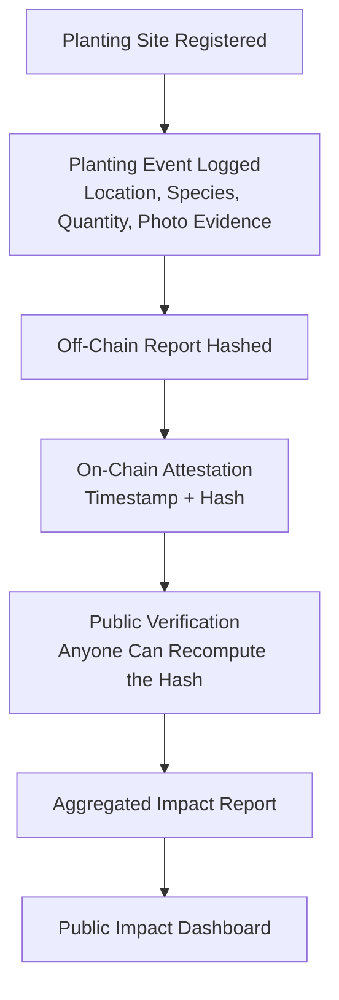

### 8.4 Why On-Chain Attestation, Not On-Chain Media

CeloHT anchors a cryptographic hash of each reforestation report on-chain, rather than the underlying photo or field-data files themselves, for practical and privacy reasons (file size, and the privacy of community members appearing in field photos), while still providing tamper-evident, independently verifiable proof that a specific report existed at a specific time and has not been altered since (`ARCHITECTURE.md` Section 10.2).

### 8.5 Best Practices Applied

- Consistent, published spending-category and reporting alignment with `TREASURY.md` Section 6.
- Community participation logged alongside environmental data, reflecting reforestation as a community activity, not a purely contracted service.

### 8.6 Risks and Mitigations

| Risk | Mitigation |
|---|---|
| Overstated or unverifiable impact claims | On-chain attestation model (Section 8.3–8.4) |
| Survivorship of planted trees not tracked long-term | Planned long-term monitoring protocol as program matures |
| Site-selection or land-rights disputes | Legal Working Group and local-partner review prior to site registration |

### 8.7 Key Takeaways

Reforestation demonstrates CeloHT's broader transparency philosophy in its most concrete form: an environmental claim the public does not have to simply trust, because it can be independently checked.

### 8.8 Future Outlook

Planned development includes expanded site partnerships, longer-term survival-rate tracking, and integration of reforestation outcomes into CeloHT's broader Impact Framework (Section 25).

---

## 9. The Integrated Impact Model

### 9.1 Executive Summary

CeloHT's three pillars are designed to reinforce one another rather than operate as independent programs sharing only a brand. This section explains how.

### 9.2 The Integration Logic

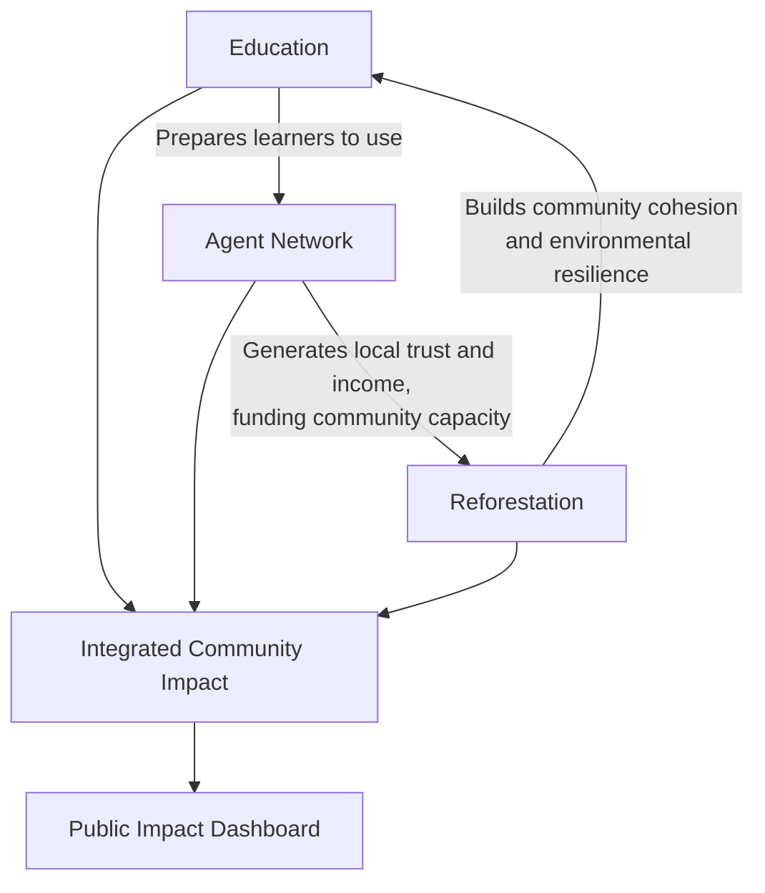

- A learner who completes financial-literacy and Valora/MiniPay training (Education) is better equipped to safely use Agent Network services and less vulnerable to error or fraud.
- An Agent Network that generates modest local income and trust creates community capacity and goodwill that supports participation in reforestation events.
- Reforestation events themselves double as community-education and community-building opportunities, reinforcing the Education pillar's reach beyond formal modules.

### 9.3 Stakeholder Table

| Stakeholder | Primary Interaction | Value Received |
|---|---|---|
| Learner | Education modules | Financial literacy, practical wallet skills |
| Community member | Agent Network | Accessible cash-in/cash-out, remittance support |
| Verified agent | Agent Network | Training, verified status, modest income opportunity |
| Community | Reforestation | Environmental restoration, community participation |
| Partner organization | Cross-pillar collaboration | Transparent, verifiable impact data for their own reporting |
| Grant funder | All pillars | Auditable, cross-referenced impact and financial reporting |

### 9.4 Risks and Mitigations

| Risk | Mitigation |
|---|---|
| Pillars drift apart operationally as the project scales | Working Group structure under a single Governance Council (`GOVERNANCE.md` Section 15) keeps cross-pillar coordination centralized |
| Impact measurement remains siloed per pillar | Unified public Impact Dashboard aggregating all three pillars (`ARCHITECTURE.md` Section 13.3) |

### 9.5 Key Takeaways

CeloHT's integrated model is a hypothesis under active testing, not a proven formula: the project's Monitoring and Evaluation framework (Section 25) is designed specifically to test whether this cross-pillar reinforcement produces measurably better outcomes than a single-pillar approach, and to publish those findings honestly regardless of outcome.

---

## 10. Technology Stack and Architecture

### 10.1 Executive Summary

CeloHT's technical architecture, documented in full in `ARCHITECTURE.md`, connects a mobile-first dApp, a backend services layer, the Celo blockchain, wallet infrastructure, and impact-reporting systems into a single coherent pipeline.

### 10.2 Technology Stack Table

| Layer | Technologies |
|---|---|
| Blockchain | Celo, cUSD, CELO, EVM-compatible smart contracts |
| Frontend | Next.js, React, TypeScript, Tailwind CSS, shadcn/ui |
| Wallets | Valora, MiniPay, WalletConnect |
| Backend | REST API (`API.md`), relational database, service-oriented architecture |
| Analytics | Blockchain indexer, scheduled reconciliation jobs, public dashboard |
| CI/CD | Automated linting, testing, testnet contract validation, staged deployment |

### 10.3 High-Level Architecture Diagram

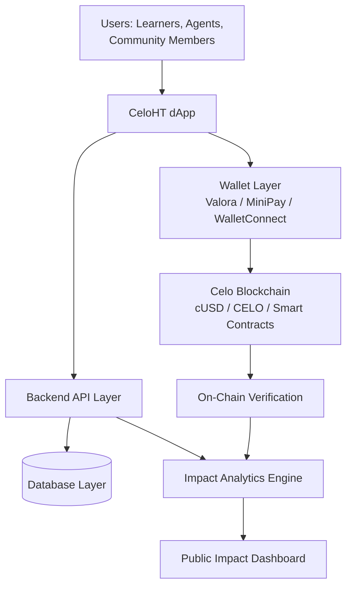

### 10.4 Design Principles

- **Minimal on-chain footprint.** Only data that genuinely benefits from public immutability (settlement, agent verification, reforestation attestation) is placed on-chain (`ARCHITECTURE.md` Section 13.1).
- **Mobile-first, connectivity-aware.** Interfaces and content are designed for intermittent connectivity and feature-constrained devices (`ARCHITECTURE.md` Section 4.2).
- **Open by default.** Source code is public across CeloHT's GitHub organization, licensed per `LEGAL_STATUS.md` Section 11.

### 10.5 Risks and Mitigations

| Risk | Mitigation |
|---|---|
| Over-engineering before genuine user demand is proven | Phased build-out tied to the roadmap in Section 29, not built speculatively ahead of need |
| Vendor or platform lock-in | EVM-compatible, open-standard technology choices throughout |

### 10.6 Key Takeaways

CeloHT's architecture is deliberately conservative in its on-chain footprint and deliberately mobile-first — both choices trace directly back to the target-user context described in Section 4.

### 10.7 Future Outlook

See Section 13 for API and SDK evolution, and `ARCHITECTURE.md` Section 15 for the full technical scalability roadmap.

---

## 11. Infrastructure, Security, and Identity

### 11.1 Executive Summary

CeloHT's security architecture, detailed in `ARCHITECTURE.md` Section 12 and `API.md` Section 14, applies least-privilege access control, multi-signature treasury protection, and OWASP-aligned API security practices throughout the stack.

### 11.2 Security Controls Table

| Control | Applies To | Reference |
|---|---|---|
| Multi-signature treasury custody | All treasury funds | `TREASURY.md` Section 4 |
| Role-based access control (RBAC) | Backend API, repository access | `ARCHITECTURE.md` Section 12.3 |
| Mandatory code review (2 reviewers for fund-handling logic) | Smart contracts, backend | `GOVERNANCE.md` Section 13 |
| Independent security audit before mainnet deployment | Smart contracts | `ARCHITECTURE.md` Section 12.6 |
| Responsible disclosure process | All security vulnerabilities | `GOVERNANCE.md` Section 12.1 |
| JWT + wallet-signature authentication | API access | `API.md` Section 4 |
| Rate limiting and replay protection | API access | `API.md` Sections 9, 14.6 |

### 11.3 Identity Approach

CeloHT deliberately avoids centralized custody of user financial identity beyond what is operationally necessary. Wallet-based identity (Section 12) is preferred over CeloHT-issued credentials wherever feasible, minimizing the personal data CeloHT itself must protect (`LEGAL_STATUS.md` Section 16).

### 11.4 Incident Response Workflow

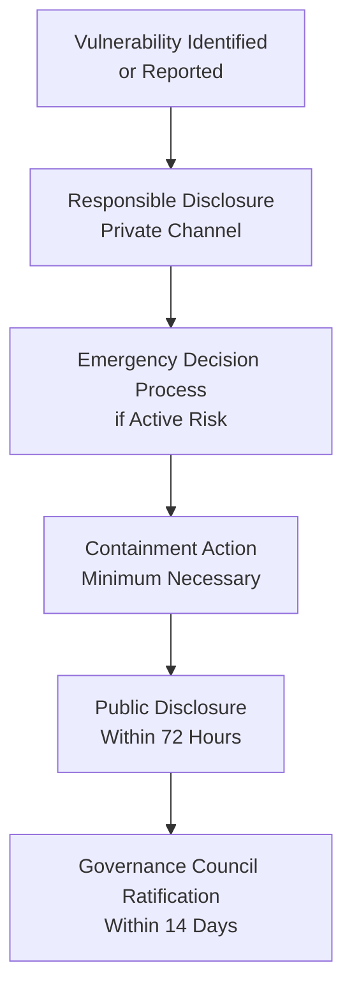

### 11.5 Risks and Mitigations

| Risk | Mitigation |
|---|---|
| Smart contract vulnerability | Mandatory audit before deployment, minimal contract surface area (`ARCHITECTURE.md` Section 6.4) |
| Credential or key compromise | RBAC, multi-signature treasury, rotation procedures |
| Data breach of personal information | Data minimization principle, restricted access (`LEGAL_STATUS.md` Section 16) |

### 11.6 Key Takeaways

CeloHT's security posture is built around minimizing what must be trusted or protected in the first place, not solely around defending a large attack surface after the fact.

---

## 12. Wallet Integration

### 12.1 Executive Summary

CeloHT does not implement custodial wallet infrastructure. All value custody and transaction signing occur in the user's own wallet, consistent with self-custody best practice.

### 12.2 Supported Wallets

| Wallet | Role in CeloHT |
|---|---|
| **Valora** | Primary recommended wallet for learners and agents wanting full functionality |
| **MiniPay** | Lightweight, embedded wallet suited to lower-end devices and first-time users |
| **WalletConnect-compatible wallets** | Standards-based fallback ensuring broader ecosystem interoperability |

### 12.3 Integration Architecture

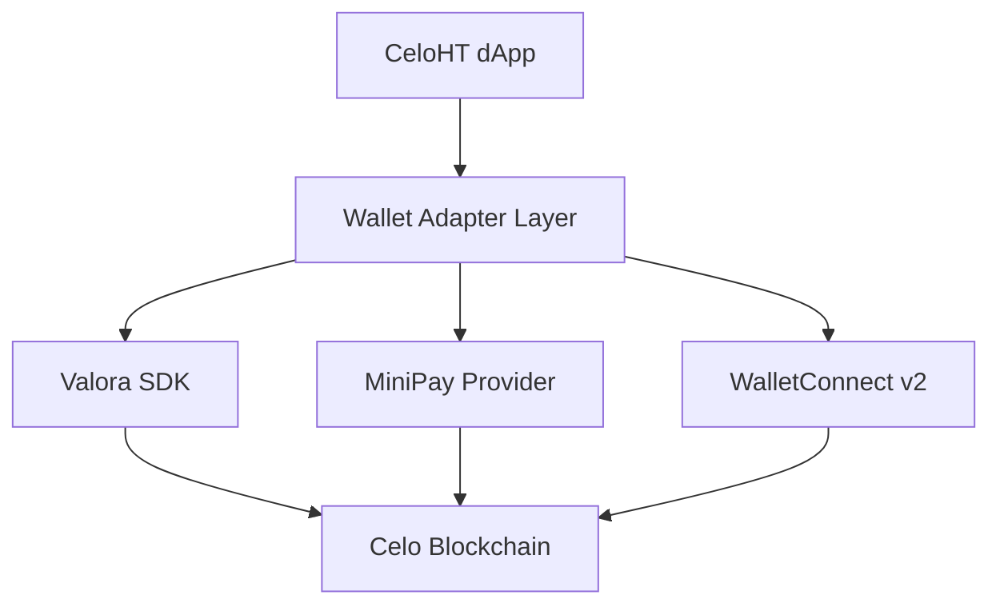

### 12.4 Why Multiple Wallets

Supporting multiple wallets, rather than a single CeloHT-controlled option, reflects the openness principle in Section 5.4 and avoids creating a single point of dependency or control over user funds.

### 12.5 Risks and Mitigations

| Risk | Mitigation |
|---|---|
| Wallet provider discontinuation or policy change | Multi-wallet, standards-based integration (WalletConnect fallback) |
| User confusion across wallet options | Education-pillar guidance on wallet selection (Section 6) |

### 12.6 Key Takeaways

Wallet integration is where CeloHT's non-custodial principle becomes concrete: CeloHT never holds user funds on their behalf.

---

## 13. Developer Experience, API Strategy, and Future SDKs

### 13.1 Executive Summary

CeloHT's developer-facing strategy, detailed fully in `API.md`, is built around a versioned REST API, an OpenAPI 3.1 specification, and a planned multi-language SDK roadmap.

### 13.2 API Design Philosophy

- Public read access by default for education, impact, and reforestation data.
- Minimal, purposeful authenticated write endpoints.
- Explicit implementation-status labeling (Implemented / In Development / Planned) for every endpoint, so integrators never build against unverified assumptions (`API.md` Section 15).

### 13.3 Developer Ecosystem Diagram

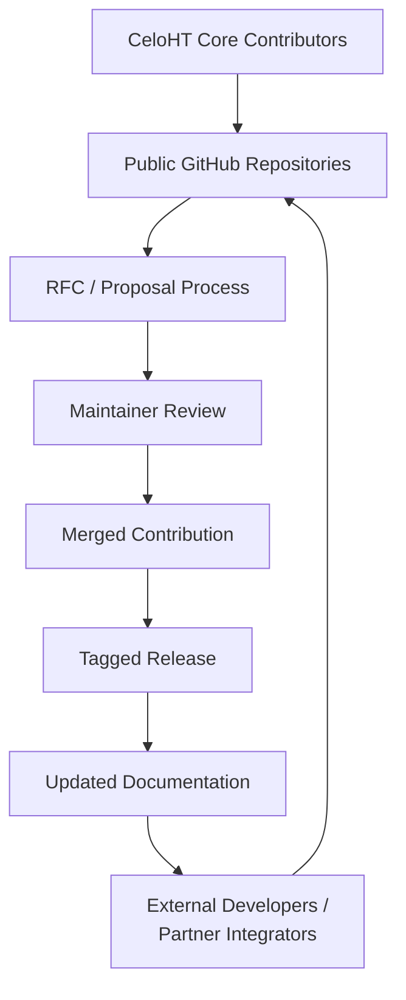

### 13.4 SDK Roadmap Table

| Language | Status |
|---|---|
| JavaScript | Planned |
| TypeScript | Planned |
| Python | Planned |
| Flutter / Dart | Planned |
| Go | Future |
| Rust | Future |

### 13.5 Open-Source Contribution Lifecycle

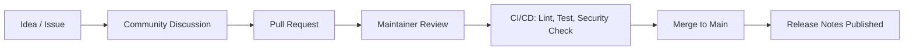

### 13.6 Risks and Mitigations

| Risk | Mitigation |
|---|---|
| API contract drift from documentation | OpenAPI specification kept in sync with `API.md` as the single source of truth |
| Low external contributor engagement | Structured onboarding via `CONTRIBUTING.md`, documentation-hub investment (Section 3.3) |

### 13.7 Key Takeaways

CeloHT's developer experience strategy prioritizes trustworthy documentation over premature SDK proliferation — publishing a stable, well-specified API contract before building convenience libraries on top of it.

---

## 14. Governance

### 14.1 Executive Summary

CeloHT is governed under a documented, community-oriented framework (`GOVERNANCE.md`) built around a Governance Council, Working Groups, and a public Proposal Lifecycle — deliberately avoiding both unilateral founder control and token-weighted voting.

### 14.2 Governance Structure Diagram

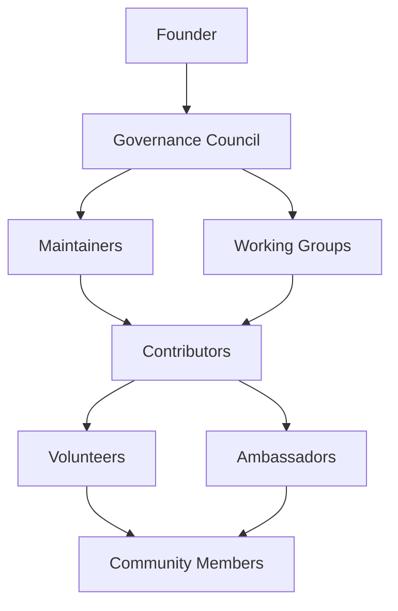

### 14.3 Governance Responsibilities Table

| Role | Core Responsibility | Authority Limit |
|---|---|---|
| Founder | Mission continuity, narrow emergency safeguard | One vote among several on Council; no unilateral treasury or governance authority |
| Governance Council | Strategic, treasury, and governance decisions | Bound by quorum, majority thresholds, and this document's own amendment process |
| Maintainers | Code review, releases, security triage | No governance or treasury authority beyond their repository scope |
| Working Groups | Operational execution within a published charter | Report to and are appointed by the Governance Council |
| Contributors, Volunteers, Ambassadors, Community Members | Proposal submission, participation, feedback | No unilateral decision authority; influence exercised through the Proposal Lifecycle |

### 14.4 Decision-Making Framework

CeloHT classifies decisions into four categories — Operational, Technical, Strategic, and Emergency — each with a defined decision-maker, process, and documentation requirement (`GOVERNANCE.md` Section 4). This tiered structure ensures routine work moves quickly while strategic and treasury-significant decisions receive proportionate scrutiny.

### 14.5 Proposal Lifecycle

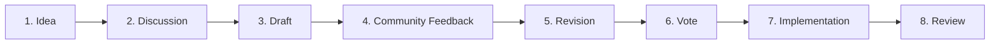

### 14.6 Risks and Mitigations

| Risk | Mitigation |
|---|---|
| Concentration of authority in the Founder role | Council-based governance, term limits, narrow and auto-expiring emergency safeguard (`GOVERNANCE.md` Section 3.1) |
| Governance paralysis | Defined quorum and majority thresholds calibrated per decision category (`GOVERNANCE.md` Section 5) |
| Governance decisions made without community visibility | Mandatory public comment periods within the Proposal Lifecycle |

### 14.7 Key Takeaways

CeloHT's governance model treats accountability as a structural property, not a personal virtue: no individual, including the Founder, can move strategy or treasury unilaterally.

### 14.8 Future Outlook

See Section 15 for how this governance model is designed to evolve toward broader community participation through the CeloHT DAO.

---

## 15. DAO Evolution

### 15.1 Executive Summary

CeloHT has published a phased design (`DAO.md`) for evolving its governance model toward broader, structured community participation — a Community Governance DAO, explicitly not a token-governance DAO. As of this document's date, the CeloHT DAO is a design specification and is not operational; `GOVERNANCE.md` remains the sole active governance framework.

### 15.2 Activation Roadmap

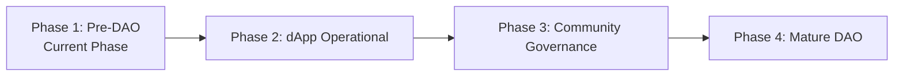

| Phase | Defining Characteristic |
|---|---|
| Phase 1 — Pre-DAO (current) | `GOVERNANCE.md` fully governs; no DAO tooling in binding use |
| Phase 2 — dApp Operational | Off-chain voting piloted for non-binding sentiment polls |
| Phase 3 — Community Governance | Off-chain voting becomes binding for defined proposal categories; Technical and Transparency Committees formed |
| Phase 4 — Mature DAO | Narrowly scoped on-chain governance components evaluated, subject to prior audit |

### 15.3 Governance Scope and Limits

The CeloHT DAO is designed to hold community-voting authority over dApp improvements, education-program direction, Agent Network expansion, reforestation initiatives, non-financial-commitment partnerships, and community initiatives (`DAO.md` Section 9) — while treasury policy, legal-status decisions, governance-document amendments, and emergency actions remain reserved to the Governance Council (`DAO.md` Section 10).

### 15.4 Risks and Mitigations

| Risk | Mitigation |
|---|---|
| Premature decentralization outpacing operational maturity | Phased activation with explicit, non-calendar-based exit criteria (`DAO.md` Section 3) |
| Governance-vote manipulation | Sybil-resistant, contribution-based voting eligibility, not token-weighted (`DAO.md` Section 6) |
| DAO tooling used to bypass treasury controls | Dual-layer design: DAO approves direction, existing treasury controls govern execution (`DAO.md` Section 7.3) |

### 15.5 Key Takeaways

The CeloHT DAO is a roadmap for deepening community ownership of decision-making — not a rebranding of CeloHT as a token-governed entity.

---

## 16. Treasury

### 16.1 Executive Summary

CeloHT's treasury, governed under `TREASURY.md`, `EXPENSE_APPROVAL_POLICY.md`, `RESERVE_POLICY.md`, and `PROCUREMENT_POLICY.md`, funds CeloHT's programmatic and operational activity exclusively — never distributed as profit, never invested speculatively.

### 16.2 Treasury Flow Diagram

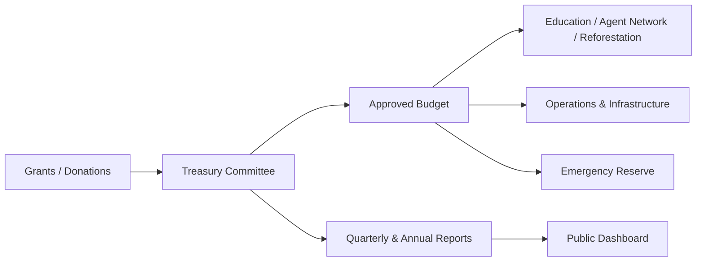

### 16.3 Treasury Approval Workflow

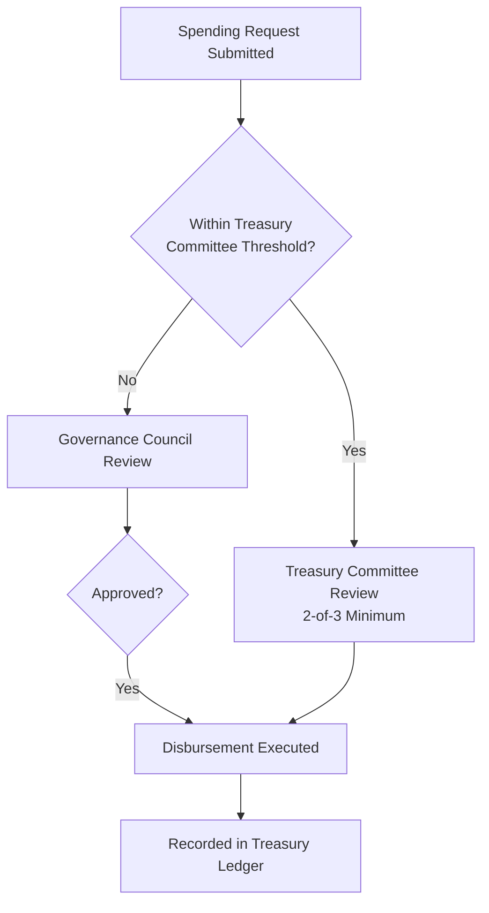

### 16.4 Spending Categories Table

| Category | Description |
|---|---|
| Education | Curriculum development, workshops, learning materials |
| Agent Network | Agent training, verification support, network operations |
| Reforestation | Planting-site costs, materials, field reporting |
| Technology | Software development, infrastructure, security review |
| Operations | Administration, governance operations, compliance |
| Community Growth | Outreach, ambassador support, community events |
| Emergency Reserve | Per `RESERVE_POLICY.md` |

### 16.5 Multi-Signature Custody

No individual holds sole signing authority over treasury funds; disbursements above defined thresholds require independent, multi-party approval (`TREASURY.md` Section 4).

### 16.6 Risks and Mitigations

| Risk | Mitigation |
|---|---|
| Unilateral fund movement | Multi-signature custody, segregation of duties (`INTERNAL_CONTROLS.md` Section 1) |
| Donor concentration risk | Diversified funding strategy (Section 24) |
| Reserve inadequacy during funding gaps | Operating Reserve target of a minimum three months of core costs (`RESERVE_POLICY.md` Section 2) |

### 16.7 Key Takeaways

Treasury governance is CeloHT's most concretely enforced accountability mechanism: every fund movement traces to a documented, multi-party-approved decision.

---

## 17. Transparency

### 17.1 Executive Summary

Transparency at CeloHT is a set of enforceable publication commitments, not a general aspiration: governance decisions, financial reports, team verification status, and impact data are published on a fixed, predictable cadence.

### 17.2 Transparency Artifacts Table

| Artifact | Cadence | Reference |
|---|---|---|
| Governance Council and Working Group meeting notes | Within 5 business days | `GOVERNANCE.md` Section 18.2 |
| Quarterly Financial Report | Within 30 days of quarter-end | `FINANCIAL_REPORTS.md` |
| Annual Financial Report | Within 60 days of year-end | `FINANCIAL_REPORTS.md` |
| Treasury Summary | Quarterly | `FINANCIAL_REPORTS.md` |
| Public Impact Dashboard | Continuously updated, minimum monthly | `ARCHITECTURE.md` Section 13.3 |
| Release notes | Per tagged software release | `GOVERNANCE.md` Section 18.5 |

### 17.3 The "Not Yet Available" Standard

Where CeloHT genuinely lacks a piece of data — a historical financial figure, an audit result, a completed team verification — this whitepaper and CeloHT's broader documentation state "Not Yet Available" explicitly, rather than omitting the topic or estimating a plausible-sounding figure. This standard, applied consistently across `TEAM.md`, `FINANCIAL_REPORTS.md`, and `AUDIT_POLICY.md`, is central to CeloHT's transparency claim being credible under due diligence.

### 17.4 Risks and Mitigations

| Risk | Mitigation |
|---|---|
| Inconsistent figures across documents | Cross-document reconciliation requirement (`FINANCIAL_TRANSPARENCY.md` Section 1) |
| Selective disclosure of only favorable data | Explicit commitment to publish unfavorable data (deficits, missed targets) (`FINANCIAL_TRANSPARENCY.md` Section 1) |

### 17.5 Key Takeaways

CeloHT's transparency commitment is tested most rigorously not by what it publishes, but by whether it publishes accurate "Not Yet Available" labels where data genuinely does not exist — which this whitepaper does throughout.

---

## 18. Risk Management

### 18.1 Executive Summary

CeloHT identifies and manages risk across five categories — legal/regulatory, financial, governance, operational, and reputational — through the structures documented across `GOVERNANCE.md`, `LEGAL_STATUS.md`, and the Financial Governance document suite.

### 18.2 Risk Matrix

| Risk Category | Example Risk | Primary Mitigation |
|---|---|---|
| Legal / Regulatory | Uncertain characterization of Agent Network activity | Legal Working Group monitoring, compliance-first design (`LEGAL_STATUS.md` Section 13) |
| Financial | Treasury mismanagement, donor concentration | Multi-person approval, quarterly reporting, operating reserve (`TREASURY.md`, `RESERVE_POLICY.md`) |
| Governance | Concentration of authority, decision-making paralysis | Distributed Council structure, defined thresholds (`GOVERNANCE.md`) |
| Operational | Key-person dependency, Working Group inactivity | Documented processes, cross-training, role-review cycles (`GOVERNANCE.md` Section 3.9) |
| Reputational | Public confusion about legal or financial status | `LEGAL_STATUS.md` and consistent public disclosure |
| Security | Smart-contract vulnerability, credential compromise | Audit requirements, RBAC, incident response (`ARCHITECTURE.md` Section 12) |
| Environmental / Programmatic | Reforestation site failure, land-rights disputes | Local-partner review, verification model (Section 8) |

### 18.3 Risk Governance Workflow

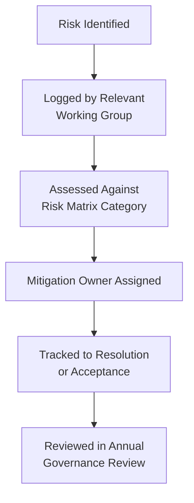

### 18.4 Key Takeaways

CeloHT's risk-management approach does not claim to eliminate risk — an honest claim no early-stage organization could credibly make — but commits to identifying, owning, and reviewing risk transparently through the Annual Governance Review (`GOVERNANCE.md` Section 21).

---

## 19. Legal Considerations and Compliance Principles

### 19.1 Executive Summary

CeloHT's legal posture is described in full, and with deliberate legal caution, in `LEGAL_STATUS.md`. This section summarizes that posture; `LEGAL_STATUS.md` remains the authoritative source in the event of any inconsistency.

### 19.2 Current Legal Status

As of this document's date:

- CeloHT is **not incorporated** as a company, foundation, association, or any other legal entity in any jurisdiction.
- CeloHT does **not hold** nonprofit, charitable, or tax-exempt status anywhere.
- CeloHT has **not received** government or regulatory approval, license, or endorsement of any kind.
- CeloHT is explicitly not a bank, cryptocurrency exchange, investment company, security issuer, token issuer, DAO with legal personality, or for-profit company (`LEGAL_STATUS.md` Section 4).

### 19.3 Compliance Principles

CeloHT's compliance approach favors activity that structurally reduces regulatory ambiguity — using an existing, independently issued stablecoin rather than issuing a CeloHT-specific asset; monitoring regulatory developments relevant to community-based payment facilitation through a dedicated Legal Working Group; and committing to pause or restructure any activity found, on legal review, to require licensing CeloHT does not hold (`LEGAL_STATUS.md` Section 13).

### 19.4 Future Institutional Development

CeloHT's current non-incorporated status reflects an early development stage, not a permanent design choice. Future institutional development — incorporation, tax-exempt status application, formal trademark registration — is subject to Governance Council approval through the Strategic Decision process, public disclosure, and update of `LEGAL_STATUS.md` at the time any such change actually occurs, never announced in advance as "pending" or "in progress" before it has (`LEGAL_STATUS.md` Section 20).

### 19.5 Risks and Mitigations

| Risk | Mitigation |
|---|---|
| Misrepresentation of legal status to a partner or funder | Mandatory disclosure of current status in due diligence (`LEGAL_STATUS.md` Section 18) |
| Operating in a jurisdiction with unaddressed licensing requirements | Legal Working Group review prior to jurisdictional expansion (`LEGAL_STATUS.md` Section 21) |

### 19.6 Key Takeaways

CeloHT's legal caution is itself a credibility asset: an organization willing to state plainly what it is not is generally more trustworthy under due diligence than one that overstates its status.

---

## 20. Ethics

### 20.1 Executive Summary

CeloHT's Ethics Policy (`GOVERNANCE.md` Section 11) governs community conduct, professional behavior, anti-corruption, and anti-discrimination across all CeloHT roles and activities.

### 20.2 Core Commitments

| Commitment | Scope |
|---|---|
| Anti-corruption, anti-fraud, anti-bribery | Prohibits any exchange intended to influence a governance, grant, vendor, or appointment decision |
| Anti-discrimination | Prohibits discrimination in role appointment, grant decisions, or community interaction on protected-characteristic grounds |
| Professional conduct | Requires accurate representation of CeloHT's mission and non-token identity in public statements |
| Conflict of interest | Disclosure and recusal required across governance and financial decisions (`CONFLICT_OF_INTEREST_FINANCE.md`) |

### 20.3 Enforcement

Ethics violations are reported to the Governance Council (or, where a Council member is implicated, to the remaining unconflicted members), with outcomes proportional to severity and an appeals process available to the affected individual (`GOVERNANCE.md` Section 11.5).

### 20.4 Key Takeaways

CeloHT's ethics framework applies without exception to every role, including the Founder — a structural choice, not a courtesy.

---

## 21. Community, Volunteer, and Ambassador Programs

### 21.1 Executive Summary

CeloHT's community structure spans Contributors, Volunteers, and Ambassadors, each with defined contribution paths and recognition mechanisms documented in `CONTRIBUTORS.md`.

### 21.2 Community Roles Table

| Role | Description | Recognition Path |
|---|---|---|
| Contributor | Submits code, documentation, translation, or design work | Listed in `AUTHORS.md` upon a recorded, accepted contribution |
| Volunteer | Supports forum moderation, event coordination, Code of Conduct enforcement | Public acknowledgment; eligible for Ambassador nomination |
| Field Contributor | Participates in reforestation planting events | Recognized in reforestation impact reporting |
| Ambassador | Represents CeloHT in a specific region or institution | Governance Council-confirmed, renewable 6-month term |

### 21.3 Contribution Pathway

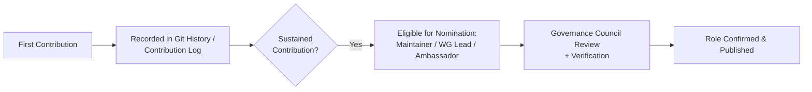

### 21.4 Risks and Mitigations

| Risk | Mitigation |
|---|---|
| Volunteer burnout or attrition | Defined, bounded role terms; recognition system (`CONTRIBUTORS.md` Section 3) |
| Informal influence outweighing recorded contribution | Nomination and recognition tied strictly to verifiable contribution history, not seniority or relationship (`CONTRIBUTORS.md` Section 4) |

### 21.5 Key Takeaways

CeloHT's community programs are designed to convert genuine, sustained participation into greater responsibility — never the reverse.

---

## 22. Partnership Strategy

### 22.1 Executive Summary

CeloHT pursues partnerships with NGOs, universities, foundations, grant programs, and ecosystem partners under a documented selection, approval, and review process (`GOVERNANCE.md` Section 19, `LEGAL_STATUS.md` Section 18).

### 22.2 Partner Categories Table

| Partner Category | Example Collaboration |
|---|---|
| NGOs and development organizations | Co-delivery of financial-inclusion or reforestation programs |
| Universities and research institutions | Curriculum review, impact research, academic case studies |
| Grant-making foundations | Funding aligned to specific pillars or operational capacity |
| Ecosystem partners (Celo ecosystem, Web3 organizations) | Technical collaboration, developer-ecosystem growth |
| Government-adjacent bodies | Regulatory dialogue, community-level coordination |

### 22.3 Partnership Approval Workflow

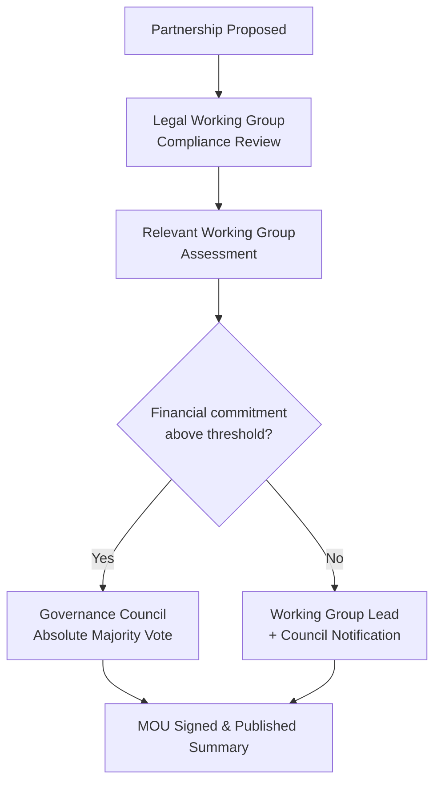

### 22.4 Selection Criteria

Partnerships are evaluated against mission alignment, financial and reputational risk, capacity to fulfill CeloHT's obligations, and consistency with CeloHT's non-token, non-investment identity (`GOVERNANCE.md` Section 19.1).

### 22.5 Risks and Mitigations

| Risk | Mitigation |
|---|---|
| Partner misalignment discovered post-agreement | Annual partnership review against original goals (`GOVERNANCE.md` Section 19.3) |
| Partner requiring CeloHT to misrepresent its legal status | Mandatory disclosure of current status prior to agreement (`LEGAL_STATUS.md` Section 18) |

### 22.6 Key Takeaways

CeloHT would rather disclose a capability gap to a prospective partner than misrepresent its status to close a partnership.

---

## 23. Grant Strategy

### 23.1 Executive Summary

CeloHT's grant strategy pursues funding aligned to its three pillars, evaluated against the criteria in `LEGAL_STATUS.md` Section 18 and processed through the acceptance and reporting rules in `DONATION_POLICY.md` and `TREASURY.md`.

### 23.2 Grant Evaluation Criteria

| Criterion | Description |
|---|---|
| Mission alignment | Grant purpose fits Education, Agent Network, or Reforestation pillars |
| Non-token compatibility | Grant does not require or imply token issuance |
| Reporting feasibility | CeloHT can realistically fulfill the grant's reporting obligations |
| Governance independence | Grant does not require ceding governance authority to the funder |

### 23.3 Grant Acceptance Workflow

Grant acceptance above $10,000 USD-equivalent requires a full Governance Council vote (`LEGAL_STATUS.md` Section 18.4); below that threshold, Treasury Committee review applies, consistent with `TREASURY.md` Section 3.

### 23.4 Funding Source Table

| Source Type | Status |
|---|---|
| Institutional grants (foundations, multilateral programs) | Actively pursued; historical figures Not Yet Available |
| Individual and community donations | Accepted per `DONATION_POLICY.md` |
| Ecosystem/ecosystem-partner grants (ecosystem-specific programs) | Actively pursued |
| Programmatic revenue | Not currently a material funding source |

### 23.5 Risks and Mitigations

| Risk | Mitigation |
|---|---|
| Grant conditions incompatible with non-token identity | Evaluation criteria applied before acceptance (Section 23.2) |
| Reporting-obligation overcommitment | Feasibility assessment prior to acceptance |

### 23.6 Key Takeaways

CeloHT evaluates grant opportunities as carefully for mission and governance compatibility as for the funding amount itself.

---

## 24. Financial Sustainability

### 24.1 Executive Summary

CeloHT's financial-sustainability approach combines diversified funding sources, disciplined reserve management (`RESERVE_POLICY.md`), and transparent reporting (`FINANCIAL_REPORTS.md`) designed to support multi-year continuity independent of any single funding relationship.

### 24.2 Sustainability Mechanisms

| Mechanism | Purpose |
|---|---|
| Operating Reserve | Minimum three months of core operational costs (`RESERVE_POLICY.md` Section 2) |
| Emergency Reserve | Urgent, unplanned needs under the Emergency Decision process |
| Sustainability Reserve | Long-term institutional development goals (`RESERVE_POLICY.md` Section 4) |
| Diversified funding | Grants, donations, and ecosystem partnerships, avoiding single-source dependency |
| Restricted-funding discipline | Restricted donations honored only where realistically achievable (`DONATION_POLICY.md` Section 2) |

### 24.3 Fund Allocation Approach

CeloHT allocates available funds across Education, Agent Network, Reforestation, Technology, Operations, Community Growth, and Emergency Reserve categories based on documented criteria — mission alignment, programmatic readiness, restricted-funding obligations, reserve adequacy, community input, and prior-period performance — without pre-committing to fixed percentages (`FUND_ALLOCATION_FRAMEWORK.md`).

### 24.4 Risks and Mitigations

| Risk | Mitigation |
|---|---|
| Single-donor over-dependence | Diversified funding-source strategy |
| Currency or macroeconomic instability affecting programmatic costs | cUSD-denominated operational spending where feasible, reducing local-currency exposure |

### 24.5 Key Takeaways

Financial sustainability at CeloHT is treated as a governance discipline, not an assumption: reserves, diversification, and allocation criteria are all explicit, published policy, not implicit practice.

---

## 25. Monitoring and Evaluation, KPIs, and Impact Framework

### 25.1 Executive Summary

CeloHT's Monitoring and Evaluation (M&E) approach ties program activity to publicly reported, cross-referenced metrics via the Impact Analytics Engine and public Impact Dashboard (`ARCHITECTURE.md` Section 13).

### 25.2 Impact Metrics Table

| Pillar | Metric Category | Reporting Status |
|---|---|---|
| Education | Learners reached, courses completed | Not Yet Available — reporting pipeline pending activation |
| Agent Network | Agents active, transactions facilitated | Not Yet Available |
| Reforestation | Trees planted, sites active, hectares restored | Not Yet Available |
| Governance | Council votes held, proposals processed | Tracked per `GOVERNANCE.md` Section 18 as governance activity occurs |
| Financial | Treasury balance, budget-vs-actual | Tracked per `FINANCIAL_REPORTS.md` as reporting periods close |

This table lists metric categories CeloHT is instrumented to report, not current values; no figures are populated here because no reporting period has yet closed with published data as of this document's date, consistent with the "Not Yet Available" standard in Section 17.3.

### 25.3 Impact Framework Diagram

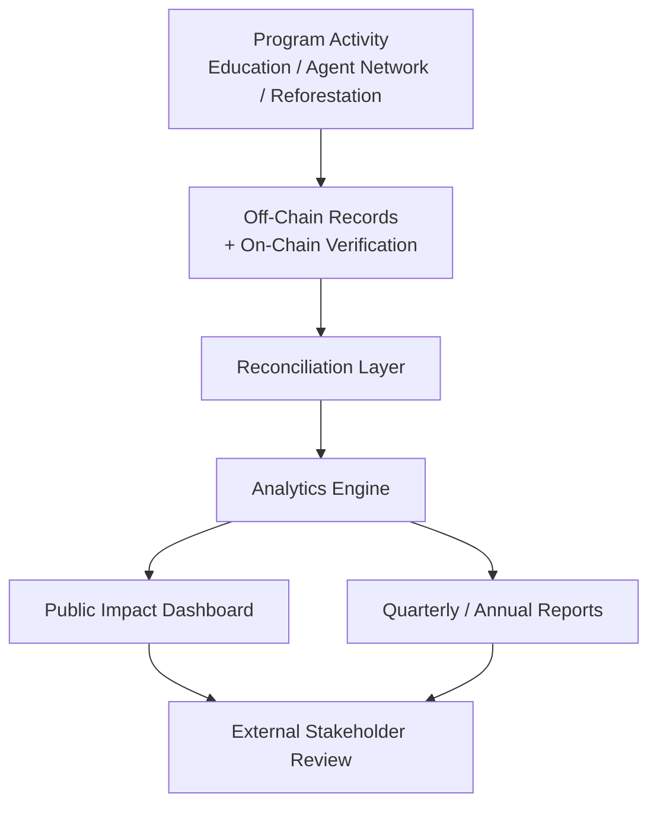

### 25.4 KPI Design Principles

- Every KPI must be traceable to an underlying, independently checkable record (on-chain attestation, database record, or published report), not a self-reported estimate.
- KPIs are reported consistently across reporting periods to preserve comparability, per `FINANCIAL_REPORTS.md` Section 7.
- Negative or underperforming KPI results are published, not suppressed, consistent with `FINANCIAL_TRANSPARENCY.md` Section 1.

### 25.5 Risks and Mitigations

| Risk | Mitigation |
|---|---|
| Metric gaming (optimizing for the number rather than the outcome) | Cross-pillar, cross-referenced reporting design (Section 9) reduces incentive to game a single isolated metric |
| Incomplete data during early operational stages | Explicit "Not Yet Available" labeling rather than estimation |

### 25.6 Key Takeaways

CeloHT's M&E framework is fully designed and instrumented but, as of this document's date, has not yet produced a closed reporting period; this whitepaper reports that status honestly rather than anticipating results.

---

## 26. Environmental Impact

### 26.1 Executive Summary

CeloHT's environmental impact work centers on the Reforestation pillar (Section 8), with impact claims structured for independent verification rather than self-reported totals.

### 26.2 Environmental Impact Approach

| Dimension | CeloHT's Approach |
|---|---|
| Verification | On-chain attestation hashes anchor each reforestation report (Section 8.4) |
| Community involvement | Planting events logged with participating community members, reinforcing local ownership |
| Long-term tracking | Planned longer-term survival-rate monitoring as the program matures (Section 8.8) |
| Reporting transparency | Aggregated into the public Impact Dashboard alongside Education and Agent Network metrics |

### 26.3 Key Takeaways

CeloHT does not currently publish tree-planting totals, hectares-restored figures, or survival-rate statistics, because no reforestation reporting period has yet closed as of this document's date; this whitepaper states that directly rather than estimating plausible figures.

---

## 27. Social Impact

### 27.1 Executive Summary

CeloHT's intended social impact spans financial-literacy gains (Education), expanded access to digital payment and remittance tools (Agent Network), and community cohesion benefits associated with shared environmental restoration work (Reforestation).

### 27.2 Social Impact Pathways

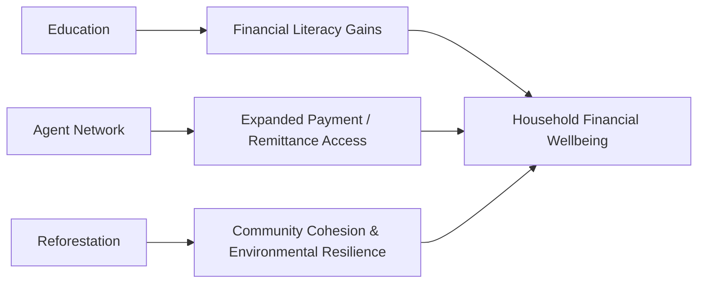

### 27.3 Measurement Approach

Social impact measurement is planned as part of the M&E framework in Section 25, with specific instruments (for example, pre/post financial-literacy assessments) to be documented and piloted as the Education pillar's dApp-integrated modules become operational (`ARCHITECTURE.md` Section 9).

### 27.4 Key Takeaways

CeloHT's social impact claims in this whitepaper are described as intended pathways under active measurement design, not as achieved, quantified outcomes, consistent with the project's current operational stage.

---

## 28. Scaling Strategy and International Expansion

### 28.1 Executive Summary

CeloHT's scaling strategy expands along five dimensions — more communities, more agents, more countries, more developers, more partnerships — without compromising its non-token, community-governed identity (`ARCHITECTURE.md` Section 15).

### 28.2 Scaling Dimensions Table

| Dimension | Current Focus | Scaling Approach |
|---|---|---|
| More communities | Léogâne and surrounding communes, Haiti | Modular Working Group and Ambassador structure, replicable to new communes and, over time, other Caribbean nations |
| More agents | Initial verified agent cohort | On-chain registry and standardized onboarding pipeline designed to scale without re-architecting core systems |
| More countries | Haiti-first | Localization-ready frontend and jurisdiction-aware Legal Working Group review before expansion |
| More developers | Founder-led core contributor group | Public RFC process, documented architecture, top-tier documentation hub |
| More partnerships | Early grant and NGO relationships | Standardized MOU and partnership-approval workflow, public Impact Dashboard for partner due diligence |

### 28.3 International Expansion Principles

- Expansion into a new jurisdiction requires prior Legal Working Group review of local regulatory requirements (`LEGAL_STATUS.md` Section 21).
- Localization is treated as a first-class design requirement, not a translation afterthought, extending the Haitian Creole-first principle (Section 2.3) to new-market languages as expansion occurs.
- Expansion pace is governed by the same "readiness over speed" principle applied to DAO activation (Section 15.2) and technical scaling (Section 10.4).

### 28.4 Risks and Mitigations

| Risk | Mitigation |
|---|---|
| Expansion outpacing legal or operational readiness | Jurisdiction-specific Legal Working Group review gate prior to expansion |
| Diluted community-governance quality at larger scale | Working Group and Ambassador structure designed for modular replication, not centralized bottlenecking |

### 28.5 Key Takeaways

CeloHT's scaling strategy explicitly rejects "growth at any cost": every scaling dimension is gated by a documented readiness check, not a fundraising or publicity timeline.

---

## 29. Five-Year Roadmap

### 29.1 Executive Summary

This section presents CeloHT's five-year roadmap as a sequence of milestones tied to the readiness criteria described throughout this whitepaper, not as fixed calendar commitments. Dates are intentionally omitted from milestones dependent on funding or community growth outside CeloHT's unilateral control; where a phase is described as "Year 1–2," this reflects planning sequence, not a guaranteed timeline.

### 29.2 Roadmap Milestones Table

| Milestone | Sequence | Dependency |
|---|---|---|
| Complete governance, legal, and financial-governance documentation suite | Achieved | — |
| Publish technical architecture and API specification | Achieved | — |
| Launch production dApp (Phase 2 of `DAO.md` Section 3) | Year 1–2 | Development capacity, funding |
| Activate first Agent Network cohort with on-chain verification registry | Year 1–2 | dApp production readiness |
| Publish first closed-period financial and impact reports | Year 1–2 | Operational activity generating reportable data |
| Pilot non-binding off-chain community voting | Year 2–3 | dApp operational phase completion |
| Transition to binding community governance for defined proposal categories | Year 2–4 | Phase 2 exit criteria met (`DAO.md` Section 3.2) |
| First independent financial review | Upon reaching the $50,000 USD-equivalent annual treasury-flow threshold | Treasury growth |
| Expand Agent Network to additional Haitian regions | Year 2–4 | Demonstrated pilot-region success |
| Evaluate expansion to additional Caribbean markets | Year 3–5 | Legal Working Group jurisdiction review |

### 29.3 Five-Year Roadmap Diagram

```mermaid
gantt
    dateFormat  X
    axisFormat %s
    title CeloHT Five-Year Roadmap (Sequence, Not Fixed Calendar)
    section Foundation (Achieved)
    Governance & Legal Documentation      :done, a1, 0, 1
    Technical Architecture & API Spec     :done, a2, 0, 1
    section Operational Buildout
    Production dApp Launch                :a3, 1, 2
    Agent Network Activation              :a4, 1, 2
    First Closed Financial/Impact Reports :a5, 1, 2
    section Governance Evolution
    Non-Binding Community Voting Pilot    :a6, 2, 2
    Binding Community Governance          :a7, 3, 2
    section Growth
    Regional Agent Network Expansion      :a8, 2, 2
    Caribbean Market Evaluation           :a9, 3, 2
```

### 29.4 Key Takeaways

CeloHT's five-year roadmap is sequenced by readiness, not committed by date — a distinction this whitepaper maintains deliberately, consistent with its broader commitment to avoid promises it cannot guarantee.

---

## 30. Ten-Year Vision

### 30.1 Executive Summary

Over a ten-year horizon, CeloHT's aspiration is to become a mature, community-governed, financially sustainable institution operating a proven, replicable model of integrated financial-inclusion education, community-agent infrastructure, and environmental restoration — first across Haiti, and, contingent on demonstrated success and legal readiness, across additional Caribbean markets.

### 30.2 Ten-Year Aspirational Themes

| Theme | Description |
|---|---|
| Institutional maturity | Formal incorporation and, where appropriate, nonprofit/charitable registration, per the process in `LEGAL_STATUS.md` Section 20 |
| Governance maturity | A fully activated Community Governance DAO (`DAO.md` Phase 3–4) with a sustained track record |
| Financial sustainability | Diversified, multi-year funding with a fully funded Sustainability Reserve |
| Proven, replicable model | A documented, evidence-based case for the three-pillar integrated model (Section 9), open for adaptation by other communities and organizations |
| Regional reach | Presence in multiple Caribbean markets, each gated by the same legal and operational readiness discipline applied to CeloHT's first market |

### 30.3 An Honest Caveat

This ten-year vision is aspirational, not a forecast. It is presented to communicate CeloHT's long-term intent to institutional stakeholders evaluating a multi-year relationship, not as a projection with defined probability. CeloHT's actual trajectory over ten years will depend on funding, community growth, regulatory developments, and governance decisions made transparently and incrementally through the processes described throughout this whitepaper — not on this section alone.

### 30.4 Key Takeaways

CeloHT's ten-year vision is deliberately framed as intent under governance control, not destiny — consistent with the whitepaper's broader distinction between verified fact and future goal.

---

## 31. Case Studies

### 31.1 Executive Summary

As of this document's date, CeloHT has not yet completed a closed reporting period generating verified, publishable case-study outcomes (Section 25.6). This section states that directly rather than presenting hypothetical or illustrative scenarios as if they were real outcomes.

### 31.2 Planned Case Study Framework

Once CeloHT's Agent Network and Education pillars are operational and reporting (Section 29.2), CeloHT plans to publish case studies following a consistent structure:

| Element | Description |
|---|---|
| Context | The community or individual context, described with participant consent and appropriate privacy protection |
| Intervention | The specific CeloHT program activity involved (education module, agent transaction pattern, reforestation event) |
| Verified outcome | Outcome data traceable to an underlying record per the Impact Framework (Section 25.3) |
| Independent verifiability | Reference to the on-chain or reporting artifact supporting the claimed outcome |

### 31.3 Key Takeaways

CeloHT's commitment to case studies grounded in verified, traceable outcomes — rather than anecdote or illustrative composites — is a direct extension of the Verifiability value in Section 2.3, and this section will be populated with real case studies as they become available, each dated and sourced.

---

## 32. Frequently Asked Questions

**Is CeloHT a cryptocurrency or an investment?**
No. CeloHT has no token, has never conducted a token sale, and is not an investment product. See `NO_TOKEN_POLICY.md` and `LEGAL_STATUS.md` Section 4.

**Is CeloHT a registered nonprofit?**
Not as of this document's date. CeloHT does not hold nonprofit, charitable, or tax-exempt status in any jurisdiction. See `LEGAL_STATUS.md` Section 3.

**Who controls CeloHT?**
No individual. CeloHT is governed by a Governance Council, Working Groups, and a public proposal process. The Founder holds one vote among several and no unilateral treasury or governance authority. See `GOVERNANCE.md` Section 3 and Section 14 of this whitepaper.

**Does CeloHT plan to launch a token in the future?**
No. The non-token design is foundational to CeloHT's mission and legal posture, not a temporary phase. See Section 5.5 and `NO_TOKEN_POLICY.md`.

**How is CeloHT funded?**
Through grants, donations, and ecosystem partnerships, evaluated and accepted under the criteria in Section 23 and `DONATION_POLICY.md`. CeloHT does not currently have material programmatic revenue.

**Has CeloHT been audited?**
Not yet. CeloHT commits to an independent financial review once its annual treasury flow exceeds $50,000 USD-equivalent, and may commission a voluntary review earlier. See `AUDIT_POLICY.md`.

**What blockchain does CeloHT use, and why?**
Celo, chosen for its mobile-first design, EVM compatibility, and native stablecoin (cUSD) infrastructure. See Section 5.2.

**Can I contribute to CeloHT without being in Haiti?**
Yes. CeloHT is an open-source project; code, documentation, translation, and design contributions are welcome from anywhere, subject to `CONTRIBUTING.md` and `CODE_OF_CONDUCT.md`.

**Where can I see CeloHT's financials?**
In CeloHT's published Quarterly and Annual Reports, once reporting periods close (`FINANCIAL_REPORTS.md`). As of this document's date, historical figures are Not Yet Available.

**How does CeloHT verify its impact claims?**
Through a combination of on-chain attestation (for reforestation and agent verification) and structured, reconciled off-chain reporting, published via the public Impact Dashboard. See Section 25.

---

## 33. Glossary

| Term | Definition |
|---|---|
| **Agent** | A verified community member facilitating cUSD cash-in/cash-out and digital-payment onboarding |
| **CHIP** | CeloHT Improvement Proposal, the DAO-era proposal format described in `DAO.md` Section 5 |
| **cUSD** | A Celo-network stablecoin used by CeloHT strictly as an operational payment rail |
| **Emergency Decision** | A narrowly scoped decision made to contain immediate risk, subject to mandatory ratification (`GOVERNANCE.md` Section 4.5) |
| **Governance Council** | CeloHT's primary strategic and treasury decision-making body |
| **Impact Dashboard** | CeloHT's public, continuously updated reporting interface aggregating Education, Agent Network, and Reforestation metrics |
| **Maintainer** | A contributor with repository write/merge access and review responsibilities |
| **MOU** | Memorandum of Understanding, CeloHT's standard partnership-formalization document |
| **On-chain attestation** | A cryptographic hash anchored on the Celo blockchain, timestamping and verifying an off-chain record without exposing the underlying data on-chain |
| **Pillar** | One of CeloHT's three core program areas: Education, Agent Network, or Reforestation |
| **Quorum** | The minimum participation required for a vote to be valid |
| **Reserve** | A treasury allocation set aside for a specific continuity purpose (Operating, Emergency, or Sustainability); see `RESERVE_POLICY.md` |
| **Sustainability Reserve** | A treasury reserve supporting CeloHT's long-term institutional development goals |
| **Transparency Committee** | A DAO-era body responsible for auditing published governance and treasury records against source data (`DAO.md` Section 4.5) |
| **Valora / MiniPay** | Mobile wallet applications supported for CeloHT's Celo-network interactions |
| **Working Group** | A standing operational team with a public charter and defined scope within CeloHT's governance structure |

---

## 34. References

This whitepaper synthesizes and summarizes CeloHT's own primary governance, technical, legal, and financial documentation. Readers seeking authoritative, complete detail on any topic summarized here should consult the following documents directly, all maintained in CeloHT's public governance repository:

1. `README.md` — Project overview and orientation
2. `ROADMAP.md` — Detailed development roadmap
3. `ARCHITECTURE.md` — Technical architecture specification
4. `API.md` — API specification
5. `DAO.md` — DAO design and activation roadmap
6. `GOVERNANCE.md` — Community governance framework
7. `LEGAL_STATUS.md` — Legal status and organizational disclosure
8. `NO_TOKEN_POLICY.md` — Non-token policy statement
9. `FUNDING_POLICY.md` — Funding acceptance and management policy
10. `SECURITY.md` — Security policy and vulnerability-disclosure process
11. `SMART_CONTRACTS.md` — Smart contract design and audit policy
12. `PROJECT_STRUCTURE.md` — Repository and project organization
13. `TEAM.md`, `AUTHORS.md`, `MAINTAINERS.md`, `CONTRIBUTORS.md`, `VERIFICATION_POLICY.md` — Team transparency and verification
14. `CONTRIBUTING.md` — Contribution guidelines
15. `CODE_OF_CONDUCT.md` — Community conduct standards
16. `RISK_MANAGEMENT.md` — Risk management framework
17. `TRANSPARENCY.md` — Transparency policy
18. `TREASURY.md`, `DONATION_POLICY.md`, `PROCUREMENT_POLICY.md`, `EXPENSE_APPROVAL_POLICY.md`, `FINANCIAL_REPORTS.md`, `RESERVE_POLICY.md`, `CONFLICT_OF_INTEREST_FINANCE.md`, `INTERNAL_CONTROLS.md`, `AUDIT_POLICY.md`, `FUND_ALLOCATION_FRAMEWORK.md`, `FINANCIAL_FAQ.md` — Financial governance suite

In the event of any inconsistency between this whitepaper and one of the documents above, the specific, more detailed document governs, and this whitepaper will be corrected accordingly at its next revision.

---

## 35. Appendices

### Appendix A — Documentation Hierarchy

```mermaid
graph TD
    WP[WHITEPAPER.md<br/>Institutional Summary] --> GOV[GOVERNANCE.md]
    WP --> LEGAL[LEGAL_STATUS.md]
    WP --> ARCH[ARCHITECTURE.md]
    WP --> API[API.md]
    WP --> DAO[DAO.md]
    GOV --> FIN[Financial Governance Suite]
    LEGAL --> TEAM[Team Transparency Suite]
    ARCH --> SEC[SECURITY.md / SMART_CONTRACTS.md]
```

This whitepaper sits above CeloHT's detailed operational documents as a synthesized institutional summary; it does not override or duplicate their authority (Section 34).

### Appendix B — Document Versioning

This whitepaper is versioned independently of, but kept in alignment with, the underlying documents it summarizes. A changelog entry is published whenever a material change to any referenced document requires a corresponding update to this whitepaper.

### Appendix C — Contact and Verification

For verification of any claim in this whitepaper, readers are encouraged to consult the specific underlying document referenced (Section 34), all of which are maintained in CeloHT's public GitHub organization. For questions not answered in this whitepaper or its referenced documents, inquiries can be directed through CeloHT's official channels as listed in the documentation hub, consistent with `LEGAL_STATUS.md` Section 24.

### Appendix D — Statement on Document Accuracy

This whitepaper was prepared to the standard described in Section 1: no fabricated statistics, explicit distinction between verified fact and future goal, and consistency with CeloHT's full documentation suite. Where CeloHT's actual status changes — a milestone achieved, a reporting period closed, a governance decision made — this whitepaper will be revised to reflect that change, dated, and versioned, consistent with the Document Governance practices described in `GOVERNANCE.md` Section 14.3.

---

*This document is maintained alongside CeloHT's complete governance, legal, technical, and financial documentation suite in the CeloHT governance repository. It represents CeloHT's institutional reference document as of its publication date and will be revised as the project's actual status develops.*
